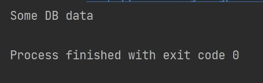

# 访问单个 Spring Beans 的 3 个简单步骤

> 原文：<https://blog.devgenius.io/3-easy-steps-to-access-individual-spring-beans-783ff6d5fe36?source=collection_archive---------5----------------------->


[https://spring.io/](https://spring.io/)

对于我的工作项目，我们使用公司内部的 Java 框架来开发我们的应用程序。尽管这个框架有其独特的特性，但它不如 Spring 强大，Spring 提供了数据库访问、缓存连接和其他外部特性。

因此，我们的团队决定率先尝试公司框架和 Spring 框架的混合。

然而，由于来自两个不同框架的注释和包的混合，我们必须分离两个框架，并对它们进行不同的配置来访问 Spring beans。

## 第一步。配置 Spring 上下文。

我们将首先创建 Spring 配置类。

@ **配置**告诉 Spring 容器生成 bean 定义和服务请求。@ **ComponentScan** 将与@ **Configuration** 一起使用，告诉 Spring 容器查找组件类，比如我们稍后在步骤 2 中定义的组件类。这里我们声明了 *basePackages* ，这样 Spring 容器将在包路径中找到组件类。

在该类中，我们有一个静态方法来创建一个*ConfigurableApplicationContext*——它将当前的*配置*类作为输入，并将 Spring 上下文返回给我们供以后使用。

```
@Configuration
@ComponentScan(basePackages = {"com.dntech.demo"})
public class SpringContextConfiguration {

    public static ConfigurableApplicationContext configure(){
        ConfigurableApplicationContext context = new AnnotationConfigApplicationContext(SpringContextConfiguration.class);
        return context;
    }
}
```

注意*ConfigurableApplicationContext*是一个接口。为了创建上下文对象，我们需要一个具体的实现类—*AnnotationConfigApplicationContext*。您可以在这里找到其他可用的实现类[。](https://docs.spring.io/spring-framework/docs/current/javadoc-api/org/springframework/context/ConfigurableApplicationContext.html)

## 第二步。在必要的类中获取上下文。

我们拥有的组件类之一是 *SomeServiceDao* 。为简单起见，我们模拟一个方法，通过返回一个字符串“Some DB Data”从 DB 获取数据。

```
@Component
public class SomeServiceDao {

    public String getSomeDbData(){
        return "Some DB data";
    }
}
```

我们如何利用上面的 Spring 上下文来访问这个方法呢？

下面的 *SomeService* 类包含了主要的业务逻辑。这里我们可以初始化默认构造函数中的 *SomeServiceDao* 和*ConfigurableApplicationContext*。

我们将首先通过调用静态方法 *configure* ()来获取 spring 上下文。之后，我们利用 *getBean* 方法来分配 *serviceDao* 字段。

然后，我们可以把重点放在我们的业务逻辑下面。这里我们有一个简单的方法从 *serviceDao* 类调用方法。

```
public class SomeService {

    final SomeServiceDao serviceDao;
    final ConfigurableApplicationContext context;

    public SomeService() {
        this.context = SpringContextConfiguration.*configure*();
        this.serviceDao = this.context.getBean(SomeServiceDao.class);
    }

    public String getData(){
        return this.serviceDao.getSomeDbData();
    }
}
```

## 第三步。访问方法。

```
public class Application {

    public static void main(String[] args) {
        final SomeService someService = new SomeService();
        System.*out*.println(someService.getData());
    }
}
```

在主应用程序类中，我们可以只构造我们的服务类并调用方法:



我们的程序输出正确的字符串。

在本文中，我们将看到*ConfigurableApplicationContext*如何帮助我们访问定制 beans。我希望这篇文章对你有所帮助。

如果你像我一样，渴望学习 Java 和更多关于后端工程的知识，请关注我的频道，了解我在日常工作和生活中获得的灵感。

> ***阅读更多:***[*一个关于 Java 静态关键字在职期间的案例*](/a-case-about-java-static-keyword-during-my-job-53cebb6af597)[*如何解决这个 Java 多线程面试问题？*](/how-can-you-solve-this-java-multithreading-interview-problem-8e6ec53fab27)