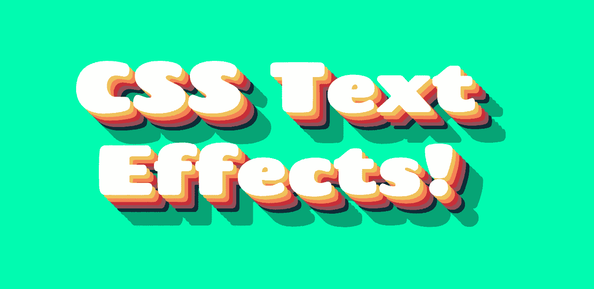

# 3 易于使用的 CSS 文本效果

> 原文：<https://blog.devgenius.io/3-easy-to-use-css-text-effects-8449935d471e?source=collection_archive---------2----------------------->

最近，我一直在深入研究仅使用 CSS 就可以创建的文本效果。我发现了一些非常容易实现的方法，我想在这篇文章中分享一下。我将要谈论的文本效果只是 CSS 无限可能性中的几个，但是我发现它们特别有创造性，使用起来很快，并且最终对于像我这样的 CSS 初学者来说非常棒。

我将简要地谈论一些我第一次发现[这里](https://freefrontend.com/css-text-effects/)的文字效果，然后决定创建我自己的版本。你会注意到这里有很多其他令人惊奇的效果，这是一个很好的文本效果资源。

这篇文章将集中在不需要大量 CSS(易于使用)的 CSS/HTML 示例上。

让我们开始吧！

# 现代外观的竖排文本

这种效果是对竖排文字的一种现代诠释，将竖排文字向相反的方向翻转。有人可能会在他们的作品集网站上使用这种效果。你可以在这里找到启发我的原始代码笔，下面是我自己对如何实现这种效果的看法:

通过制作这个，我学到了两个新的东西，我学到了 CSS 属性`writing-mode`，它允许我们将文本转向一边，还有`line-height`，它有助于将文本的基线彼此拉近。

我选择对每个`translate()`使用百分比，这样当字体大小改变时,“k”的右脚仍然会与“泰勒”中“l”的脚对齐。这是一种文体选择，根据您选择的文本而有所不同。可能有必要调整 translate()属性，使它看起来像您想要的那样。

关于这一点，根据您使用的字体，您可能也需要使用`line-height`属性。

我认为一旦我对`writing-mode`、`line-height`和`transform`属性了解得多一点，这个就更容易理解了。

# 多层文本阴影

我发现这个有趣的效果是最容易使用的，也是最有创意的想法之一。[这里的](https://codepen.io/TajShireen/pen/abzmoRE)是启发我自己做的原始码笔。

使用的主要概念是 CSS 属性`text-shadow`，除了不再停留在一个阴影处，我们继续添加它们，使它们离初始文本越来越远，同时将颜色更改为任何首选的方案:

我选择对每个`text-shadow`使用测量值`vw`,这样当改变屏幕宽度时，阴影会做出反应。

对于更大的阴影效果，我只是拿了我用于 T3 的 T2，把它插入到谷歌拾色器 T10 中，然后向下拖动光标来创建一个更暗的阴影。

我也喜欢用[coolers](https://coolors.co/03fcb1-f2c14e-f78154-cc2936-954e5a)来挑选我的调色板，看看吧！

# **混有文本阴影的文本笔画**

我将展示的最后一个例子演示了如何使用文本笔画来创建一个很酷的效果，这是字体轮廓的另一种说法。CSS-Tricks 有一篇很棒的[文章](https://css-tricks.com/adding-stroke-to-web-text/)关于它，这里的[是我找到的原始 CodePen，下面是我的版本:](https://codepen.io/creatz/pen/pooBeev)

这个的按键是`-webkit-text-fill-color`、`-webkit-text-stroke-width`和`-webkit-text-stroke-color`。我把`color: black;`放在这里的原因是因为`-webkit`属性适用于除了 Internet Explorer 之外的几乎所有浏览器，所以如果它在 IE 上打开，文本笔划属性将无法正常工作，这是在那种情况下的默认行为。

我认为这是一种在任何应用程序或网站上吸引注意力的有趣方式！

# 结论

上述文本效果都不需要太多的 CSS，并且可以很容易地在任何 HTML/CSS 项目中实现。他们一定会给你的项目增添趣味！不要忘记，还有更多的可能性，但是如果这篇文章教会了一个 CSS 新手一个很酷的方法来定制他们的文本，我的目标就达到了。

我希望这对你有益！如果你能做到这一步，感谢你的阅读，一如既往，祝你黑客生涯愉快！