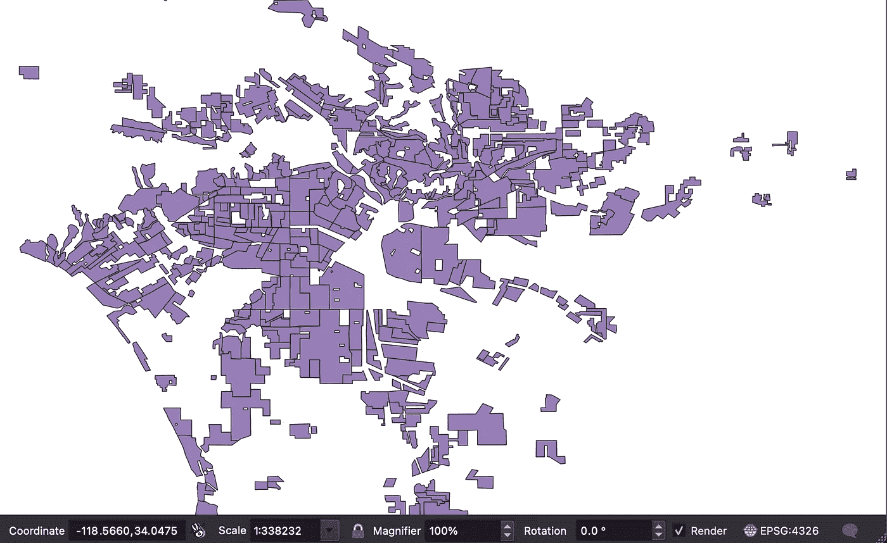
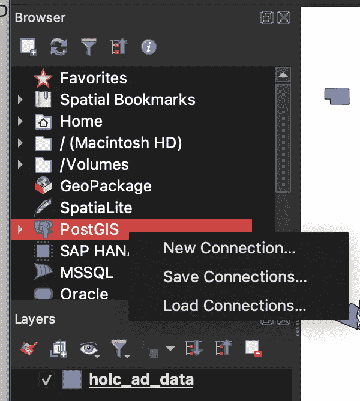
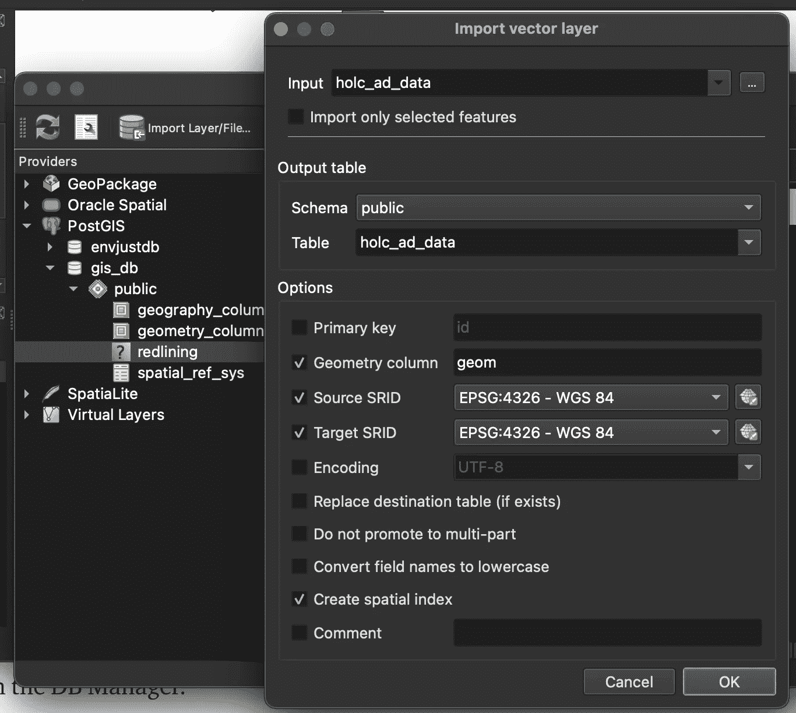

# 将 shapefile 导入 PostgreSQL 数据库的 3 种简单方法

> 原文：<https://blog.devgenius.io/3-easy-ways-to-import-a-shapefile-into-a-postgresql-database-c1a4c78104af?source=collection_archive---------0----------------------->


安妮·斯普拉特在 [Unsplash](https://unsplash.com/s/photos/map?utm_source=unsplash&utm_medium=referral&utm_content=creditCopyText) 上的照片

**在我们开始**之前，您必须安装一个带有 PostGIS 扩展的 PostgreSQL 实例。PGAdmin 是一个很好的数据库管理软件，可以和 PostgreSQL 一起安装。

*   下载 PostgreSQL—[https://www.postgresql.org/](https://www.postgresql.org/)
*   安装 PostGIS—[https://postgis.net/install/](https://postgis.net/install/)

**我们还需要数据集**。在本文中，我们将使用里士满大学的制图不等式数据集，这是一个追踪美国红线区的面坐标集合。

*   红线 GIS 数据集—[https://DSL . Richmond . edu/panorama/红线/# loc = 5/39.1/-94.58&text = downloads](https://dsl.richmond.edu/panorama/redlining/#loc=5/39.1/-94.58&text=downloads)

# 1.使用 shp2pgsql 命令行工具创建表并导入文件

首先，在 PostgreSQL 中创建一个数据库并启用 PostGIS。

```
CREATE DATABASE "gis_db"
    WITH 
    OWNER = <dbuser>
    ENCODING = 'UTF8'
    CONNECTION LIMIT = -1;CREATE EXTENSION postgis;
```

然后，从包含 holc_ad_data.shp 文件的目录中的命令行(以及。项目和。dbf 文件)，运行以下命令:

```
shp2pgsql -s 4326 -I holc_ad_data.shp redlining  \
| psql  -d gis_db -U <dbuser>
```

这将创建一个名为“红线”的新表，并从 holc_ad_data.shp 导入数据。

# 2.Python 使用 Geopandas 和 SQLAlchemy 推送数据

这是一个简单的代码解决方案，可以很容易地在管道中实现自动化。

# 3.从 QGIS 应用程序推送数据

最后但同样重要的是，GUI 选项。首先，在本地机器上下载并安装 QGIS。

[](https://qgis.org/en/site/forusers/download.html) [## 下载 QGIS

### 适用于 macOS High Sierra (10.13)和更新版本的官方一体式签名安装程序 Mac 安装程序包。QGIS 尚未…

qgis.org](https://qgis.org/en/site/forusers/download.html) 

安装 QGIS 后，启动应用程序。您应该会看到一个空白的白色画布。**将您的 shapefile 拖到 QGIS 中**。红线数据显示为用颜色填充的点的多边形，隐约呈美国的形状。这里我放大了洛杉矶。



作者图片

**将 QGIS 连接到 gis_db 数据库。**在浏览器中右击 Postgis 并选择新建连接。



作者图片

填写您的连接信息，然后单击测试连接。如果成功，单击确定，您将看到它作为一个连接列在 PostGIS 下。

点击数据库并打开数据库管理器。单击导入/图层文件(这是违反直觉的，因为您是从 QGIS 导出并导入到 Postgis)。

