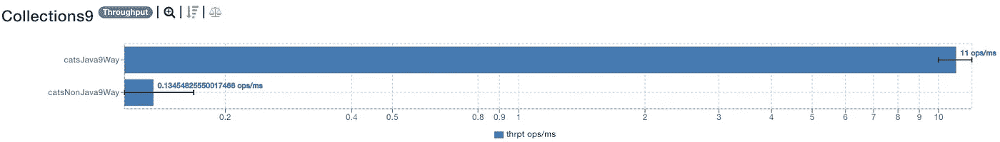
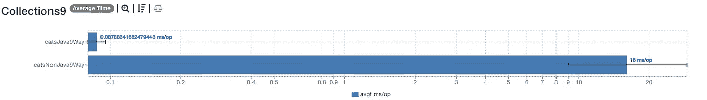
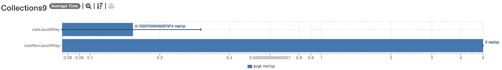
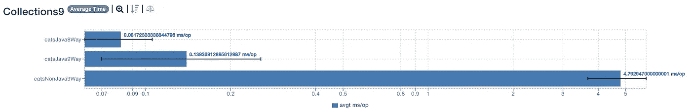
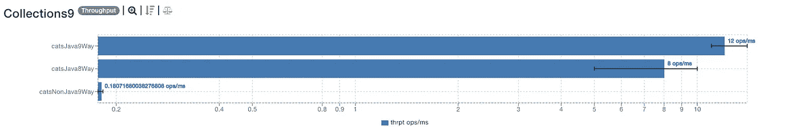
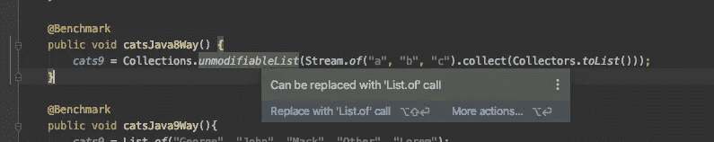
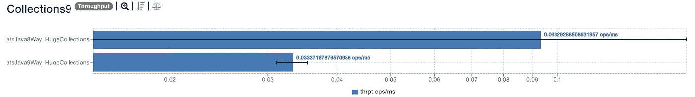
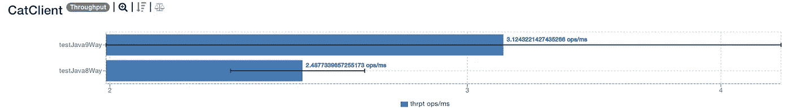
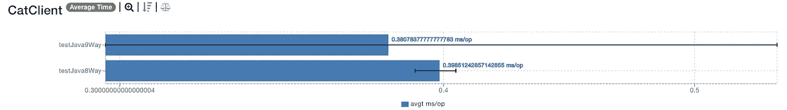
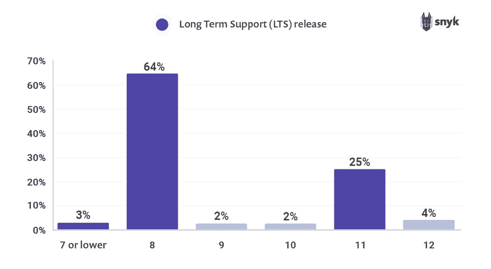

# 你应该知道的 3 个有效的 Java 特性

> 原文：<https://blog.devgenius.io/3-effective-java-features-to-tune-your-java-app-performance-c85c3f77f15c?source=collection_archive---------3----------------------->

## **冥想者应该知道的 3 个有效的 Java 9 特性**


由[瓦达什·马加良斯](https://unsplash.com/@waddasmagalhaes?utm_source=unsplash&utm_medium=referral&utm_content=creditCopyText)在 [Unsplash](https://unsplash.com/s/photos/developer-working?utm_source=unsplash&utm_medium=referral&utm_content=creditCopyText) 拍摄的照片

您缺少关于 HTTP 请求的文档。你在接口中有许多复制粘贴的但是通用的代码。你创建列表，但不知道哪一个是最好的。

我写了很多 Java 8 代码。这些是我的主要障碍。升级到 Java 11 后，这些问题消失了*。*

这里是你应该知道的解决常见 Java 8 问题的三个有效特性。

```
· 1\. [Convenience factory methods for collections (JEP-269)](#9f80)
  ∘ [Problem](#0f3d)
  ∘ [Research](#47b6)
  ∘ [Findings](#8386)
· 2\. [Private interface methods (JEP-213)](#011d)
  ∘ [Problem](#ab6b)
  ∘ [Research](#8d9a)
  ∘ [Findings](#966a)
· 3\. [Carving way for newer HTTP clients (JEP-110)](#bb73)
  ∘ [Problem](#b10d)
  ∘ [Research](#7c6e)
  ∘ [Findings](#ad6d)
· [Takeaway](#e2ca)
· [References](#eca9)
```

# 1.集合的便利工厂方法 [(JEP-269)](https://openjdk.java.net/jeps/269)

## 问题

*定义库 API，以便用少量元素创建集合和映射的实例。减轻 Java 编程语言中没有集合文字的痛苦。—* [*来源*](https://openjdk.java.net/jeps/269)

在 Java 8 中，没有方便的方法来创建小集合。尽管有很多带有帮助方法的库。当你有很多选择时会发生什么？许多选项被随意挑选，导致不一致的代码实践。较新的 Java 版本如何解决这个问题？它们增加了一种简单、方便、高效的创建集合的方式。

```
// new way to create collections
Set<String> set = Set.of("a", "b", "c");
```

另一个问题。*冗长*。向集合中添加元素伴随着高冗长级别。更多的冗长——更多的样板代码。*Java 9 如何减少冗长？Java 9 提供了简单的集合创建方法。在 Java 9 之前，许多样板文件创建了一个简单的集合。*

这是研究和性能测试的结果。

## 研究

这是我对 JEP-269 的补充。我们将使用基准测试,并看到 JEP-269 加速小型集合处理。

*基准* [*要旨*](https://gist.githubusercontent.com/zivce/8f2a3d3be193eac2a00118640407b016/raw/a87761365cca16fc3294938f4817a6d031239cbd/jep-269-benchmark.java) *是什么？*创建收藏的方式不多。当您有一个简单的模型`Cat`时，您需要将它们添加到一个`catsNonJava9Way`中。实例化每一个并在循环中添加它们。当模型很简单，只有一个字符串时，可以删除实例。这就是`catsJava8Way`。`catsJava9Way`展示了一种更新的 Java 方式。

*下面是较新的 Java 如何改进小型集合。*

Java 9 方法的吞吐量更好。没有临时对象的创建。平均时间也是如此。



Java 9 方法的吞吐量要好几百倍



Java 9 方法的平均时间也要好几百倍

*是什么减缓了以前的 Java 方法？临时对象分配。*三分之二的时间花在创造物体上。移除`new Cat`变量可以加快执行速度。避免使用临时变量。分配、垃圾收集和分配它们需要时间。



删除不必要的变量后

Brian Goetz 认为 Java 8 方法弊大于利。会损害代码的可读性和吞吐量，但不会影响平均时间。

我们来做个对比。经过基准测试，Java 9 的平均时间并没有超过 Java 8。*平均时间可以忽略不计，因为它要慢几倍。*



Java 8 在平均时间上优于 Java 9

Java 9 比 Java 8 有更好的吞吐量。这意味着 Java 9 比 Java 8 每秒处理更多的运算。吞吐量显示的差异可以忽略不计。



Java 9 的吞吐量胜过 Java 8

*结论是什么？*根据性能挑选 Java 9 或者 Java 8 没有意义。他们都表现得很好。你应该选择让代码更干净的东西。选择权在你。

```
cats8 = Collections.unmodifiableList(Stream.of("George", "John", "Mack", "Other", "Lorem").collect(Collectors.toList()));
// or this one
cats9 = List.of("George", "John", "Mack", "Other", "Lorem");
```

默认情况下，IntelliJ 建议一种更干净的方式。创建收藏的更简洁方式。



IntelliJ 通知使用 Java 9 方法

*在更大的集合上提供高性能不是我们的目标。重点是小集合。—* [*来源*](https://openjdk.java.net/jeps/269)

JEP-269 并不关注大型收藏。这不是目标。下面是我用来证明这一点的基准。

JEP-269 的非目标—基准

*对于更大的集合，Java 8 的性能优于 Java 9。*



Java 8 甚至比 Java 9+方法表现得更好


[来源](https://www.manypixels.co/gallery)

## 调查的结果

Java 9 给出了一种清晰、简洁、高效的方法来创建集合。所有都遵循相同的 API，例如`List.of`，这使得它更容易使用。根据我的基准，*这将集合的创建速度提高了几百倍。*

在 Java 8 中，更大的集合性能更好。这一变化的目标并不是为了改进大型集合的处理。在基准测试之后，我们看到非目标已经完成。*处理更大的集合没有任何改进。*

# 2.私有接口方法 [(JEP-213)](https://openjdk.java.net/jeps/213)

## 问题

在界面中使用复制粘贴技术。一遍又一遍地复制相似的代码。使用私有方法，您可以将共享代码放在私有方法中。

当你没有私有方法时复制粘贴

Project Coin 在 Java 7 中增加了一些小的增强。现在它被包括在爪哇的 LTS 中。检查 [JEP-213](https://openjdk.java.net/jeps/213) 以获得关于项目硬币的更多细节。

Java 9 中的私有接口方法

## 研究

Java 9 表现更好。我们现在有两个理由使用私有方法:

*   表演
*   代码可读性

你可以查看这篇关于内联的文章。在频繁点击相同的方法后，相同的方法会变得*‘热’。*这使得编译器内联该方法，并且之后执行得更好。


[来源](https://www.manypixels.co/gallery)

*为什么会导致性能提升？*拙见私有方法得到*‘热’*。这里是[的基准](https://gist.github.com/zivce/daedb06e70f1f85cd8f3a25c6dce55c5)结果。



Java 9 中的猫喵喵叫得更好



Java 9 中的猫跑得更快一点

## 调查的结果

使用私有接口方法可以创建简洁的接口。不存在相同代码的复制。*私有方法，持有共享代码，减少代码行数。*

私有方法的另一个好处是性能。Java 9 方法的吞吐量和平均时间更好。*私有方法变得“热门”,平均表现更好。*

# 3.新 HTTP 客户端的雕刻之路 [(JEP-110)](https://openjdk.java.net/jeps/110)

## 问题


[来源](https://www.manypixels.co/gallery)

Brian Goetz 认为旧的 HTTP 请求已经过时了。JDK 1.1 首先增加了对 HTTP 请求的支持。直到 JDK 9，你可以使用弃用的 Gopher 和 FTP。没有 Java 9，HTTP 客户端的效率会很低，因为它包含了很多不推荐使用的特性。

在 Java 9 之前，HTTP 请求不支持 HTTP/2。在未来的 Java 版本中，[*HTTP Client*](https://docs.oracle.com/en/java/javase/11/docs/api/java.net.http/java/net/http/HttpClient.html#newBuilder())*成为 Java 中事实上的 HTTP 客户端。*

旧的本地客户端速度慢，难以使用，并且缺乏文档。您仍然可以找到关于 HTTP 请求的[活动堆栈溢出问题](https://medium.com/r?url=https%3A%2F%2Fstackoverflow.com%2Fquestions%2F2793150%2Fhow-to-use-java-net-urlconnection-to-fire-and-handle-http-requests)。JEP-110 为更好的`HTTPClient`铺平了道路。

## 研究

下面是如何使用新的`HTTPUrlConnection`类。

旧方法——源自对 Java 9 的掌握，稍加修改

这里是*孵化器*T2 的新方法。如今，孵化中的`HTTPClient`是`[java.net.http](https://docs.oracle.com/en/java/javase/13/docs/api/java.net.http/java/net/http/package-summary.html)`的一部分。

我们可以再查一下[这个问题](https://stackoverflow.com/questions/2793150/how-to-use-java-net-urlconnection-to-fire-and-handle-http-requests)。[一个答案](https://stackoverflow.com/a/36932953/5999670)脱颖而出。这是 Java 9 处理 HTTP 的方式。让我们比较一下公认的答案和这个答案。Java 9 方法用更少的代码做更多的事情。

[Java 9 的答案](https://stackoverflow.com/questions/2793150/how-to-use-java-net-urlconnection-to-fire-and-handle-http-requests/36932953#36932953)

`HTTPUrlConnection`没有异步。你需要[绕过](https://stackoverflow.com/questions/11790324/how-to-add-asynctask-in-an-httpurlconnection)让异步到位。随着新的`HTTPClient`，这是内置的。

[来源](https://docs.oracle.com/en/java/javase/13/docs/api/java.net.http/java/net/http/HttpClient.html)

## 调查的结果

`[HTTPClient](https://docs.oracle.com/en/java/javase/13/docs/api/java.net.http/java/net/http/HttpClient.html)`是发出 HTTP 请求的新方式。支持更新的 HTTP，创建简洁的代码，并且是最新的。

`HTTPClient`增加了对异步请求的本地支持。在以前的 Java 版本中，没有异步支持。*当没有本地支持时，开发人员会破解并创建不稳定的解决方案。*

# 外卖食品

较新的 Java 带来了新的方便的方法来创建集合。重点是较小的集合，正如您在我们的性能测试中看到的。*使用 Java 9 静态工厂方法减少了冗长，并且性能更好。*

私有接口方法对我们的接口有积极的影响。现在，您可以提取共享代码并重用它。随之而来的是*性能提升*，因为编译器更喜欢小的共享方法。

布莱恩·戈茨支持更新的`HTTPClient`。这为异步请求铺平了道路。支持较新的 HTTP 版本。最终获得更好的开发者体验。

即使在这些变化之后，*大多数人还是使用 Java 8* 。你应该升级到 Java 11，因为它也提供 LTS。不仅仅是 LTS，还有你在这篇文章中看到的所有特性。



[来源](https://snyk.io/blog/developers-dont-want-to-leave-java-8-as-64-hold-firm-on-their-preferred-release/)

# 参考

*精通 Java 9—Edward Lavieri 博士，Peter Verhas*