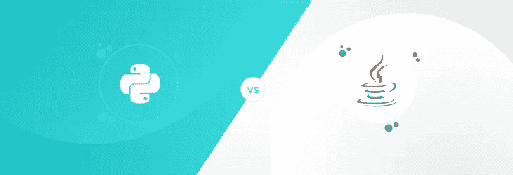
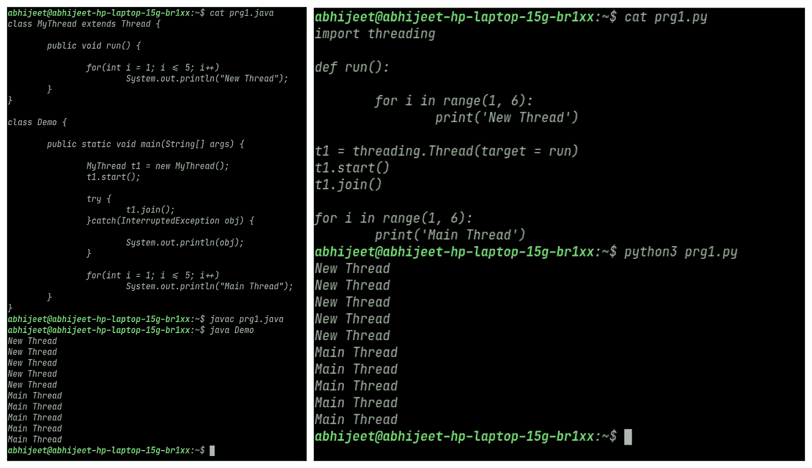
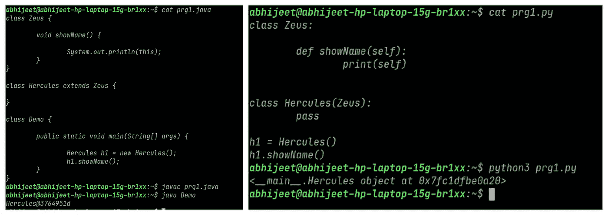
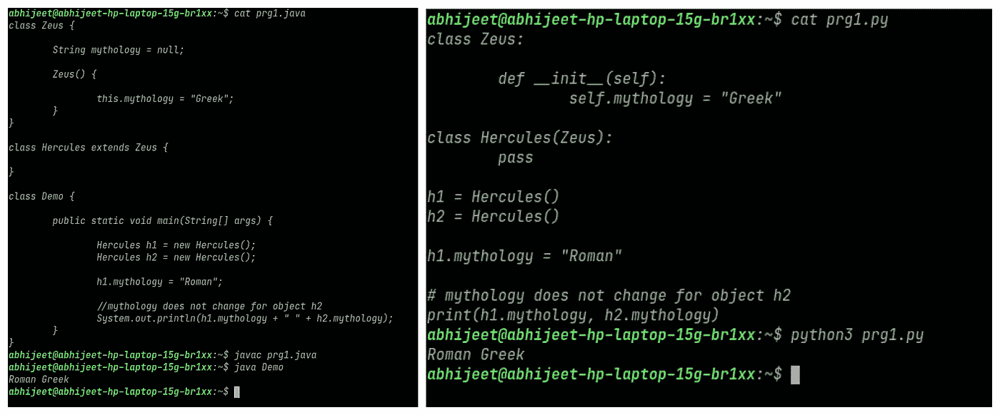
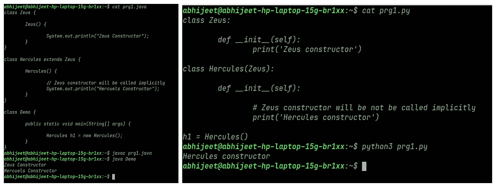
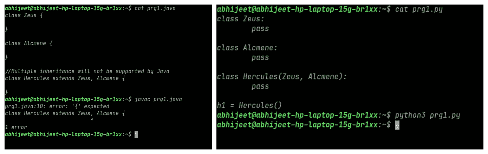
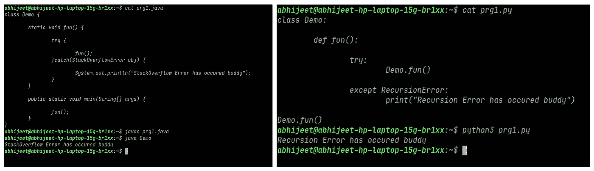

# 3 个 Java 和 Python 相同的例子。

> 原文：<https://blog.devgenius.io/3-instances-when-java-and-python-were-the-same-a504e9e3ca22?source=collection_archive---------5----------------------->

> ***先说 Java 和 Python 不可区分的 3 个实例和完全不同的 2 个实例。***

> ***1。*** 加入方法(相同)

如果一个线程调用任何其他线程的 join 方法，那么调用方线程必须等待被调用线程完成其执行并终止。例如，这里主线程调用了线程 t1 的 join 方法，然后主线程等待线程 t1 完成它(t1 的)执行。并且在主线程的执行恢复之前，主线程等待 t1 线程被终止和杀死。这个 join 属性在 Java 和 Python 中是相同的。

> ***2。本我/自我在继承中的作用(相同)***

当我们用 Java / Python 中的**方法**打印这个/ self 时。打印对象的名称，在其上调用**方法**。例如，这里的方法 showName()属于 Zeus 类，但是当我们在方法 showName 中打印 this / self 时。赫拉克勒斯级的名字印出来了。因为方法 showName 由类 Hercules 继承，并在类 Hercules 的对象上调用。这个/自我的这个角色在两种语言中都是一样的。

> ***3。每个子类实例变量的唯一副本(相同)***

如果存在超类的子类。以及该子类是否有各种对象。那么子类的所有对象都将得到其父类(超类)实例变量的唯一且独立的副本。例如，这里的父类宙斯有实例变量神话。并且有两个子类 Hercules 的对象 h1 和 h2。所以如果 h1 改变 parent(Zeus’)实例变量神话。这种变化不会反映在 h2 中。因为 h1 和 h2 有不同的继承实例变量神话副本。该属性在两种语言中保持不变。

> ***1。调用超类构造函数(不同)***

在 Java 中，每当我们在任何类中编写构造函数时。默认情况下，构造函数的第一行是对超类的构造函数的调用。这是隐性的，而且一直都在发生。但是在 Python 中，当我们在任何类中编写 init 时，默认情况下不会调用超类的 init。

> **2*2。*多重继承(不同)**

在 Java 中，不能创建从多个类继承的类。换句话说，java 不支持多重继承。但是 Python 有。在 Java 中要实现多重继承，只有求助于接口。但是在 Python 中，我们可以直接用类实现多重继承。

> ***加成:堆栈溢出(类似)***

在 java 中，当我们堆栈的时候，框架会不断地被推到 Java 堆栈上，而不会弹出。换句话说，如果我们不停地调用方法，就会导致堆栈溢出错误。我们可以试着抓住它。类似的事情在 Python 中也会发生，但这被称为递归错误。我们可以试着处理，除了