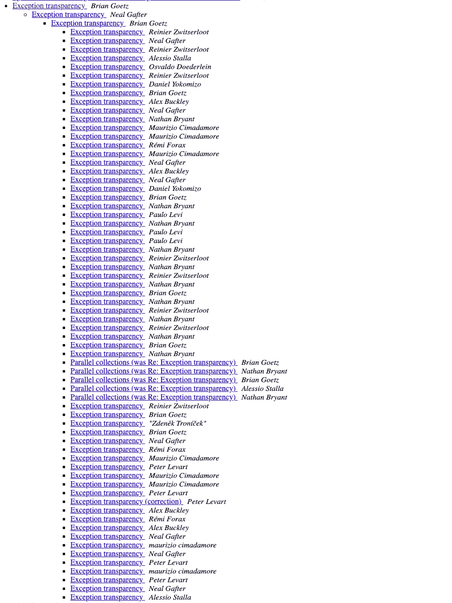

# 3 个专家希望更好的 Java 特性，现在有什么替代方案

> 原文：<https://blog.devgenius.io/3-java-features-experts-wish-would-be-better-and-what-are-the-alternatives-today-d9279bc55d98?source=collection_archive---------7----------------------->

## #3 字符串插值

[亚娜拉·www.freepik.com 创作的商业照片](https://www.freepik.com/photos/business)

你想要的 Java 特性远不止三个。

即便如此，这个故事也只讲几个。 ***打包、流和字符串插值。***

我们将介绍目前可用的产品，以及有哪些替代产品。

让我们开始吧。

# 对目前的包装满意吗？

在 Java 14 之前，没有本地打包工具。我们的意思是你需要在你的系统上安装 JDK/JRE。*没有来自 Java 的点击式可执行构建流程。*

虽然有一个`javapackager`并不是在所有的 JDK 发行版中都有。尽管如此，这是在 JDK 11 号中被移除的。*这个工具就是我们今天的* `*jpackage*` *工具的前身。*

所以在`jpackage`之前，你需要 JRE 或 JDK 来运行应用程序。交付 JDK/JRE 更容易支持更新，并且这种方法的安全性不成问题。

今天有什么活动？jpackage、jdeps 和 jlink。

`[jpackage](https://docs.oracle.com/en/java/javase/14/docs/specs/man/jpackage.html)`首先创建应用程序映像。然后使用这些信息生成本地打包格式(dmg、pkg、exe)。

`jlink`是一个归档员。你可以修改包含的内容，或者删除一些脂肪依赖。你仍然需要将应用程序与运行时打包。没有包装，它只是一个档案。

结合 jlink 和 jpackage 获得自定义运行时。Jlink 受益于模块化 Java。因此，如果没有模块化结构，jlink 可能很难配置。

这里有一个 jlink 和 jdeps 可以提供帮助的真实例子。[乔使用这些工具](https://levelup.gitconnected.com/java-developing-smaller-docker-images-with-jdeps-and-jlink-d4278718c550)创建了一个定制的 JRE。这样做，他削减了大量脂肪或 250 兆脂肪。

***还是，没有交叉编译。*** 你还是需要在 macOS 机器上编译 macOS app。

即使有了 GraalVM 编译器，仍然没有办法交叉编译。Github 动作支持交叉编译。你可以为每个平台创建图像，这里是教程[。 ***即便如此，GraalVM 也没有计划为本地开发加入交叉编译。***](https://github.com/marketplace/actions/github-action-for-graalvm#building-a-helloworld-with-graalvm-native-image-on-different-platforms)

下面是托马斯(甲骨文实验室)[对这个问题的看法:](https://github.com/oracle/graal/issues/407#issuecomment-1188978769)

*“但是，目前还没有计划为不同的操作系统提供这种交叉编译支持，即从 Linux 创建 Windows 二进制文件，反之亦然。总的来说，我们简化本机映像创建的策略更倾向于提供本机映像生成服务，用户可以在其中指定所需的体系结构。”*

下面是交叉编译的问题:
*“在操作系统之间，JDK 或第三方库依赖项的初始化以及最终快照到本机映像的方式可能会有所不同。因此，本机映像的交叉编译问题比 C 程序的交叉编译更难解决。”*

至于优化的容器映像，现在我们有了 Spring Native。还有一个[工具](https://docs.spring.io/spring-native/docs/current/reference/htmlsingle/#executable-jar-to-native)可以将可执行文件 JAR 转换成本机映像。

这方面另一个值得一提的工具是:[GitHub—Google container tools/jib:🏗为您的 Java 应用程序构建容器映像。](https://github.com/GoogleContainerTools/jib)下面是[如何在 maven 项目中使用 jib](https://www.baeldung.com/jib-dockerizing)。Jib 使用图像分层技术，因此构建更加精细和增量。 ***有了 Jib 到位，就不需要 dockerfile 了，一切都是用 Java 构建的。***

***包装 Java 应用仍在探索中。*** 有些[还在争论 Graal JIT vs AOT 的利弊](https://github.com/oracle/graal/issues/1069#issuecomment-473649871)。尽管如此，Java 工具的这一特性仍在不断发展。*我们可以期待未来更多的包装改进，比如* [*莱顿项目*](https://mail.openjdk.org/pipermail/leyden-dev/2022-June/thread.html#42) *。*

***JIT 编译还是会有的。***

因为 [AOT 和 PGO 对于某些应用来说可能很贵](https://github.com/oracle/graal/issues/1069#issuecomment-647672692)。并不是所有东西都可以移植到本机，一个例子就是[巴泽尔构建系统](https://github.com/bazelbuild/bazel/issues/7884)。

# 你如何处理流中的错误？

大多数 Java 开发人员厌倦了在流中使用 try-catch。

因为这是处理检查异常的唯一方法。你会发现很多关于这个问题的帖子。 ***即使到了今天，流中的检查异常处理似乎也被忽略了。***

看看[无休止的对话](https://mail.openjdk.org/pipermail/lambda-dev/2010-June/thread.html#1484)没有给出具体的解决方案。

*您现在可以用什么来缓解这个问题？*

我们可以使用这个库来帮助解决这个问题。
[GitHub—jOOQ/jOOL:jooλ—Java 8 缺失的部分—未检查](https://github.com/jOOQ/jOOL#orgjooqlambdaunchecked)

还有人提议`@SneakyThrows`从龙目岛出发。尽管这是一种无摩擦的方法，但是这个偷偷抛出的异常有一个问题。

*如果你使用@SneakyThrows，你需要处理上游的异常*。换句话说，您无法捕捉用 SneakyThrows 注释的方法抛出的异常。这种处理需要在其他地方进行，可能需要管理员的建议。

另外，SneakyThrows 诱使 javac 生成不可编译的字节码。基本上欺骗 javac 来产生 JVM 不介意运行的字节码。正如`SneakyThrows` [描述中所说的](https://github.com/projectlombok/lombok/blob/master/src/core/lombok/Lombok.java#L30) :
*“异常仍然被抛出——javac 将停止抱怨它。”*

因此在使用前请阅读[小字](https://projectlombok.org/features/SneakyThrows#small-print)。

*Brian Goetz* [*提出*](https://stackoverflow.com/a/27648758) *来包装例外。尽管如此，这看起来更像是样板文件，我们仍然不能抛出检查过的异常。*

第三方的另一个解决方案是 Vavr。 [Vavr 尝试](https://docs.vavr.io/#_try)可以解决这个问题，并且是专门为这个场景设计的。

***不管是哪种，都是用这个特性自己挑毒。在这个问题上，人们做得不多。至少我接触的代码库大多都有 SneakyThrows。 ***SneakyThrows 是邪恶的，但其他替代方案需要更多的第三方依赖。******

# Java 中的字符串插值在哪里？

`String#format`是我们今天拥有的最接近的东西。即便如此，它还是很笨重。您需要添加所有参数并指明它们的类型。

`String#format`的表现值得怀疑。你可以找到一些关于这个问题的帖子[这里](https://stackoverflow.com/questions/29747912/can-i-precompile-the-format-string-in-string-format-or-do-any-other-thing-to-m)那里[那里](https://stackoverflow.com/questions/513600/should-i-use-javas-string-format-if-performance-is-important)。

我们可以感谢 Claes 在 JDK17 中让`String#format`变得更快。

以下是他在 17 版本以下的 Java 中对`String#format`的基准测试。

根据他的更新，我们得到了以下结果。

尽管如此，复杂的格式仍然很慢。但是让我们看看简单的场景。平均而言，这一变化使`String#format`的速度提高了 3 倍。

***在此之前的另一个选项是***)****。****

*宽松仅将字符串识别为输入。你可以在为这个方法编写的[测试](https://github.com/google/guava/commit/7fe1702aeacff37ad4a7aca5d82ac9958e46e639#diff-8150a60b2bcf1a4afddf059f85b35a0dcc0bea9626d2ccc82edebe1cd1a24ef2)中检查它是如何被使用的。*

**随着最近的改进，什么是更快的宽容格式或字符串#格式？*让我们看看[基准](https://gist.github.com/zivce/bf1110a4f0f8b1d8a6fdacbf5dad343d)的结果。*

*如果你需要提高简单日志的性能，我会选择`lenientFormat`。*

*还有其他的选择，但都归结为相同的格式。如果您可以使用 Apache Commons Text，您可以查看[string substitutor(Apache Commons Text 1.9 API)](https://commons.apache.org/proper/commons-text/javadocs/api-release/org/apache/commons/text/StringSubstitutor.html)。*

****今天我们只有这个***[***JEP***](https://openjdk.org/jeps/8273943)***作为 Java 中字符串插值的前驱。****

**在评论里让我知道你用 Java 的痛点。**