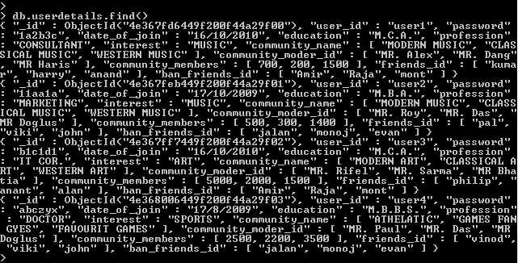
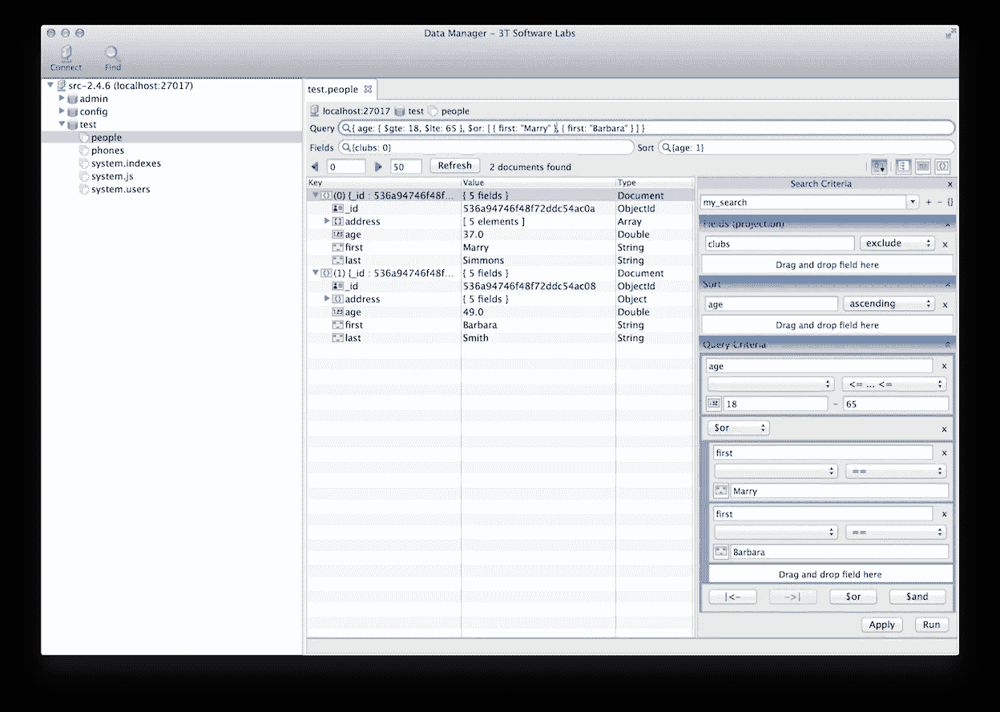
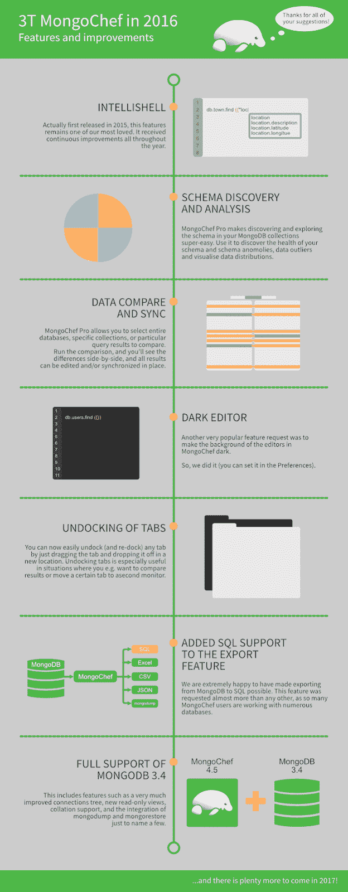
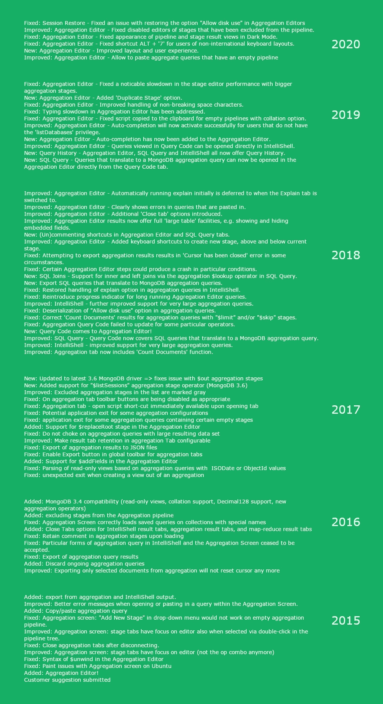
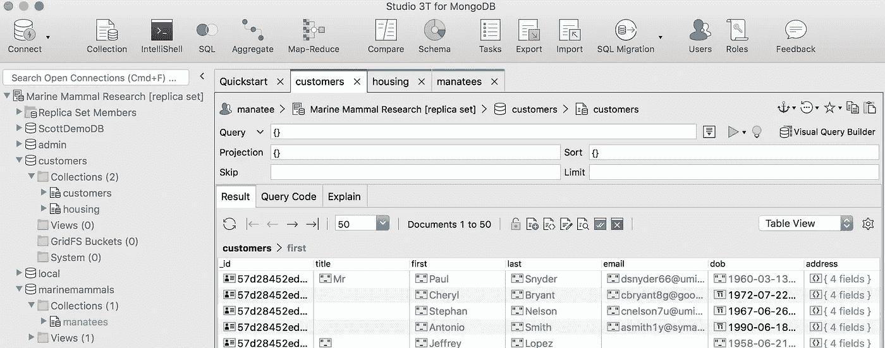

# 7 年来为 MongoDB 构建 GUI 的 3 个教训

> 原文：<https://blog.devgenius.io/3-lessons-from-7-years-of-building-a-gui-for-mongodb-67393d33d16d?source=collection_archive---------7----------------------->

## 如何为整个团队打造一个工具？抓抓，听听，然后努力做些小事情。

搜索“mongodb gui ”,你会看到一个完整的搜索结果页面，包括广告、列表和工具选项。

2013 年的情况并非如此。

当时我们是 SQL 用户，他们喜欢我们在 MongoDB 上看到的东西，这是 2007 年推出的新的 NoSQL 数据库。

我们喜欢数据库本身的易用性和灵活性，但是 mongo shell 可能非常耗时，而且当时可用的工具也达不到要求。

一个不太漂亮的 mongo shell(图片:w3resource)

因此，我们构建了 3T 数据管理器，它与 Schema Explorer 和 Data Compare & Sync 一起被整合到 MongoChef 中。

然后在 2017 年，MongoChef 变成了我们今天的样子: [Studio 3T](https://studio3t.com/) 。

我们已经看到第三方工具空间与 MongoDB 一起成长。这个独立软件供应商(ISV)生态系统的增长是 MongoDB 成长为价值数十亿美元的公司的原因之一。

以类似的有机方式，Studio 3T 特性集也变得更加广泛和强大。

我们如何决定构建和改进什么？我们倾听我们的痛点和我们的客户。然后对小事情发汗。

# 第一课:搔自己的痒处

> "如果你对你产品的第一个版本不感到尴尬，那你推出得太晚了."
> 
> 领英联合创始人里德·盖瑞特·霍夫曼

在最初的几个月里，我们公开但低调地发布了我们的软件，完善了源于我们自身痛点的核心功能:

*   我们需要一个多平台工具
*   查看数据是一场噩梦，MongoDB 缺少合适的 GUI
*   比较两个收藏是不可能的
*   没有办法调试集合并发现模式中的错误
*   mongo shell 可以好得多

终于在 2014 年 5 月，[我们向全世界公布了 3T 数据管理器](https://news.ycombinator.com/from?site=3tsoftwarelabs.com)。

2014 年 Studio 3T(当时的 3T 数据管理器)

作为一个“MongoDB 的就地数据浏览器和编辑器 GUI”，它已经拥有了至今仍保留在 Studio 3T 中的关键核心特性:

*   就地数据编辑—双击要编辑的单元格
*   可视化查询构建器—拖放式 MongoDB 查询生成
*   表、树和 JSON 视图——查看集合的灵活方式
*   模式资源管理器—简单的模式分析
*   数据比较和同步—并排比较两个 MongoDB 集合

到 2014 年 9 月，我们开始[通过 Uservoice 收集客户反馈](https://3t-io.uservoice.com/forums/265122-share-your-ideas-with-us/filters/top)，我们现在仍在使用。

2016 年 3T 工作室(当时的 MongoChef)

# 第二课:倾听客户

特性是从痛点中诞生的——这就是我们最初为 MongoDB 构建 GUI 的原因——我们的客户在塑造 Studio 3T 的过程中发挥了重要作用，当他们感到恼火时，他们不会退缩。

我们会回复每封支持电子邮件和客户票证，在会议上与用户交谈，并定期召开 UX 会议，以更好地了解哪些有效，哪些无效，以及缺少什么。

用户知道什么会惹恼他们。但是他们并不总是知道解决方案。那是我们的工作。

自 2014 年 9 月我们开始使用 Uservoice 以来，我们已经收到了大约 520 份客户票证，其中:

*   214 项已经完成
*   42 项正在审查中
*   已经计划了 15 个
*   11 个被拒绝
*   5 个已经开始

但是，这 520 个请求与我们每天通过支持收件箱、UX 会议、客户调查和我们参加的会议(现场和面对面)收到的反馈相比就相形见绌了，所有这些都将被记录下来，以供未来的版本考虑。

# 第三课:从小事做起

如果您使用 Studio 3T，这里有几个您可能认识的特性——这是 MongoDB 工具空间中的第一个特性，后来被许多其他人复制——它们直接来自客户票证:

*   [聚合管道建造商](https://3t-io.uservoice.com/forums/265122-share-your-ideas-with-us/suggestions/7597014-add-gui-support-for-aggregation-framework-in-mongo)
*   [任务调度](https://3t-io.uservoice.com/forums/265122-share-your-ideas-with-us/suggestions/33329998-task-scheduler-in-ui-to-run-queries-and-extract-re)
*   SQL 和 MongoDB 数据库之间的迁移(现在也支持 [IBM DB2](https://3t-io.uservoice.com/forums/265122-share-your-ideas-with-us/suggestions/39956875-db2-sql-connection) 和 Sybase)
*   [查询代码的开端，从 MongoDB & SQL 查询生成代码(现在支持](https://3t-io.uservoice.com/forums/265122-share-your-ideas-with-us/suggestions/7111184-have-an-easy-way-to-get-a-javascript-version-of-th) [PHP](https://3t-io.uservoice.com/forums/265122-share-your-ideas-with-us/suggestions/34061161-in-the-section-query-code-add-php-language)
*   [将 MongoDB 导出为 CSV](https://3t-io.uservoice.com/forums/265122-share-your-ideas-with-us/suggestions/6732910-allow-export-to-csv)
*   [会话恢复](https://3t-io.uservoice.com/forums/265122-share-your-ideas-with-us/suggestions/15664035-save-entire-session)
*   [颜色编码连接](https://3t-io.uservoice.com/forums/265122-share-your-ideas-with-us/suggestions/19588741-color-coding-connection-by-server-type)

这些小东西——节省时间的热键、快捷方式、菜单选项、逻辑放置的按钮——我们的用户已经标记了多年:

*   并排查看收藏选项卡
*   [在表格视图中显示嵌入字段](https://3t-io.uservoice.com/forums/265122-share-your-ideas-with-us/suggestions/9282513-table-view-array-object-head-as-field1-field2)
*   轻松[导入和导出连接细节](https://3t-io.uservoice.com/forums/265122-share-your-ideas-with-us/suggestions/10526688-export-data-from-connection-manager)以便快速团队共享
*   允许[更灵活的模式](https://3t-io.uservoice.com/forums/265122-share-your-ideas-with-us/suggestions/7248435-allow-more-flexible-modes-of-entering-queries-pro)输入查询、投影字段和排序字段
*   添加方式为 [load `.mongorc.js`](https://3t-io.uservoice.com/forums/265122-share-your-ideas-with-us/suggestions/7693170-add-way-to-load-mongorc-js-perhaps-per-connecti)
*   [导出完整的数据库](https://3t-io.uservoice.com/forums/265122-share-your-ideas-with-us/suggestions/8323809-export-full-databases-not-only-collections)，而不仅仅是集合
*   当导出到另一个集合时，能够[“覆盖具有相同 id 的现有文档”](https://3t-io.uservoice.com/forums/265122-share-your-ideas-with-us/suggestions/6589802-offer-the-choice-to-overwrite-existing-documents)
*   显示[查询执行时间](https://3t-io.uservoice.com/forums/265122-share-your-ideas-with-us/suggestions/8083500-output-time-of-query-execution)， [show _id 为时间戳](https://3t-io.uservoice.com/forums/265122-share-your-ideas-with-us/suggestions/8861287-option-to-show-id-as-a-time-stamp-via-generation)
*   能够[重命名 MongoDB 字段](https://3t-io.uservoice.com/forums/265122-share-your-ideas-with-us/suggestions/20013535-field-renaming)，改进了[的复制/粘贴行为](https://3t-io.uservoice.com/forums/265122-share-your-ideas-with-us/suggestions/8124963-right-click-copy-value-not-field-name-and-value)
*   使[为连接定义可信的自签名 SSL 证书](https://3t-io.uservoice.com/forums/265122-share-your-ideas-with-us/suggestions/9891951-make-it-possible-to-define-a-trusted-self-signed-s)成为可能
*   [突出显示匹配(或不匹配)的括号](https://3t-io.uservoice.com/forums/265122-share-your-ideas-with-us/suggestions/9150094-highlight-matching-or-unmatched-brackets-parent)，圆括号等。在编辑器中
*   打开 IntelliShell [用一个空白的 find()查询](https://3t-io.uservoice.com/forums/265122-share-your-ideas-with-us/suggestions/10664136-right-click-on-collection-and-select-intellishell)，能够[导出结果](https://3t-io.uservoice.com/forums/265122-share-your-ideas-with-us/suggestions/8987350-export-from-intellishell)
*   [自动重新连接](https://3t-io.uservoice.com/forums/265122-share-your-ideas-with-us/suggestions/9807051-auto-reconnect#%7Btoggle_previous_statuses%7D)断开时，[恢复丢失的连接](https://3t-io.uservoice.com/forums/265122-share-your-ideas-with-us/suggestions/8765893-allow-recovering-of-lost-connection)
*   能够[为每个连接配置 mongo shell 可执行文件](https://3t-io.uservoice.com/forums/265122-share-your-ideas-with-us/suggestions/10831434-intellishell-configuration-per-db-connection)
*   打开和关闭可视化查询构建器中的[查找、投影和排序选项](https://3t-io.uservoice.com/forums/265122-share-your-ideas-with-us/suggestions/37155403-allow-find-project-and-sort-drop-down-selections)
*   [不是迁移 SQL 表，而是迁移 SQL 查询结果](https://3t-io.uservoice.com/forums/265122-share-your-ideas-with-us/suggestions/38457655-add-source-query-filter-capability-to-sql-migratio)
*   选择[复制和粘贴聚集阶段](https://3t-io.uservoice.com/forums/265122-share-your-ideas-with-us/suggestions/37092379-add-copy-paste-or-duplicate-stage-to-aggregation)，增加对[附加聚集阶段](https://3t-io.uservoice.com/forums/265122-share-your-ideas-with-us/suggestions/19475308-handle-replaceroot-aggegration-stage)的支持，能够[导出结果](https://3t-io.uservoice.com/forums/265122-share-your-ideas-with-us/suggestions/10003023-add-export-for-aggregate-queries)，以及[暂时禁用管道阶段](https://3t-io.uservoice.com/forums/265122-share-your-ideas-with-us/suggestions/10627905-option-to-temporarily-disable-individual-pipeline)
*   [能够在数据库/收藏/文档放置确认对话框中看到服务器名称](https://3t-io.uservoice.com/forums/265122-share-your-ideas-with-us/suggestions/9668880-server-name-in-database-collection-document-drop-c)
*   按字母顺序排列的[下拉菜单选项](https://3t-io.uservoice.com/forums/265122-share-your-ideas-with-us/suggestions/38321608-in-field-edit-dialogbox-entries-in-type-list-pull)
*   允许模式浏览器查询被[编辑并重新运行](https://3t-io.uservoice.com/forums/265122-share-your-ideas-with-us/suggestions/32040667-allow-schema-analysis-queries-to-be-edited-and-re)
*   [更直观](https://3t-io.uservoice.com/forums/265122-share-your-ideas-with-us/suggestions/20236054-in-tree-view-double-clicking-anywhere-on-row-ex)在树形视图中双击 UX
*   [UUID 表示](https://3t-io.uservoice.com/forums/265122-share-your-ideas-with-us/suggestions/35830960-option-to-choose-uuid-representation-in-json-view)在 JSON 视图中，[复制 UUID 的能力](https://3t-io.uservoice.com/forums/265122-share-your-ideas-with-us/suggestions/8548066-ability-to-copy-uuids-in-chosen-representation)在选择的表示中
*   [将连接](https://3t-io.uservoice.com/forums/265122-share-your-ideas-with-us/suggestions/32540131-folder-for-connection-manager)分组到[文件夹](https://3t-io.uservoice.com/forums/265122-share-your-ideas-with-us/suggestions/12848757-improve-organisation-of-connections-in-connection)，[点击标题即可轻松排序](https://3t-io.uservoice.com/forums/265122-share-your-ideas-with-us/suggestions/34764613-add-sorting-to-the-connections-window-table)，而[则按名称过滤](https://3t-io.uservoice.com/forums/265122-share-your-ideas-with-us/suggestions/16092223-filter-collections-by-name)
*   在连接中支持[只读模式](https://3t-io.uservoice.com/forums/265122-share-your-ideas-with-us/suggestions/32738137-read-only-mode)
*   [在查询编辑器中切换注释特性](https://3t-io.uservoice.com/forums/265122-share-your-ideas-with-us/suggestions/34265512-add-a-toggle-comment-feature-to-code-editor)、[代码格式](https://3t-io.uservoice.com/forums/265122-share-your-ideas-with-us/suggestions/32150941-add-a-json-formatter-to-the-json-editor)和 Cmd+【和 Cmd+】[缩进和缩进](https://3t-io.uservoice.com/forums/265122-share-your-ideas-with-us/suggestions/35329963-allow-for-cmd-and-cmd-indent-and-de-dent-in-qu)
*   [隐藏工具栏](https://3t-io.uservoice.com/forums/265122-share-your-ideas-with-us/suggestions/37039828-ability-to-toggle-the-top-toolbar) =为数据争论获得(更多)空间
*   支持用于 SSH 隧道认证的 [Ed25519 密钥](https://3t-io.uservoice.com/forums/265122-share-your-ideas-with-us/suggestions/12423318-support-for-ed25519-keys-for-ssh-tunnels-authentic)
*   对[复制集合](https://3t-io.uservoice.com/forums/265122-share-your-ideas-with-us/suggestions/12370224-copying-collections-to-a-remote-destination-server)的改进(现在[也复制索引](https://3t-io.uservoice.com/forums/265122-share-your-ideas-with-us/suggestions/11612445-copy-collection-with-indexes)
*   [在比较集合时，指定用户定义的唯一 ID](https://3t-io.uservoice.com/forums/265122-share-your-ideas-with-us/suggestions/7571766-data-compare) 来代替对象 ID，增加了对多个/所有集合的[同步](https://3t-io.uservoice.com/forums/265122-share-your-ideas-with-us/suggestions/6848748-synchronisation-at-all-levels)
*   支持[其他 GridFS 类型](https://3t-io.uservoice.com/forums/265122-share-your-ideas-with-us/suggestions/6605361-mongochef-support-other-id-types-in-gridfs)
*   人类可读的[数据大小](https://3t-io.uservoice.com/forums/265122-share-your-ideas-with-us/suggestions/7214750-make-data-sizes-human-readable-mb-gb-tb-etc)，更好的[窗口位置行为](https://3t-io.uservoice.com/forums/265122-share-your-ideas-with-us/suggestions/7184528-the-mongochef-app-doesn-t-remember-its-window-posi)
*   [多](https://3t-io.uservoice.com/forums/265122-share-your-ideas-with-us/suggestions/34420066-shortcut-key-for-comment-a-line-in-sql-editor)、[多](https://3t-io.uservoice.com/forums/265122-share-your-ideas-with-us/suggestions/32385853-support-tabs-navigation-with-default-hotkeys-on-ma)、[多](https://3t-io.uservoice.com/forums/265122-share-your-ideas-with-us/suggestions/8538733-general-hokeys-f5-ctrl-w)热键
*   [许多](https://3t-io.uservoice.com/forums/265122-share-your-ideas-with-us/suggestions/10273647-inline-patch-upgrade)，[许多](https://3t-io.uservoice.com/forums/265122-share-your-ideas-with-us/suggestions/8038059-self-updater)，[许多](https://3t-io.uservoice.com/forums/265122-share-your-ideas-with-us/suggestions/6538404-automatic-updates)请求自动更新

有时甚至可能与功能无关。我们关心应用程序的感受，就像我们关心它的表现一样。

这意味着当用户要求一个黑暗模式时，[我们建立一个](https://3t-io.uservoice.com/forums/265122-share-your-ideas-with-us/suggestions/11600736-theme-support-please-black-background-would-be-ni)——我们将不断迭代，直到它尽可能好。

当我们得到反馈说我们的应用程序感觉像是“T0”卡在了时间机器里，我们[与时俱进](https://studio3t.com/whats-new/release-2020-6/)。

当[我们的偶像被叫到](https://3t-io.uservoice.com/forums/265122-share-your-ideas-with-us/suggestions/7077304-great-app-ugliest-icon-in-the-world-however)的时候，我们就开始努力。

休·海牛的进化

当涉及到我们的关键功能时，我们努力使它们变得更好，即使这意味着将它们拆开。第一个 [MongoDB 聚合管道构建器](https://studio3t.com/knowledge-base/articles/mongodb-aggregation-framework/)聚合编辑器就是一个很好的例子。

我们最近在 2020 年 2 月重新设计的核心功能在 2015 年 4 月作为[客户功能建议](https://3t-io.uservoice.com/forums/265122-share-your-ideas-with-us/suggestions/7597014-add-gui-support-for-aggregation-framework-in-mongo)开始，并迅速成为人们的最爱。它为用户节省了大量时间。

> “3T 工作室对我来说是最好的。只需 30 分钟，我就可以在构建聚合查询时获得一整天的工作量。”
> 
> Orange 的开发工程师 Pierre Yves Folens

但我们只能重建它，这要感谢我们的用户，他们指出了我们可以改进的小东西，这些小东西现在是聚合编辑器 UX 不可或缺的一部分。

聚合编辑器的历史

# 现在和未来

2020 年的 3T 工作室

七年后， [Studio 3T 特性列表继续增长](https://studio3t.com/features/)，因为我们对我们的关键核心特性进行了改进。

为什么我们现在要写我们的产品开发方法？

因为一个又一个发布说明，我们发现自己只强调了新特性，减少了对几个要点的修复和改进，而将其余的隐藏在我们的[变更日志](https://files.studio3t.com/changelog/changelog.txt)中。

因此，我们在最新发布的[中打破常规，将焦点重新放在过去七年中做出所有改变的小事情上——并继续计数。](https://studio3t.com/whats-new/release-2020-6/)

最后，我们想对那些花时间告诉我们什么时候需要改进的客户大声疾呼。正是这些人让 Studio 3T 成为了一种享受:

安德烈亚斯·克罗尔 (T0) 马克·海格 (T1) 克里斯·丹尼尔斯 (T1) 克里斯·帕金森 (T3) 托马斯·英汉姆 (T4) 克劳斯·尼尔森 (T5) 柯克·塞夫奇克 (T6) 维克多·席尔瓦 (T7) Ed Lomonaco (T8) Dmitry Khokhlov (T9) 阿尔扬·基曼 (T9) 奥斯汀·霍姆斯 (T10) 安德鲁·麦克斯韦尔 (T12) Gerhard Pretorius (T13) Priyanka Baviskar (T14) 瓦伦丁·斯拉维奇克 (T14) 大卫·亨德森 (T16) Alex Ilyaev (T17) Dave Smith (T18) Aytek Ustundag )(他)(们)(们)(都)(不)(知)(道)(,)(我)(们)(还)(不)(知)(道)(,)(我)(们)(还)(是)(不)(知)(道)(,)(我)(们)(还)(是)(不)(知)(道)(,)(我)(们)(还)(是)(不)(知)(道)(,)(我)(们)(们)(还)(是)(不)(知)(道)(,)(我)(们)(们)(还)(是)(不)(知)(道)(,)(我)(们)(们)(还)(不)(知)(道)(,)(我)(们)(们)(还)(不)(能)(不)(知)(道)(,)(我)(们)(还)(不)(能)(不)(知)(道)(理)(,)(我)(们)(们)(还)(不)(能)(不)(知)(道)(理)(,)(我)(们)(们)(

and countless others :)