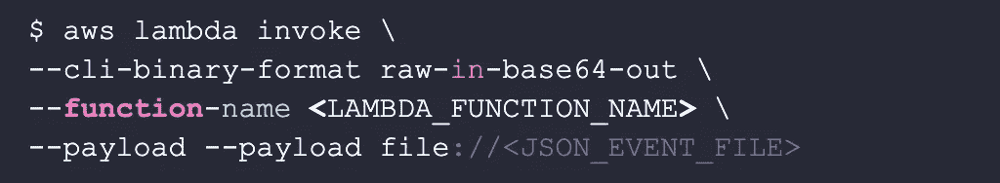
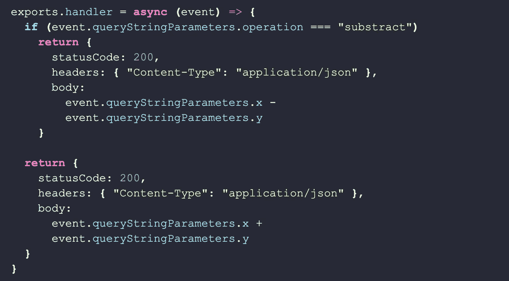
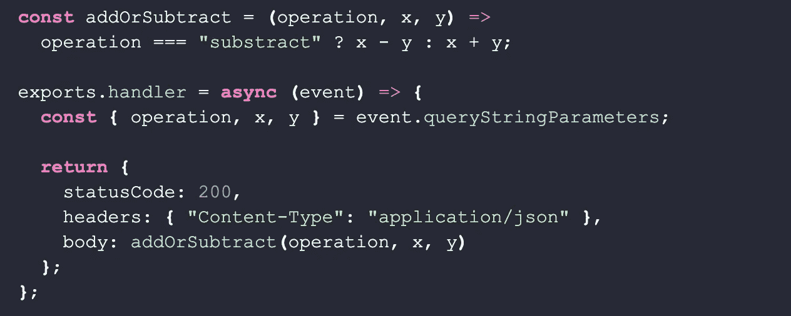
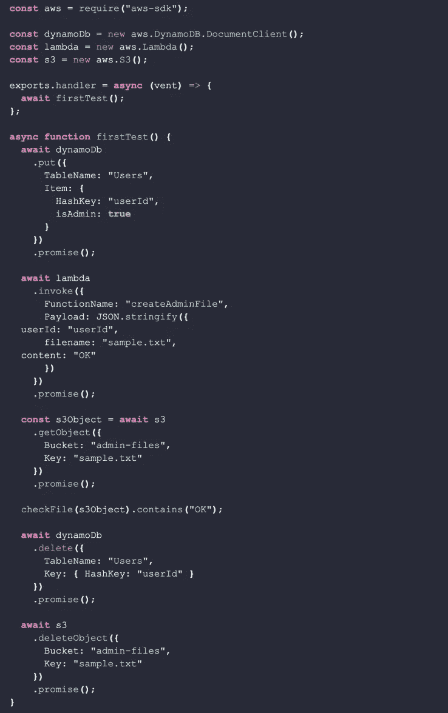
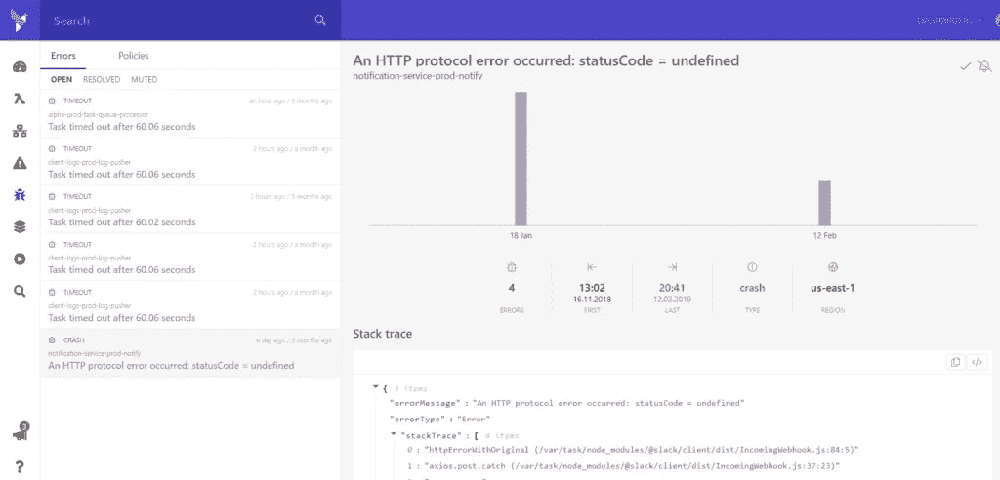

# 测试 JavaScript Lambda 函数的 3 种方法

> 原文：<https://blog.devgenius.io/3-methods-for-testing-javascript-lambda-functions-e76d66663729?source=collection_archive---------2----------------------->

本文将讨论测试 AWS Lambda 函数的不同选项；重点将放在 JavaScript 上。

[功能即服务](https://dashbird.io/blog/what-is-faas-function-as-a-service/) (FaaS)像 AWS Lambda 这样的产品是软件开发的福音。他们**消除了后端基础设施的设置和维护带来的许多问题**。随着大量前期工作从流程中去除，他们还降低了开始新服务的门槛，并鼓励软件系统的模块化和封装。

**测试分布式系统**和**无服务器云基础设施**一直是长时间讨论的来源。有些人更喜欢**本地方法**来模拟你自己代码周围的一切，因为它给了你快速的迭代。其他人说这给了你一种错误的安全感，因为当你部署到你的生产环境中时，你并没有真正测试实际的服务。

# 需要测试什么？

首先，**你自己的代码**，很明显。

但是架构中 FaaS 真正闪耀的主要部分是集成代码。Lambda 可以被视为 AWS 和其他供应商提供的所有托管服务之间的通用粘合剂。因此，**测试的主要焦点不仅仅是你的代码**，还有它**如何与不同的服务**集成。拥有一个只读取事件并写入输出的 Lambda 将是一种罕见的情况；通常，它将访问一个或多个其他服务，如 S3、阶跃函数或 RDS。

# 烟雾测试

冒烟测试是一种简单明了的测试。他们只是检查你的代码在你试图运行它的时候没有崩溃。这意味着冒烟测试**不会检查你的代码是否正确工作**。可能是你在某个 if 分支中有一个 bug，而这个 bug 没有在测试中执行。它也不测试逻辑问题。

就网络服务器而言，冒烟测试意味着启动服务器。没有请求被发送到服务器；刚刚启动服务器，看看它是否崩溃。这很容易做到，如果失败了，您可以节省运行任何其他测试的时间。

对于 **Lambda** ，启动和处理一个事件的动作是一样的，因为 Lambda 只有在处理一个事件的时候才会运行，并且在完成工作之后就会被冻结或者退休。这意味着冒烟测试意味着**向 Lambda 函数**发送一个事件，看看它是否抛出一个错误。最简单的甚至是你认为你的 Lambda 函数应该能够处理的。

可以通过 AWS CLI 使用以下命令进行冒烟测试:

*在这里* *找到可复制的代码片段* [*。*](https://dashbird.io/blog/test-javascript-lambda-functions/)

出于自动化的目的，您可以将这样的 CLI 命令添加到 bash 脚本中，并在其他测试运行之前简单地执行它。

# 单元测试

单元测试比冒烟测试稍微复杂一点，因为它们实际上是测试你的函数的逻辑。由于大多数错误通常发生在将您的代码与其他服务集成时，与集成测试相比，它们不会带来太大的价值。

但有时，在 Lambda 函数中有非常复杂的逻辑，不需要访问其他服务。如果它访问其他服务，与它们的交互是非常基本的。

为了进行单元测试，你的第一步是**提取你想要测试的逻辑**到一个 JavaScript 模块中。

让我们看看下面这个 Lambda 函数的例子，它根据一个操作参数将两个数相加或相减。

*在这里* *找到可复制的代码片段* [*。*](https://dashbird.io/blog/test-javascript-lambda-functions/)

这是一个虚构的例子，但是这个函数比它需要的更难测试。我们将不得不创建一个包含`queryStringParameters`字段的事件对象，这将要求出现一个`operation`、`x`和`y`字段。

如果我们将这种逻辑封装在一个只需要三个参数的普通 JavaScript 函数中，事情会更简单。

*在这里* *找到可复制的代码片段* [*。*](https://dashbird.io/blog/test-javascript-lambda-functions/)

在这个重构的例子中，我们现在可以独立于 Lambda 处理函数来测试逻辑。

# 集成测试

集成测试是测试 FaaS 最重要的部分。之前说过，我再重复一遍， **AWS Lambda** 大多用于**粘合托管云服务**，你的 Lambda 函数与其他服务交互的部分是**最关键的测试目标**。

现在，有两种主要的集成测试方法:

*   使用真实基础设施进行测试
*   通过模拟基础设施进行测试

他们都有各自的优点和缺点。例如，如果用**模拟的**基础设施测试**更快更便宜**，但是如果你的模拟是错误的，你的测试也是错误的。用真实的基础设施进行测试会给你更多的信心，但是会花费更多的钱，而且如果你需要为每一次测试运行提供基础设施的话，测试会很慢。

此外，在编写集成测试时“没有免费的午餐”。当您不必干预真实的基础设施时，您可能节省的时间将用于更新您的模拟基础设施。马丁·福勒写了[一篇很棒的文章](https://martinfowler.com/articles/mocksArentStubs.html#TheDifferenceBetweenMocksAndStubs)关于模拟考试的一切。

# 使用真实基础设施进行测试

只有当你使用基础设施作为代码工具时，用真实的基础设施进行测试才有意义。否则，手动配置资源会浪费太多时间。尤其是无服务器应用程序倾向于包含许多小型服务。

AWS 提供了多种 IaC 工具: [CloudFormation](https://aws.amazon.com/cloudformation/) 、 [SAM](https://aws.amazon.com/serverless/sam/) 和[CDK](https://aws.amazon.com/cdk/)是其中几个与 AWS 生态系统很好集成的工具。

当您准备好您选择的工具时，您就可以使用它来部署一个 IaC 定义的测试和生产。这样，您可以确保您的测试环境与生产环境相匹配。

现在，测试将检查 Lambda 函数的输入和输出。

例如，对于一个 Lambda 的**同步调用，它发生在 API-Gateway 中，这意味着进入您的 Lambda 函数的事件和该函数返回的响应。对于**异步调用**，没有返回值。**

这些测试中更有趣的部分是**你的函数如何访问其他服务**。如果您的函数从 DynamoDB 中读取一些数据进行身份验证，在它开始工作之前，您需要检查这些数据是否可访问，并在运行测试之前纠正**。如果你写信给 S3，你必须访问 S3 来检查运行测试**后一切是否正常**。**

您可以使用相同的 [AWS SDK for JavaScript](https://docs.aws.amazon.com/sdk-for-javascript/v3/developer-guide/installing-jssdk.html) 在您的测试中检查这些服务。如果您选择在 AWS Lambda 上运行测试，它甚至会被预装。

让我们看看这样一个集成测试会是什么样子:

*在这里* *找到可复制的代码片段* [*。*](https://dashbird.io/blog/test-javascript-lambda-functions/)

这个例子是一个测试另一个 Lambda 函数的 **Lambda 函数** **。它在 DynamoDB 表中创建一个具有 admin 权限的用户文档。然后它调用带有事件参数的 Lambda 函数。调用该函数后，它检查是否在 S3 创建了一个文件。最后，它清理所有与测试相关的数据。**

这只是一个基本的实现，包括像 tape 这样的测试框架来使事情变得更方便。但是它说明了即使一个简单的集成测试需要什么才能工作。

你可以测试，重新测试所有你想要的应用程序，但是一旦那个婴儿上线，s*#@就会发生。事情就是这样。您将能够使用 [Dashbird](https://dashbird.io/) 的功能视图来查看您的应用程序的运行情况，当应用程序出现问题时，您将能够使用事件管理平台来查看问题的具体内容和位置。

# 结论

这篇文章只谈了三种测试你的功能的基本方法:

*   烟雾测试
*   单元测试
*   集成测试。

甚至有更多的测试类型有更大的范围，如 E2E 测试或测试你的功能的特定行为，如性能测试。

为了开始，你应该准备好进行**冒烟和集成测试**。确保您的 Lambda 在调用开始时不会崩溃，然后测试它实际上是否准确地使用了其他服务。

如果您有非常复杂的 Lambda 函数用于特定的逻辑，而不仅仅是集成多个服务，那么尝试封装该逻辑并运行单元测试。这样可以迭代的更快更便宜。

*延伸阅读:*

如何测试无服务器应用？

[基于日志的 AWS Lambda 监控](https://dashbird.io/blog/log-based-monitoring-for-aws-lambda/)

[确定云资源规模时要避免的 10 个错误](https://dashbird.io/blog/sizing-cloud-resources-mistakes/)

[为什么无服务器应用会失败，如何设计弹性架构？](https://dashbird.io/blog/why-serverless-apps-fail-and-how-to-design-resilient-architectures/)