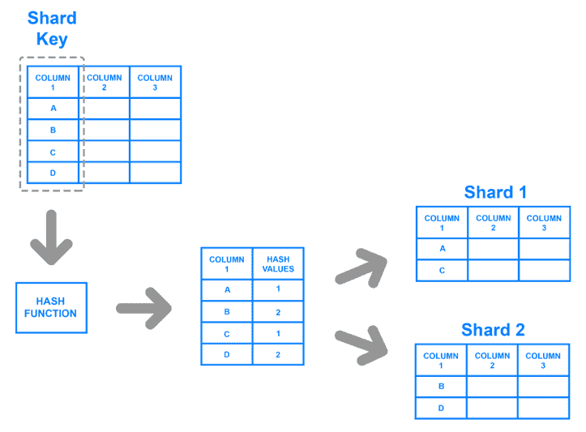
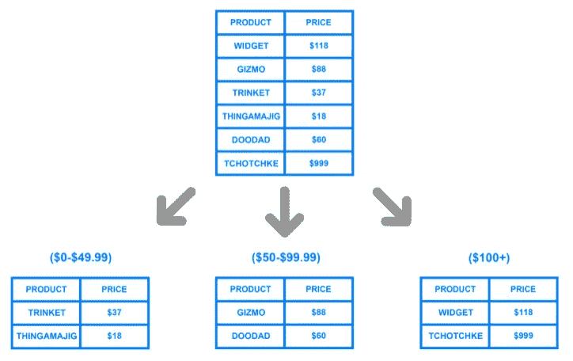

# 2 分钟数据库分片介绍

> 原文：<https://blog.devgenius.io/3-min-intro-of-database-sharding-28e0a587d41f?source=collection_archive---------8----------------------->

照片由[法比奥](https://unsplash.com/@fabioha?utm_source=medium&utm_medium=referral)在 [Unsplash](https://unsplash.com?utm_source=medium&utm_medium=referral) 上拍摄

数据库分片是系统设计中的一个重要概念，也是采访中经常提到的话题。无论您的专业是什么，前端、基础架构还是移动。这是值得有个像样的认识的东西。

# 定义

分片是将数据分割成更小的块(或碎片)，每个碎片可以在不同的机器上。

# 为什么要切分？

*   数据太大，无法将所有内容都保存在一台机器的一个表中。例如，用户的推文，每天都有数百万条新推文产生。
*   系统需要分布式处理来加快数据处理性能

# 什么时候切分？

*   数据库读/写操作的数量将超过单个数据库节点的限制，这将导致**更慢的响应时间或超时。**
*   您的数据增长将**超过单个数据库节点的存储容量**。

# 实施水平

*   应用程序级:应用程序包括定义向哪个碎片传输读写数据的代码。
*   数据库级:路由/配置逻辑在数据库内部实现，分片对应用程序是透明的。DB 像 HBase，Cassandra 支持分片。

# 分片策略

**基于密钥的散列法**

*   也称为“**基于哈希的**
*   计算碎片键字段值的散列。根据散列碎片键值，为每个碎片分配一个范围
*   虽然一系列碎片键可能“接近”，但它们的散列值不太可能在同一个块上。所以通常情况下，数据平均分布在不同的键上

图片来自[数字海洋](http://digitalocean.com)

**基于范围的散列法**

*   根据分片键值将数据划分到不同的范围。基于分片键值，每个块被分配一个范围
*   一系列值“接近”的分片键更有可能驻留在同一个块上
*   这允许有针对性的操作

图片来自[数字海洋](http://digitalocean.com)

# 分片的缺点

*   在数据库架构中实现分片很复杂，并且增加了系统的复杂性。
*   数据将被不均匀地分布到不同的碎片中，并且需要随着时间的推移重新平衡
*   并非所有数据库引擎都支持分片