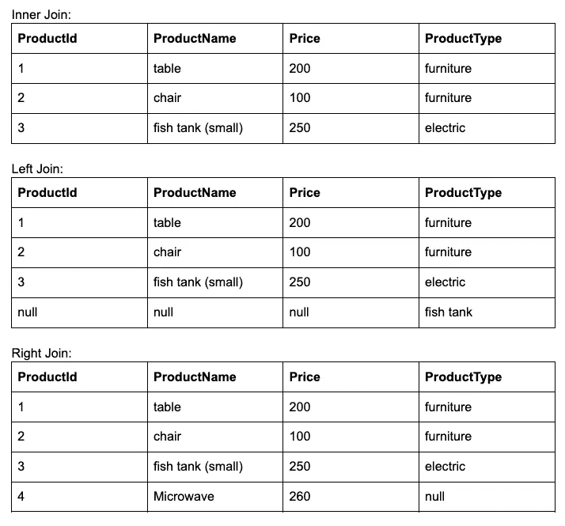

# 3 必须知道在 Apache Beam 中连接数据集的方法

> 原文：<https://blog.devgenius.io/3-must-know-approaches-to-join-datasets-in-apache-beam-934228de2d4e?source=collection_archive---------0----------------------->

## 大数据工程之旅

## 作为大数据工程师，必须了解加入数据的方法

米利安·耶西耶在 [Unsplash](https://unsplash.com/?utm_source=medium&utm_medium=referral) 上拍摄的照片

# 概观

当我们在[的第一篇文章](https://medium.com/@techisbeautiful/the-journey-to-big-data-engineering-apache-beam-overview-part-1-685e8bfefb15)中探索 Apache Beam 的概述时，我们继续在这篇关于“加入”的文章中探索关于 Apache Beam 的更多细节。连接是处理数据集的一种非常流行的操作。在本教程中，我们将介绍如何在 Apache Beam 中的数据集之间执行“连接”操作。本文中提到了加入 Apache Beam 的不同方法:

*   [阿帕奇光束库加入](https://beam.apache.org/documentation/sdks/java-extensions/#join-library)
*   [按键连接分组](https://beam.apache.org/documentation/transforms/java/aggregation/cogroupbykey/)
*   [使用侧面输入](https://beam.apache.org/documentation/patterns/side-inputs/)

我们将涵盖所有流行的连接，如内部连接，外部连接(左，右，完整)与上述每种方法。

# 加入方案

## **样本输入数据**

让我们用下面的例子来理解在 Apache Beam 中执行 Join 的上述不同方法。我们有产品表和产品类型表两个数据文件。数据集的结构如下:

示例模式

正如你在上面看到的结构数据集，我们通过为每个表创建 CSV 文件来输入数据，你可以很容易地想象到下面的顺序:

**文件名:products.csv**

**products.csv**

**文件名:product_types.csv**

**product_types.csv**

“产品”和“产品类型”的连接键是“产品类型 Id”字段。

## 样本输出数据

现在，如果我们希望在同一个表中包含产品和产品类型，我们可以借助连接特性将这两个表结合起来。假设使用连接，我们将得到如下输出数据:

内、左、右连接的输出数据

完全连接的输出数据

# **#1 使用 APACHE 梁库加入数据**

Beam 支持模式集合上的连接，其中连接条件取决于字段子集的相等性。您可以看到下图定义了这些操作:

加入数据流

为了执行连接，我们将模式定义如下:

**产品模式**

**产品类型模式**

然后，我们将 PCollection 中的数据集准备为键值对象。为此，我们必须读取前面创建的两个 CSV 文件(product，product_type ),然后我们将创建两个 PCollection。

**产品收集**

**产品类型 p 集合**

到目前为止，我们在加入之前需要的所有步骤都已经很好了。现在我们开始执行 Join，但是在执行之前，我们通过描述来看一下每个 Join 的理论，以便清楚地理解它们。

## 内部连接

让我们通过上面处理产品和产品类型的两个集合的数据示例来理解内部连接的概念。这种连接基于集合之间的逻辑关系(一个公共键),因此我们可以使用一个公共键来连接两个集合。我们称之为两个集合:左侧和右侧。内部联接比较并查找左侧和右侧的匹配行。左边的每条记录都将与右边相应的记录连接起来。最后，它聚合两个集合中的匹配记录，并放入连接的集合的结果。

MySQL 的语句使用了内部连接:

下面是这个连接的 Java 代码:

使用“ProductTypeId”字段上的自然联接来联接两个 PCollection，其中左侧和右侧的 p collection 都有一个具有该名称的字段。产生的 PCollection <row>将有两个字段:“lhs”(左侧)和“rhs”(右侧)，每个字段都有相应的输入左和右集合的模式。</row>

## 左连接

左连接从左侧开始选择数据。它根据公共键将左侧的每一行与右侧的每一行进行匹配。它返回左侧的所有行，而不管左侧的行是否与右侧的行匹配。

MySQL 的语句使用左连接:

下面是这个连接的 Java 代码:

## 右连接

右连接与左连接相反。它从右侧开始选择数据，将右侧的每一行与左侧的每一行进行匹配。如果两个行都导致条件评估为“TRUE ”,则右连接会将这些行的列组合成一个新行，并将这个新行包含在结果集合中。

但是，如果右侧的一行与左侧的一行不匹配，右连接会将右侧该行的列与右侧所有列的 NULL 值组合成一个新行，并将这个新行包含在结果集合中。

MySQL 的语句使用了右连接:

下面是这个连接的 Java 代码:

## 完全连接

完全连接基本上结合了左连接和右连接。它返回两边的所有行，还包括那些不匹配的行。没有匹配项的行将具有空列值。

在 MySQL 中，它没有完整的外部连接语法。因此，我们必须通过组合 LEFT JOIN 和 RIGHT JOIN 语句来解决它，如下所示:

下面是这个连接的 Java 代码:

**加入后生成列**

加入后，我们得到一个输出数据的结果，我们将呈现哪些名称列将显示在一行中。正如您在下面看到的，我们在 output 元素中处理选择列。

**将结果数据写入 CSV 文件**

在生成预期的输出数据后，我们将数据写入输出文件:

# #2 通过基于关键字的分组来连接数据

使用 CoGroupByKey 变换执行连接操作时提供的梁。

CoGroupByKey 按键聚合所有输入元素，并允许下游处理使用与键相关的所有值。CoGroupByKey 的操作是两个或多个具有相同键的数据集的关系连接，并且还对多个输入集合进行操作。

例如，假设我们有一个产品类型集合，它包含“ProductTypeId”作为键，它的所有列作为值，还有一个产品集合也是如此。然后，我们将这两个基于“ProductTypeId”字段的集合进行连接，并最终在新的 PCollection 中获得结果，结果数据的类型是一对键/值以及 ProductTypeId /所有产品列。

此图演示了上面的示例，我们只需遵循编码示例的流程:

通过密钥流加入分组

我们将在下面一步一步地用 CoGroupByKey 进行示例:

首先，我们创建两个要连接的 Pcollection:

**产品收集**

**产品类型 p 集合**

其次，我们创建两个对应于这些 p 集合的 TupleTag:

第三，我们使用 CoGroupByKey 来组合两个集合:

接下来，我们应用 Pardo 来实现每个连接的处理元素，比如内连接、左连接、右连接和全连接。我们为什么要这么做？因为分组后的结果数据非常混乱，我们需要一个步骤来排列数据中的行，这就像在将数据导出到 CSV 文件之前将数据规范化或逻辑化一样。

最后，我们将每种内连接、左连接、右连接和全连接的输出数据写入文件。

# #3 使用 APACHE 波束侧输入连接数据

我们可以使用波束侧输入模式执行连接。

侧输入是帕尔多变换的附加输入。DoFn 可以在每次处理主输入 PCollection 中的一个元素时访问这个副输入。当我们指定侧输入时，我们创建了一些其他数据的视图，这些数据可以在处理每个元素时从 Pardo 变换的 DoFn 中读取。任何对象，以及单例、元组或集合，都可以用作副输入。

侧面输入流量

现在，为了理解如何在 Apache beam 管道中使用侧输入模式，让我们实现一个侧输入连接产品的示例。当处理一个元素时，我们将比较列表中哪个产品匹配 ProductTypeId，然后我们将这个产品写入结果集合。我们一步一步地遵循:

首先，从 CSV 文件中读取数据并创建两个 PCollections:

其次，我们创建一个侧面输入来连接产品:

接下来，应用一个 Pardo，它将“productTypeMap”作为边输入。该 Pardo 将处理与“ProductTypeId”匹配的产品的加入。

最后，我们将结果数据写入 CSV 文件:

*注意:每当我们为下游转换创建一个侧输入时，侧输入适合内存。如果输入数据量很大，可能是内存有问题，波束作业会失败。要解决这个问题，您必须以某种方式配置内存量，您可以通过在命令行上使用“–setWorkerCacheMb”选项来设置缓存的大小，或者您必须了解输入数据的大小。*

# 摘要

Apache Beam 是编写数据 ETL 管道的一个很好的框架。在本文中，我们探讨了如何使用 Apache Beam 来连接数据集。本文中的示例代码很容易理解如何在 Apache Beam 中使用 join。但是，我认为这篇文章是探索和学习 Apache Beam 的一个很好的切入点。

如果你喜欢这个故事，请[关注](https://medium.com/@techisbeautiful)，[订阅我](https://medium.com/subscribe/@techisbeautiful)成为我下一个故事的第一个接收邮件的人。

[你可以在这里](https://medium.com/@techisbeautiful/membership)成为媒介会员**无限制访问**媒介平台上的每一个故事。如果你使用上面的链接，它也支持我，因为我有一个来自 Medium 的小佣金。谢谢大家！

# 参考

[https://medium . com/@ knol dus/Apache-beam-ways-to-join-p collections-171814876011](https://medium.com/@knoldus/apache-beam-ways-to-join-pcollections-171814876011)