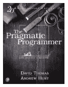
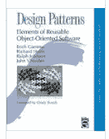

# 程序员必读的 3 本书

> 原文：<https://blog.devgenius.io/3-must-read-books-for-experienced-programmers-819a300ace92?source=collection_archive---------6----------------------->

这个列表主要为已经在这个领域的程序员服务。此外，如果你刚刚开始——一定要看看这些书，越早开始读越好！

# [务实的程序员:你的精通之旅](https://www.goodreads.com/book/show/4099.The_Pragmatic_Programmer)

务实的程序员——安德鲁·亨特和戴维·托马斯

就我个人而言，这本书是最好读的一本书。

它有独特的功能，并以务实的方式教你编程和软件工程，而不是*所有的理论*。它将有助于培养你的，不仅仅是编码技能，还有工程技能，以及批判性思维和现实主义，总的来说，将极大地改善你的心态。

# [干净的代码:敏捷软件工艺手册](https://www.goodreads.com/book/show/3735293-clean-code)

干净的代码——罗伯特·马丁

> 即使是糟糕的代码也能运行。但是如果代码不干净，它会使开发组织陷入困境。

写代码并没有那么难，但是写出好的代码是——句号。这本书对我的帮助有多大，有多少次我看到别人看完之后有所提高，我怎么强调都不为过。

干净的代码将挑战你去思考别人和你自己的代码，并将教你如何发现好的、坏的和丑陋的。

# [设计模式:可重用面向对象软件的元素](https://www.goodreads.com/book/show/85009.Design_Patterns)

设计模式——由四人组*提出:Erich Gamma，Richard Helm，Ralph Johnson，John Vlissides*

面向对象软件是一个非常好的工具，但是它很容易被滥用。

这本书可能不容易阅读，但它展示了 23 种模式，让您可以进行正确的设计。使用设计模式，您将学习如何利用简单且已知的解决方案来解决设计问题。

有很多好书，但以上几本是必读的，会帮助你彻底建立你的专业知识。🎉感谢阅读！🎉

—

## 更多来自 B.E .的故事

 [## 你的企业需要一个聊天机器人，现在！

### 什么是聊天机器人，你为什么需要它？

be-ja.medium.com](https://be-ja.medium.com/why-your-company-needs-a-chatbot-1bd9e4bb7c53)  [## 五大有用的免费 API

### 这里有 5 个完全免费的 API，你可以把它们用于你的工作、个人项目或者仅仅是娱乐。

be-ja.medium.com](https://be-ja.medium.com/top-5-useful-and-free-apis-618cdf6499bf)  [## 外行人的加密货币和 DeFi Staking

### 总的来说，随着加密货币、区块链、NFTs 和整个加密空间成为最新的炒作，有人认为…

be-ja.medium.com](https://be-ja.medium.com/laymans-cryptocurrencies-and-defi-staking-446c572bf4c4)  [## 6 个谷歌 Chrome 生产力扩展

### 我喜欢简单的解决方案，由于这个列表不会很广泛，但还是有一个谷歌浏览器的列表…

be-ja.medium.com](https://be-ja.medium.com/6-google-chrome-extensions-for-productivity-d7dc907b4ac0)  [## 如何应对过度工程和过度思考

### 软件——名词 1。告诉计算机如何工作的一组指令。

be-ja.medium.com](https://be-ja.medium.com/a-how-to-on-overengineering-and-overthinking-88a53a7fe435)