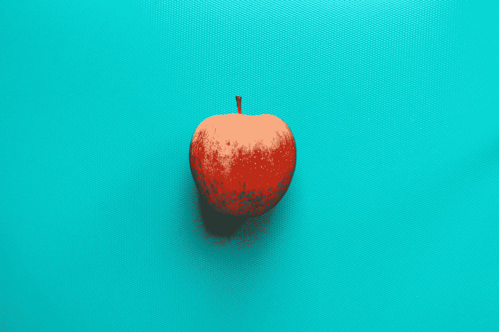
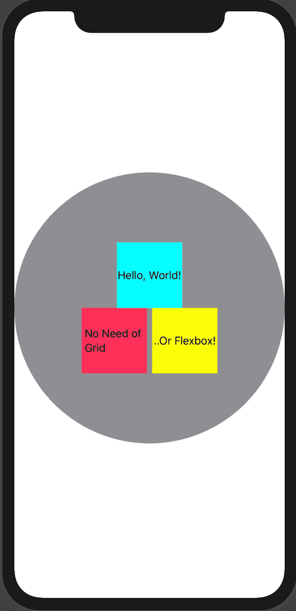
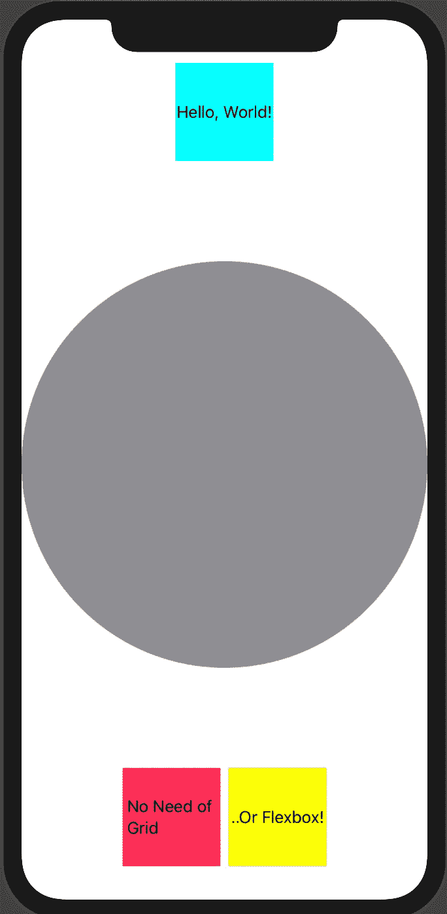
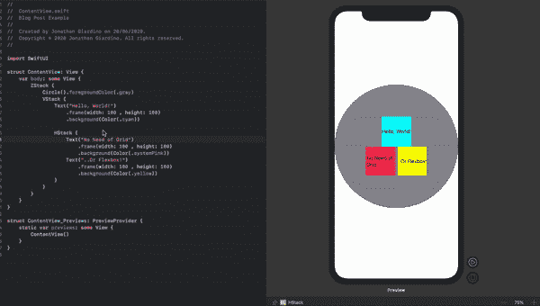

# 喜欢 SwiftUI 的 3 个随机理由

> 原文：<https://blog.devgenius.io/3-random-reasons-to-love-swiftui-5631bfc6c81e?source=collection_archive---------27----------------------->



几周前，我开始了成为 SwiftUI 专家的旅程，你可以在这里阅读相关内容。

我是一名 Javascript 开发人员，所以很多“编程”概念都很容易掌握，然而，当我开始进入 SwiftUI 时，我对用一种完全不同的方法构建 UI 感到高兴和兴奋。

我每天都在学习这个框架，我对它越来越感兴趣。

今天，我将列出 3 个随机的理由，让你和我一起热爱这种构建 iOS 原生应用的奇妙方式，我甚至不会深入。

# 1.再见网格和 Flexbox

我不认为 Grid 和 Flexbox 不好，事实上，它们实际上是一种令人惊叹的 web 和移动应用布局方式。然而，正如这个星球上最出色的运动员或最受欢迎和最成功的人每天提醒我们的那样，我们总能做得更好。

在我看来，SwiftUI 就是这样。

VStack(垂直堆栈)、HStack(水平堆栈)和 ZStack(深度堆栈，来自 Z-Index)是极大地加速布局开发的三个容器。正如你可以推断的那样，它们可以帮助你垂直、水平或分层地布局你的元素。

另外，SwiftUI 中的每个元素都从中心开始定位，这非常方便。

假设我想要三个带有文本的正方形，一个在中间，另外两个在下面水平堆叠。所有这些都需要在一个圆圈形状作为背景。

这是我们在 SwiftUI 中的做法:

```
ZStack { //The order of the layers goes from top to bottom, the first element will be in the back and accordingly all the following on top of each other. Circle().foregroundColor(.gray) VStack {//Here we stack vertically a text element and a HStack that in turn has two text elements but this time they will layout horizontally Text("Hello, World!")
                    .frame(width: 100 , height: 100)
                    .background(Color(.cyan))
                HStack {
                    Text("No Need of Grid")
                        .frame(width: 100 , height: 100)
                        .background(Color(.systemPink))
                    Text("..Or Flexbox!")
                        .frame(width: 100 , height: 100)
                        .background(Color(.yellow))
                }
            }
        }
```



你不是已经爱上它了吗？

# 2.间隔器

如果我们想移动屏幕顶部的第一个方块和底部的另外两个方块呢？

很简单，我们只需在它们之间插入一个`Spacer()`，这将把它们一直推到屏幕的末端，方向将基于它们所属的 StackView，在这种情况下是一个 VStack，因此是垂直的。

```
ZStack {
            Circle().foregroundColor(.gray)
            VStack {
                Text("Hello, World!")
                    .frame(width: 100 , height: 100)
                    .background(Color(.cyan)) Spacer() HStack {
                    Text("No Need of Grid")
                        .frame(width: 100 , height: 100)
                        .background(Color(.systemPink))
                    Text("..Or Flexbox!")
                        .frame(width: 100 , height: 100)
                        .background(Color(.yellow))
                }
            }
        }
```



# 3.活画布

你是否像我一样厌倦了每次编辑按钮的圆角半径或更改段落的间距或字体时都要重新构建项目？

SwiftUI 有一个实时画布，显示几乎每一秒的变化。这真的令人印象深刻，并且惊人地加快了 UI 开发。



任何反馈，评论或建议都非常感谢，事实上，这是鼓励。

我们连线吧！

网址:[jonathangiardino.com](https://jonathangiardino.com/)

推特: [@jonathan_gardn](https://twitter.com/jonathan_gardn)

中: [@jonathangiardino](https://medium.com/@jonathangiardino)

照片由 Louis Hansel @shotsoflouis 在 [Unsplash](https://dev.to/jonathan_gardn/%5Bhttps://unsplash.com/photos/MardkT836BU%5D(https://unsplash.com/photos/MardkT836BU)) 上拍摄