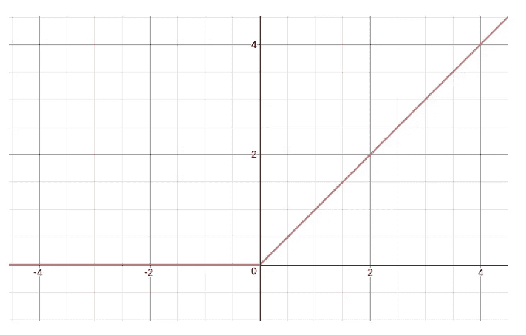
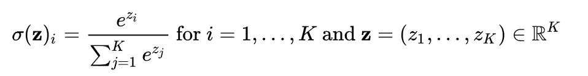
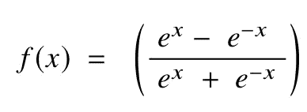

# 神经网络中的 3 个标准激活函数

> 原文：<https://blog.devgenius.io/3-standard-activation-functions-in-neural-network-46b0a18fd14f?source=collection_archive---------24----------------------->

## 什么是激活功能，你如何应用它？


克林特·王茂林在 [Unsplash](https://unsplash.com?utm_source=medium&utm_medium=referral) 上拍摄的照片

神经网络分为三层，描述如下:

## 输入层

> 被动层将相同的信息从单个节点传递到多个输出。这是神经网络的第一个入口。

## 隐蔽层

> 对输入进行数学计算并产生净输入，然后应用激活函数产生输出。通常，这一层被视为一个黑盒，比其他层小得多。

## 输出层

> 合并并具体产生来自先前层的复杂计算的输出结果。

如上所述，大多数神经网络由三层构成。让我们更深入地研究一下架构。每层由一个或多个**节点组成。**从输入层到输出层有一个信息的流程。在每个神经网络中，所使用的激活函数的类型决定了数据应该如何在神经网络中成形。激活功能的主要目标是:

## 对数据应用某种非线性函数，以便输入数据不会直接映射到输出图层。

# 整流线性单元

ReLu 是深度学习模型中最常用的激活函数。这也可以说是深度学习革命中为数不多的进步之一，例如，现在允许持续开发非常深度的神经网络的技术。

如果 ReLu 函数接收到任何负的输入，它将返回 0，但是对于任何正值 x，它将返回该值。所以可以写成 *f(x)=max(0，x)。*

ReLu 最初是由 **Abien Fred M. Agarap** 在他的文章 *'* [*深度学习使用校正线性单元(ReLU)*](https://arxiv.org/pdf/1803.08375.pdf) '中介绍的，作者将其描述为:

> 由此引入的激活函数具有强大的生物学和数学基础。2011 年，它被证明可以进一步改善深度神经网络的训练。它的工作原理是将阈值设为 0，即 f (x) = max(0，x)。简单来说，当 x < 0, and conversely, it outputs a linear function when x ≥ 0 ([源](https://arxiv.org/pdf/1803.08375.pdf)时输出 0



来源:https://arxiv.org/pdf/1803.08375.pdf

在神经网络中使用 ReLu 有一些明显的好处:

1.  让我们再次回忆一下 *f(x)= max(0，x)。*意味着随着 x > 0 *，*，梯度消失的可能性降低。为了保持更快的学习，更恒定的梯度是优选的。
2.  在一些实践中，ReLu 往往表现出**更快的收敛性能**。如本文[所述，ReLu 实现的训练收敛速度比其他激活函数快六倍，以实现 25%的训练误差损失。](http://www.cs.toronto.edu/~fritz/absps/imagenet.pdf)

# Softmax

在所有的神经网络中，输出层被设计成基于一定的置信度输出结果。让我们想象一下。

假设你有一个预测，得分为(0.04，0.96)，A 类为 0.04，B 类为 0.96。显然，网络有信心将预测识别为 a 类

但是(0.75，0.85)怎么样？我们可以说 B 类的预测有更高的“可能性”是正确的。因此，以上这些都不是概率，而 Softmax 函数恰恰提供了这一点。Softmax 函数定义为:

> 将一个实数向量作为输入，并将其规范化为一个概率分布数组，该数组由与输入向量项的指数成比例的概率组成。这个概率分布总计为 1

```
**def** softmax(x):                   # *x* is the input vector
    e_x = np.exp(x)               # Taking the exponential of *x*
    **return** e_x / e_x.sum()        # Returns the probability vector
```

在数学符号中，它被推导为:



资料来源:https://en.wikipedia.org/wiki/Softmax_function

在神经网络中，Softmax 用作分类网络最后一层的激活。这是因为结果是概率分布。比如在最后一层，一旦出现[0.05，0.23，0.12， **0.60** 这样的概率，概率最高(0.60)的类就表示模型的最终预测。

# 双曲正切值

双曲正切激活函数有一个基本用途，它会将负输入强推至(-1，1)范围内的负输出。tanh 和 sigmoid 的区别在于 sigmoid 函数不能很好地处理负输入。在神经网络中，梯度在前馈传播过程中更新。

如果输入不变，模型参数将不会持续更新，因为 sigmoid 不处理负输入，并将它们分配到接近零值。



来源:[https://arxiv.org/pdf/1811.03378.pdf](https://arxiv.org/pdf/1811.03378.pdf)

在本文[来源于](https://arxiv.org/pdf/1811.03378.pdf)中，作者解释了双曲正切函数对于多层网络具有更好的训练性能。并且该范围是从(-1，1)到非(0，1)的事实使得它对于大多数深度神经网络是优选的。由于双曲正切函数的平均值接近 0，意味着范围也更大，这导致更大的导数，从而使收敛性能更快地达到全局最小值，极大地减少了训练时间和复杂性。双曲正切函数通常用于递归神经网络和语音识别模型。

*如果我已经设法让你注意到这一点，请留下你的评论，如果你对这个系列有任何建议，因为它将大大增加我的知识，改善我的写作方式。* [***普雷姆·库马尔***](https://towardsdatascience.com/@premstroke95) *是一个无私的学习者，对我们身边的日常数据充满热情。如果你想谈论这个故事和等待的未来发展，请在*[***LinkedIn***](https://www.linkedin.com/in/premstrk/)**上与我联系。**