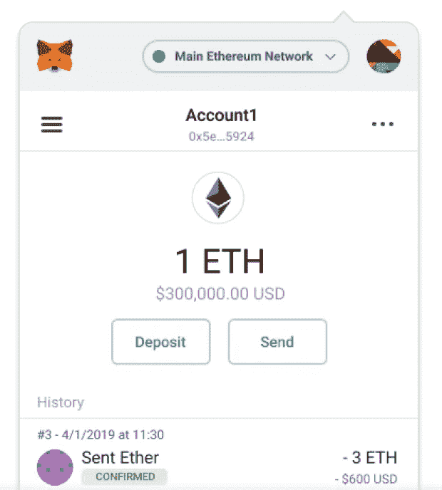
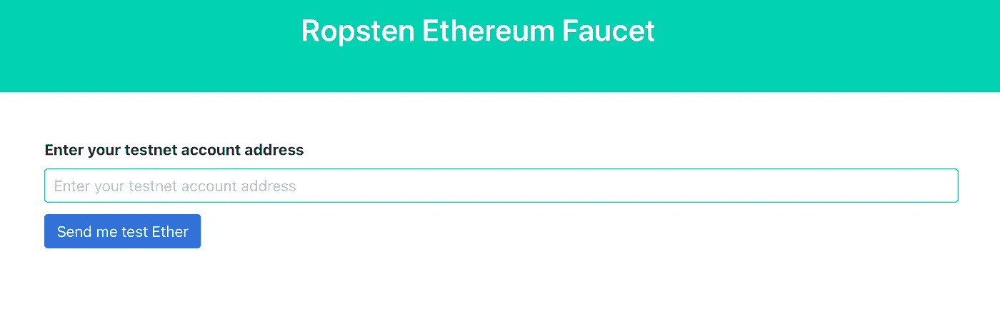
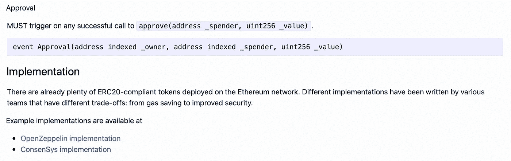
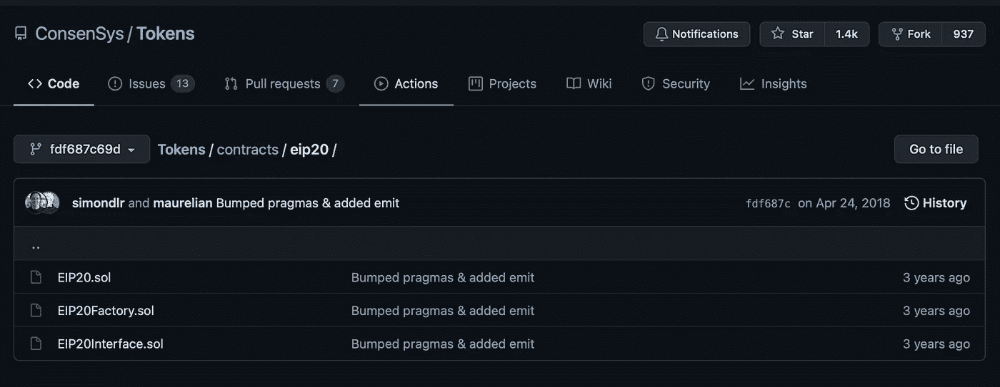
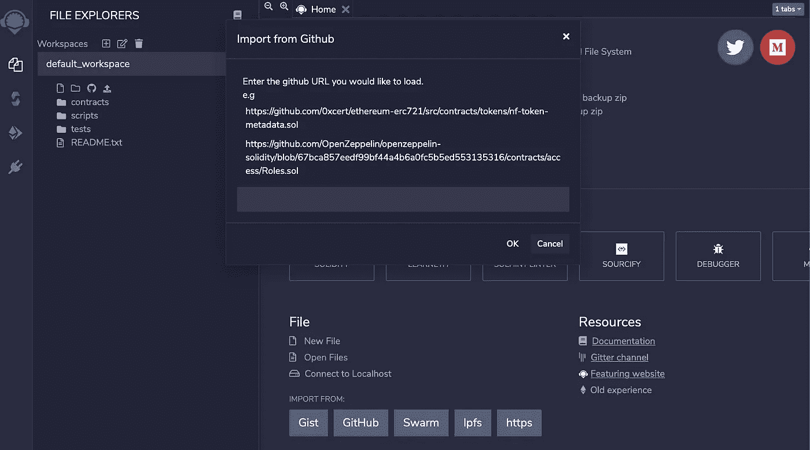
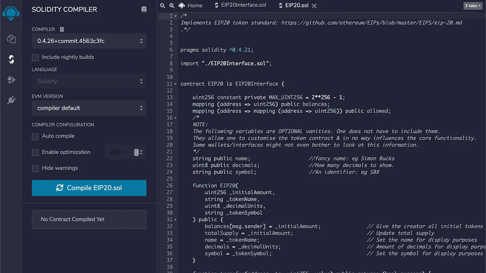
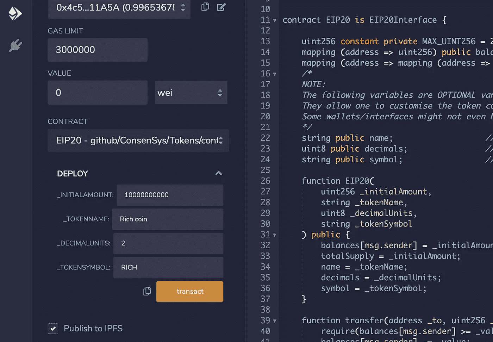
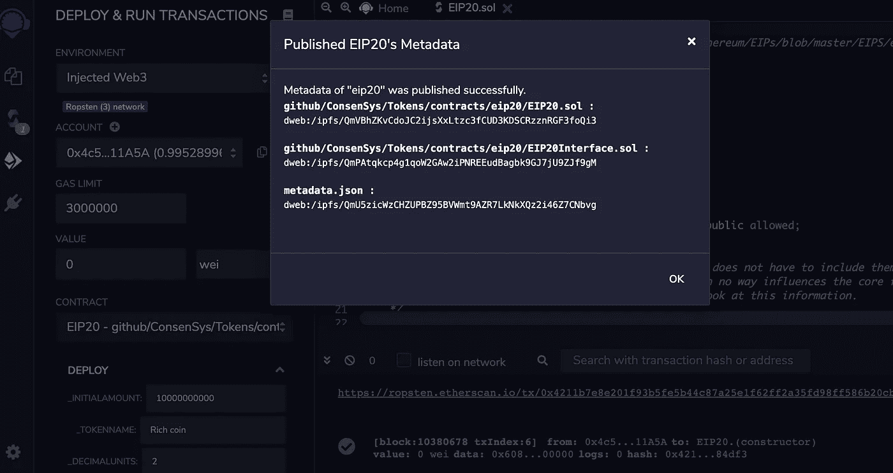
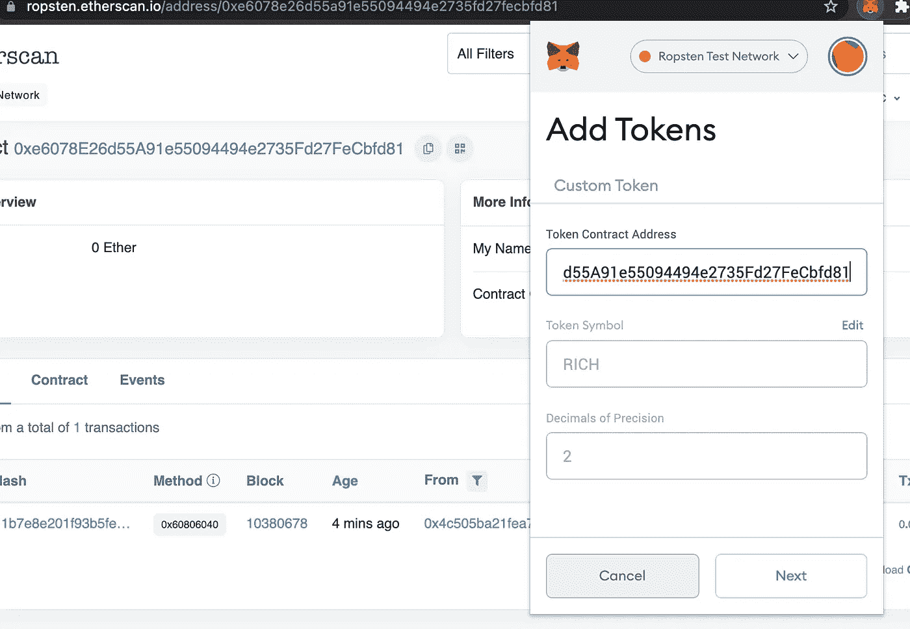

# 创建你自己的加密硬币的 3 个步骤

> 原文：<https://blog.devgenius.io/3-steps-to-create-your-own-crypto-coin-9ae3eec9820a?source=collection_archive---------2----------------------->

比特币，以太坊，Dogecoin，Shibacoin…

你可能听说过所有这些疯狂的“硬币”和关于它们巨大的市场价值涨跌的新闻。你可能不想投资这些密码，但作为一名从事技术工作的专业人士，多了解一点也不是一个坏主意，比如主流的区块链技术和创建一个这样的技术的过程。

在这篇文章中，我将带你通过简单的三个步骤来创建你自己的硬币，而不用写任何代码。

# 介绍

创造硬币的想法很简单:将你的“合同代码”放在区块链上。

这里的“契约”就是硬币，包括名称、初始金额等。在这个例子中，我们将选择**以太坊**作为我们的例子区块链，它是每个人部署其应用程序(coin)最容易访问和最可靠的平台之一。

# 1 —创建您的钱包

第一步是创建你自己的钱包。在这里，我建议使用 [MetaMask](https://metamask.io/download.html) ，一个简单的 **Chrome 扩展**，给你一个免费的钱包。

按照网站上的步骤操作就行了。你可以在几分钟内得到你的加密钱包。完成后，您应该会在右上角看到一个钱包。

> 注意:对于初学者，可以选择使用“**考网”**进行试用。所以你不需要支付真正的 ETH(花费$$)来发射你的测试币。准备好了就可以切换到**主以太坊网络**。

要在测试网上获得你的 ETH，可以去[https://水龙头. ropsten.be](https://faucet.ropsten.be) 粘贴你的钱包地址。它可以每 5 秒发送一次测试。

[https://水龙头. ropsten.be](https://faucet.ropsten.be)

# 2 —编译代码

要在以太坊网络上释放你的硬币，你的硬币必须符合一个名为 [**EIP-20: ERC-20 令牌标准**](https://eips.ethereum.org/EIPS/eip-20) 的标准。这听起来很专业，但是不要担心，你不必了解它，除非你真的想深入了解它的技术细节。

履行

这个标准有几个推荐的实现。在这里，我们将使用一个叫做****。****

****

**理事会**

**让我们打开一个以太坊官方 delopy 工具([https://remix.ethereum.org](https://remix.ethereum.org))和这个 [Github 代码回购](https://github.com/ConsenSys/Tokens/tree/fdf687c69d998266a95f15216b1955a4965a0a6d/contracts/eip20)。**

**点击“Github ”,获取以下文件的网址(重复两次):**

*   **EIP20.sol**
*   **EIP20interface.sol**

****

**粘贴文件**

**然后打开 **EIP20.sol** 文件，进入“固化编译器”选项卡，点击“编译 EIP20.sol”**

****

**编制**

# **3-创造你的硬币**

**完成编译步骤后，这是创建硬币的有趣部分。转到“部署和运行事务”选项卡。这里我们需要做的是:**

1.  **将环境更改为“注入的 Web3”**
2.  **确保“帐户”是您的钱包地址，即 MateMask 插件窗口中您的姓名下的字符串。**
3.  **单击橙色“部署”按钮旁边的向下箭头图标。**
4.  **选择硬币的初始金额、代币名称、十进制单位和符号。如果您希望初始金额为 1000，小数单位为 2(最小单位为 0.01)，请在 _INITIALAMOUNT 中输入“ **100000”****
5.  **单击“Transact ”,您将看到弹出的 MateMask 窗口。它显示了在网络上创造你的硬币需要多少 ETH。如果你选择测试网络，这是免费的，但如果你想让你的硬币真正在主网络上推出，你需要在你的钱包里有真正的 ETH。它可以在 MateMask 或任何交易所(如币安、比特币基地)购买，并发送到你的 MateMask 钱包。**
6.  **点击“确认”，等待一分钟，你会看到你的硬币被部署！**

****

**你的硬币**

****

**部署完毕！**

**所以，就这样了。非常简单，最后一步是将硬币放入钱包:**

1.  **打开 MateMask，单击活动**
2.  **点击第一项，打开一个窗口。**
3.  **单击“活动日志”中的第一个日志，它将导航到一个新的浏览器选项卡。**
4.  **在 Etherscan 网站上，点击“收件人:[合同 0xxxxxxxxxxx 已创建]”**
5.  **在新页面中，复制合同名称。**
6.  **打开 MateMask，点击“添加令牌”，复制合同名称。**
7.  **现在你的钱包里有你的代币，准备送给你的朋友！**

****

**完了！**