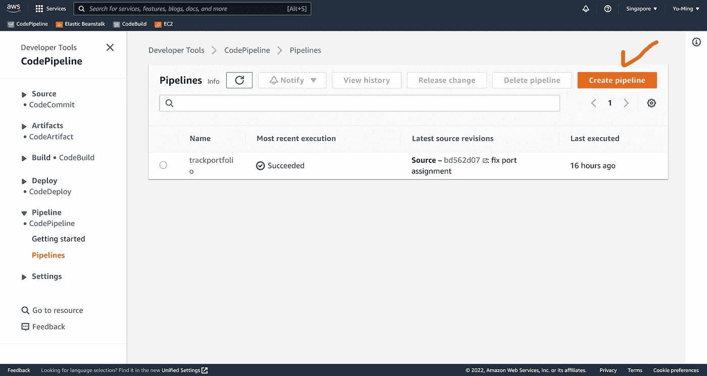

# 通过持续交付将 TypeScript 部署到 AWS Elastic Beanstalk 的 3 个步骤

> 原文：<https://blog.devgenius.io/3-steps-to-deploy-typescript-to-aws-elastic-beanstalk-with-continuous-delivery-611bc7ecf15c?source=collection_archive---------4----------------------->

## 查看我在[我的技术文章](https://yumingchang1991.medium.com/technical-article-structure-on-medium-954850e1ef4d)中的所有帖子

[C 达斯汀](https://unsplash.com/@dianamia?utm_source=medium&utm_medium=referral)在 [Unsplash](https://unsplash.com?utm_source=medium&utm_medium=referral) 上的照片

# 背景

我正在处理我的投资组合，并考虑在哪里部署我的 web 服务器。我加入的编码新兵训练营用的是 Heroku 然而，我注意到越来越多的职位空缺将 AWS 放在了他们的职位描述中。所以我问自己，这次把我的服务器部署到 AWS 怎么样？

# 目标

设置一个连续交付环境，这样我只需要在我的 repo 中管理 TypeScript，AWS 负责编译和部署。

# 结果

我最终使用以下 AWS 服务来实现我的目标:

1.  **部署**:使用 *AWS Elastic Beanstalk* 自动整合 AWS 资源来托管和运行 web 应用程序
2.  **连续交付(CD)** :使用 *AWS 代码管道*从 GitHub Repo 中拉源代码，配置 AWS 编译 TypeScript，并将编译结果部署到 AWS Elastic Beanstalk 中

在继续之前，让我给你一些参考

*   这是我的 GitHub 回购协议，如果你更有兴趣看看一个真正的回购协议
*   一旦我部署了中间件来阻止对我的服务器的随机请求，我将共享我的 AWS API 服务器的 URL(或者，出于安全考虑，我不应该共享它？请在评论中告诉我)

我写这篇文章的动机是因为我找不到一个对初学者友好的教程。

有两篇文章，但是它们要求我们知道存储弹性 Beanstalk 操作系统的相对目录:

*   第一个是 Andrew Chung 在 2019 年发表的 [*我如何自动将 Typescript 部署到 Elastic Beanstalk 以加快服务器端开发*](https://medium.com/quick-code/how-i-automatically-deployed-typescript-to-elastic-beanstalk-to-speed-up-server-development-22b89870e159)
*   第二个是 [*在 2019 年由 Viet Hoang Le 在 ElasticBeanstalk NodeJS 服务器*](https://medium.com/@lhviet88/deploy-a-typescript-expressjs-into-elasticbeanstalk-nodejs-server-8381e00e7e52) 中部署一个 TypeScript，ExpressJS 应用程序
*   这两篇文章是循环引用的

在我的例子中，我不知道如何验证目录路径，所以我最终自己发现了一种不同的方法。(如果你知道找出目录路径的魔法，请告诉我怎么做)

# 将 TypeScript 部署到 AWS Elastic Beanstalk

## 先决条件

1.  您有一个 AWS 帐户
    (如果您没有，现在就去注册)
2.  你对什么是 AWS 弹性豆茎和 AWS 代码管道有一个大致的概念
3.  你不反对与 YAML
    合作(因为我们将使用它进行定制配置)
4.  你知道如何运行一个打字服务器
    (如果你不知道编译对打字意味着什么，你可能想在继续之前[阅读这个官方文件](https://www.typescriptlang.org/docs/handbook/typescript-tooling-in-5-minutes.html#compiling-your-code)

## 步骤 1 —创建 AWS 弹性 Beanstalk 应用程序

创建 AWS 弹性 Beanstalk 应用程序的过程应该非常直观。应用程序代码，我们现在只选择示例代码，稍后将通过 AWS 代码管道由我们的 repo 替换。

为我们的应用程序创建一个 AWS 弹性 Beanstalk 环境需要几分钟时间。一旦完成，我们可以进入下一步。

创建新的 AWS 弹性 Beanstalk 应用程序

## 步骤 2 —创建新的 AWS 代码管道

这一步需要注意的事项:

1.  **选择 GitHub repo 作为该管道的源代码。**如果您是第一次在 AWS 上连接到 GitHub repo，它会要求您提供凭证以进行身份验证
2.  **选择 AWS 代码构建作为构建提供者**。您需要创建一个新的代码构建项目。选择 docker 图像时要小心。 [*查看此表*](https://docs.aws.amazon.com/codebuild/latest/userguide/available-runtimes.html) 以确保为您的预期运行时间选择正确的图像。
3.  **选择 AWS Elastic Beanstalk 作为部署提供商**。您应该能够看到我们在步骤 1 中创建的应用程序和环境的名称。

设置好 AWS 代码管道后，下一次我们向我们的 repo 推送新的提交时，它将触发这个 AWS 代码管道，并将我们的新代码部署到 AWS Elastic Beanstalk。

创建新的 AWS 代码管道

配置此管道的源代码

为此管道配置一个生成项目。让我们为我们的案例选择 AWS 代码构建。

配置部署目标。让我们为我们的案例选择 AWS 弹性豆茎。

## 步骤 3 —在 GitHub Repo 的根路径中创建一个 buildspec.yml

现在我们已经准备好了 AWS 代码管道，但是它还不知道在构建阶段做什么。让我们创建一个`buildspec.yml`文件，并将其放在 GitHub repo 的根路径中。这个文件告诉 AWS 代码构建要执行什么 Linux 命令。

需要注意的事项:

*   默认情况下，文件名必须是`buildspec.yml`，除非您在浏览器控制台中创建新的 AWS 代码构建项目时指定了不同的名称
*   第 1 行的`version: 0.2`是强制的。它让 AWS 代码构建知道这个文件引用的是哪个构建规范版本。`0.2`是我在 2022 年 8 月写这篇文章时的最新版本。
    在 [*AWS 官方文档*文档](https://docs.aws.amazon.com/codebuild/latest/userguide/build-spec-ref.html#build-spec-ref-versions)上查看当前版本和语法
*   我们的构建环境需要在编译之前安装 typescript
*   `artifacts`AWS 是用来指代输出文件集合的名称。只有在`artifacts: files:`中指定的文件名将被捆绑并传递到 AWS 代码管道的下一阶段。
    AWS 代码构建的默认行为是捆绑从其输入构件接收的所有内容。然而，我们只需要将`.js`文件部署到 AWS Elastic Beanstalk，这就是我在这里指定某些文件名的原因:只将`javascript`文件传递到下一阶段。
*   另一个要叫出来的是`artifacts: files:`中的`'build/**/*'`。在我的`tsconfig.json`中，我将输出目录指定为根路径中一个名为`build`的文件夹。因此字符串`'build/**/*'`意味着传递名为`build`的目录下的所有文件
*   `discard-paths`表示我们是否希望输出 JavaScript 文件的结构与输入 TypeScript 文件的结构相同，或者我们是否希望放弃当前的文件结构，以便在输出中没有文件夹结构。**丢弃路径影响文件引用**，所以是否丢弃路径取决于我们项目的复杂程度。
    *注*
    *当我在 2022 年 8 月写这篇文章的时候，这个项目非常简单，根本不需要单独的* `*routes, controllers, services, and models*` *所以上面的 config 设置了* `*discard-paths*` *到* `*yes*` *。到 2022 年底，我的项目发展到了值得花时间构建文件的地步，这样我就可以毫不费力地在杂乱的代码库中找到特定的部分。
    喊出来* [*阿卜杜勒·萨拉姆*](https://medium.com/u/7e95a0734f83?source=post_page-----611bc7ecf15c--------------------------------) *谁点这个出来。*
*   最后，AWS Elastic Beanstalk 执行命令`npm run start`来启动应用程序。由于我们只将`javascript`文件传递给部署阶段，我们应该指定在我们的`package.json`中执行一个`.js`文件，如下所示

在本地 repo 中创建了`buildspec.yml`文件后，将这些更改推送到 GitHub repo 中，并观察代码管道的状态。

它现在像魔法一样工作，对吗？

通过 AWS 代码管道成功地将 TypeScript 服务器部署到 AWS Elastic Beanstalk

# 参考

帮助我完成这个挑战的唯一来源是通过挖掘 AWS 文档。

*   [关于弹性豆茎的 AWS 文件](https://docs.aws.amazon.com/elasticbeanstalk/latest/dg/Welcome.html)
*   [关于代码构建的 AWS 文档](https://docs.aws.amazon.com/codebuild/latest/userguide/welcome.html)