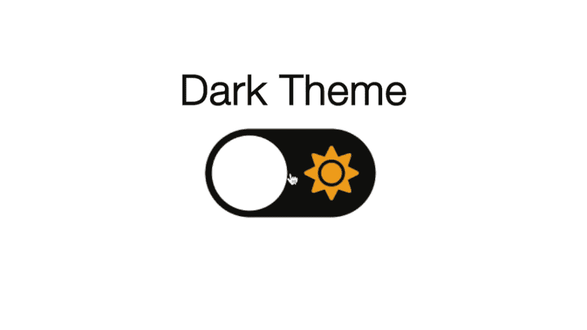
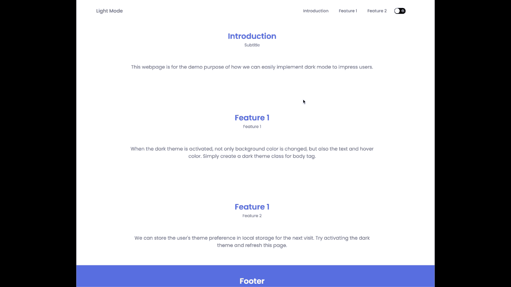
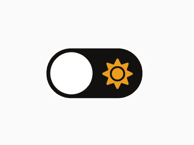
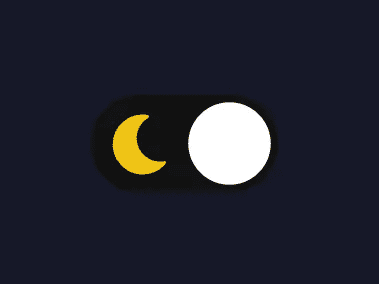
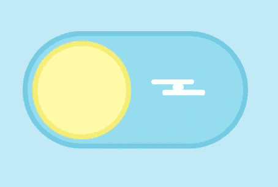
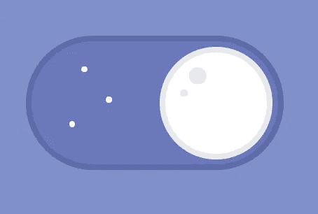
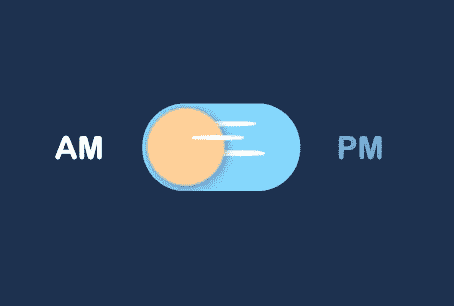
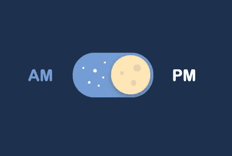

# 用 JavaScript 实现黑暗主题打动用户的 3 个步骤

> 原文：<https://blog.devgenius.io/3-steps-to-impress-users-by-implementing-dark-theme-with-javascript-3bbf54dc2e1?source=collection_archive---------2----------------------->

## 实现简单，印象深刻。实施时间不到 2 分钟。



如今，黑暗主题已经成为任何应用程序的“东西”。忘记像减少眼睛疲劳或电池消耗这样的好处，它只是很酷。

此外，它还为开发人员减少了 bug，因为“光会吸引 bug”。玩笑归玩笑，这篇文章是为你设计的，用 3 个简单实用的步骤来实现一个黑暗主题。

1.  实现一个切换按钮来切换主题。
2.  用 CSS 变量设计主题颜色。
3.  存储用户下次访问的主题偏好。

在此之前，让我们看看我们要建立什么。**暗/亮主题切换按钮不仅可以改变背景颜色，还可以切换整个颜色主题。其次，存储用户下次访问的主题偏好。**

# 演示



Demo.gif

在 [CodePen](https://codepen.io/onewayteo/pen/abyyBWd) 上查看源代码，并进行试验。

# 步骤 1:实现一个切换按钮来切换主题

在这一部分，我们有 HTML 和 CSS 代码来实现一个切换按钮。



切换按钮实现。归功于[弗罗林波普](https://www.youtube.com/watch?v=xodD0nw2veQ&t=1s&ab_channel=FlorinPop)。

将下面的 HTML 和 CSS 代码复制到您的代码库中。

与各自的作者为您提供替代设计。



致谢[克里斯·邦格斯](https://codepen.io/rebelchris) & [源代码](https://codepen.io/rebelchris/pen/jOMGweo)。



致谢[本杰明·雷托](https://codepen.io/bnthor) & [源代码](https://codepen.io/bnthor/pen/WQBNxO)。

# 第二步:用 CSS 变量设计主题颜色。

要有一个黑暗的主题，不仅仅是一些黑暗的东西。想象一下`text-color`是浅色主题的黑色，我们几乎看不到深色主题的文字。

出于这个原因，我们需要提供一个黑暗的主题包，而不是一个单一的变化，例如，`text-color`，原色等。然而，这导致了另一个挑战，我们如何在不修改每个 CSS 选择器的情况下轻松地切换它们？

CSS 变量和 HSL 颜色来拯救。

从上面设置，让我们轻松切换主题。

```
body {
**background-color: var(--body-color);
color: var(--text-color);**
}
```

# 第三步:存储用户下次访问的主题偏好。

人都喜欢被人记住，尤其是生日和选择。如果我们在应用程序中记住他们的主题偏好，并在下次访问时默认显示，他们会感到惊讶。我们只是使用 JavaScript 将它们存储在本地存储中。

Tada！你的应用程序应该有一个功能主题切换特性！

如果你喜欢阅读这样的故事，并想支持我成为一名作家，考虑关注我，并与可能会发现它有用的朋友分享。

# 关于作者

OneWay Teo 是一名驻新加坡的软件工程师，他喜欢开发可扩展的 web 应用程序。我写的是软件职业和可伸缩的 web 应用程序。分享我的成功故事给你复制，还有我的尴尬错误给你避免。

在 [Linkedin](https://www.linkedin.com/in/teowangwei/) 上随意联系。

[](https://medium.com/@onewayteo) [## 单向 Teo -介质

### 人生有几个章节，每个章节都有一个我们相信的不同的标题或引语。我目前的心态…

medium.com](https://medium.com/@onewayteo)