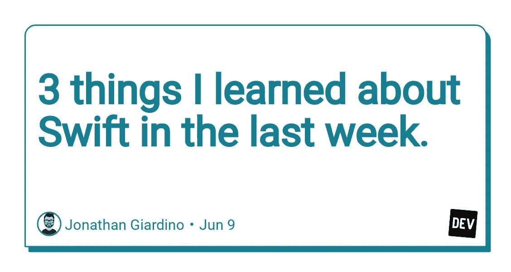

# 上周我了解到的关于 Swift 的 3 件事。

> 原文：<https://blog.devgenius.io/3-things-i-learned-about-swift-in-the-last-week-7bceb49f8f68?source=collection_archive---------39----------------------->



这是我 100 天 SwiftUI 旅程的另一集。

在过去的几天里，我浏览了 Swift 语言的一些基础知识，如函数、闭包和结构，作为一名以前编写 Javascript 的前端开发人员，我发现了许多共性，但是当切换到另一种语言时，有些东西的命名或用法会有所不同。

此外，Javascript(除非使用 Typescript)不是一种强类型语言，这使得它不同于 Swift 或其他编程语言。

在本文中，我不会讨论 Swift 的基础知识，但我想强调 3 件我不知道的事情，作为一名程序员，这些事情与 Javascript 无关。

# 1.Inout 参数

传递到 Swift function 中的所有参数都不能更改，因为它们是常量，所以我们基本上每次调用带有新参数的函数时都会返回一个新值。

由于有了 ***inout*** 参数，我们可以直接在函数内部更改值，而不是返回一个新值，这将反映该函数外部的原始值。

例如，假设我们想对一个数字进行 10 次幂运算:

```
func decuplicate(number: inout Int) {
    number *= 10
}
```

在这种情况下，我们不仅进行乘法运算，还进行乘法运算并将新值赋给`number`。

要使用这个函数，我们需要创建一个变量来存储我们将要在其中使用的 Int，当我们调用这个函数时，我们要在变量名前使用一个&符号。

```
var newNum = 2 
decuplicate(number: &newNum)
```

老实说，我有点困惑，但是这个关于 [HackingWithSwift](https://dev.to/jonathan_gardn/%5Bhttps://www.hackingwithswift.com/quick-start/understanding-swift/when-should-you-use-inout-parameters%5D(https://www.hackingwithswift.com/quick-start/understanding-swift/when-should-you-use-inout-parameters)) 的简短解释帮助了我。

# 2.捕获闭包中的值

当您在函数中返回一个闭包时，该闭包可以访问或“捕获”该函数中存在的值，并跟踪它们，即使它们不再存在。

在这个例子中，函数`eat()`返回一个闭包，它相应地接受一个字符串作为参数并返回 void(所以基本上不返回任何东西，它只是打印到控制台):

```
func eat() -> (String) -> Void {
    return {
        print("I'm going to eat some \($0)")
    }
}
```

然后我们可以调用这个函数，并简单地使用其中的闭包。

```
let meal = eat()
meal("Fruit")//prints "I'm going to eat some Fruit"
```

如果我们在函数`eat()`中创建一个值，比如记录我们吃了多少次。我们的闭包将捕获每次调用函数时在闭包内保持活动的值。

```
func eat() -> (String) -> Void {
    var mealCounter = 1 return {
        print("Meals for today: \(mealCounter). I'm going to eat some \($0)")
        mealCounter += 1
    }
}
```

当我们调用函数时，每次调用`eat()`时，我们的`mealCounter`都会增加。

```
meal("Beans and Eggs")
meal("Tofu")
meal("Salad")
meal("Pizza")//mealCounter will increase to 5 in this case
```

# 3.结构和属性观察器

当我们创建一个结构的实例时，有时我们希望每次属性改变时都发生一些事情。

假设我们已经创建了一个结构体，它记录了我们跑步或骑车的距离:

```
struct Distance {
    var action: String
    var miles: Int
}
```

然后，我们为会话创建一个实例:

```
var session = Distance(action: "Running", miles: 0)
session.miles = 2
session.miles = 7
session.miles = 12
```

如果每次我们调用`miles`属性并更新它时，我们也通知用户距离，这不是很酷吗？

嗯，我们可以用房产观察家的谎言`didSet()`做到这一点

```
struct Distance {
    var action: String
    var miles: Int {
        didSet {
            print("You have been \(action) for \(miles)miles")
        }
    }
}
```

任何反馈，评论或建议都非常感谢，事实上，这是鼓励。

我们连线吧！

网址:【jonathangiardino.com T3

推特: [@jonathan_gardn](https://twitter.com/jonathan_gardn)

Dev 社区: [@jonathan_gardn](https://dev.to/jonathan_gardn)

*最初发布于 2020 年 6 月 9 日*[*https://dev . to*](https://dev.to/jonathan_gardn/3-things-i-learned-about-swift-in-the-last-week-417e)*。*