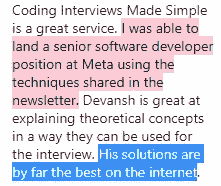

# 关于面试准备，运动训练可以教会你的 3 件事

> 原文：<https://blog.devgenius.io/3-things-sports-training-can-teach-you-about-interview-preparation-54209208b34d?source=collection_archive---------8----------------------->

## 这种方法会让你在准备过程中达到最佳表现和最佳结果

你们很多人通过我写的关于面试准备的文章找到了我，

我在网上写过我的系统，它帮助人们通过面试进入他们梦想的公司。在这封邮件/帖子中，我将分享我的辅导系统中最重要的元素之一——系统的基本框架。这个框架提供了我建议如何准备您的系统的指南。到本文结束时，您将对应该如何为您的自学系统做准备有一个完整的轮廓——无论是为即将到来的编码面试、考试，还是为自学困难的主题。

别担心。这个系统**不涉及**解决 500+ Leetcode 问题，每天花费数小时学习，或者许多(任何)不眠之夜。所有这些都是极其低效的，老实说- *这是对你时间和精力的巨大浪费。我更希望你把时间和精力花在你真正喜欢的事情上。*

这种方法对很多人都有效，并帮助他们找到了令人惊叹的工作。

这个系统是受运动训练的启发。我从小就参加体育运动，我的很多理念都从训练/我参加体育运动的经历中借鉴过来。这是我生命中最重要的部分之一。然而，今天讨论的课程将适用于你在球场内外的旅程。

# 主要亮点

1.  **比赛是在场外赢得的-** 当你或我明天坐下来看世界杯时，我们看到的是一场 90 分钟的足球比赛。然而球员们每天都在为此训练。比赛的结果并不是在那 90 分钟内决定的。这是在 2-4 小时的练习课、媒体参观、厨房和恢复课中决定的。比赛只是让我们看看谁做得更好。你的面试不是取胜之战。面试前的准备是你应该关注的战斗。
2.  休息的重要性- 这一点非常重要，足以保证它有自己的一节。休息。过度工作只会损害你的身体。我知道 LinkedIn 上的这些西格玛男性喜欢谈论他们如何只睡了 4 个小时，做了 500 多个问题，但所有这些都是不必要的。你能为你的职业生涯(和你的生活)做的最重要的事情就是好好休息。这将会给你带来很多好处，并帮助你避免精疲力尽(这是科技行业的一个杀手)。
3.  **专注基础。-** 体育和科技有一个共同点——领域总是在变。2 年前的模式和今天的模式不一样。如何才能在这些千变万化的领域出类拔萃？掌握基本面。无论是反扑，蒂基-塔卡，还是格根普雷斯——一个运动能力很强的足球运动员，传球，工作率都会一直记在心里。

听起来像你的果酱？让我们开始吧。

# 比赛是在场外赢得的

这是你需要采取的心态，让你的面试准备更上一层楼。太多的人犯了这样的错误，把他们的面试看作是决定他们是否被录取的一个单一事件。这不是真的。面试仅仅是你学习系统效率的一个代理。

对你们中的许多人来说，这听起来像是一般性的自我帮助，但是它的含义比你们想象的要重要得多。如果你没有把整个过程做好，你就失去了面试的机会。如果你因为睡眠不好、缺水、不良饮食或总体健康状况不佳而感到压力，那么你的学习和面试表现就会大打折扣。即使你曾经在面试中得了高分，如果你决定换工作会怎么样呢？正如我之前提到的，换工作是获得加薪/升职的最好方法之一。你将不得不再次经历面试准备的痛苦**你将会忘记你所学的大部分内容**。就像学生前一天晚上临时抱佛脚准备考试，然后很快就忘记了他们所学的东西。如果你看到了一个 Leetcode 问题，却无法解决它，“理解”它只是一周后无法解决它，那么你知道我在说什么。

 [## 为加薪/升职而跳槽[金融星期五]

### 快乐星期五，神奇的人类，我相信所有的通货膨胀消息都让你担心你的银行。别害怕，我…

codinginterviewsmadesimple.substack.com](https://codinginterviewsmadesimple.substack.com/p/switching-jobs-for-pay-raisespromotionsfinance?utm_source=substack&utm_campaign=post_embed&utm_medium=web) 

更好的方法是拓宽你的视野。面试不是一场你想要赢的比赛。这只是一个关卡，在这里你可以展示你的技能有多棒。你赢得的战斗每天都在发生，和你自己。你必须找到一些时间有条不紊地学习，确保你得到足够的休息+锻炼+营养，与能给你带来有趣角色的人交往，并在你的个人生活中平衡所有这些。如果你能平衡所有这些，那么你的面试就被排序了。

我举个个人的例子吧。经常有非常资深的人看我的文章，向我伸手。他们告诉我一些有趣的角色/项目，其中一些我必须参加面试。这些项目需要立即开始，因为我所有的承诺，我没有太多的时间来准备面试。但是我仍然可以做得很好。这是因为，我已经在机器学习和人工智能方面建立了大量的工作，因此当涉及到它们时，我可以做得很好。**因此，我在面试之外的生活，直接帮助我在面试中取得成功。**

照片由[瑞德·路易斯](https://unsplash.com/@historysoccerof?utm_source=medium&utm_medium=referral)在 [Unsplash](https://unsplash.com?utm_source=medium&utm_medium=referral) 拍摄

不幸的是，这对于 Leetcode 式的面试来说并不适用。Leetcode 问题是非常噱头的，除非你是一个喜欢竞争的程序员，否则它不会很容易地融入你的生活。你将不得不咬紧牙关，努力熬过去。然而，你仍然可以应用这种方法来获得更好的结果

1.  **当你准备 Leetcode 面试的时候-** 不要以健康/生命为代价才进入 LC。每天做 1-2 小时的准备。你可以在周末做更多的事情，但是要有间隔。慢慢来，真正整合你正在做的事情。确保摄入正确的热量+营养，多睡觉，多锻炼，多休息，通过各种问题跟踪自己的进步。这样做，你就会得到你想要的。即使你错过了一次 FAANG 面试，你也会多得 5 分。你的准备会感觉更顺利，让你更上一层楼。永远不要为了一次面试而精疲力竭。这会损害你的身心健康，让你无法享受劳动成果。
2.  **当你没有积极准备的时候-** 如果你遇到了一份很棒的工作，并且不打算马上跳槽，那么这份工作很棒。首先，休息一下，因为这是你应得的。然而，当这些完成后，确保你继续研究你的领域。如果你是一个人工智能的家伙，读报纸。如果你是一只窥云者，看看那边在看什么。跟随你的领域并继续掌握它。这样，当您切换到 Leetcode 准备阶段时，您就少了一件需要担心的事情。了解你所在的领域是确保你不受经济衰退影响的唯一方法。

你可能会认为我关注的很多事情(睡眠时间、饮食、锻炼)都与面试准备无关。然而，这就是你错的地方。这些对你的准备至关重要。让我们来看看如何实现。

# 休息——训练中最重要的(也是最容易被忽视的)部分

看看下面的图表-

这就是为什么我如此热衷于在你的准备中使用简单的问题。在此阅读更多关于如何使用它们的信息

注意有多少副作用会影响你的智力。ADHD 样行为、认知障碍、记忆丧失、身体疼痛等等都会摧毁你的学习能力。原本需要 1 小时的时间现在需要 6 小时。记忆丧失意味着你甚至可能记不住你所学的东西，从而抵消了你从这个过程中获得的任何长期益处。这听起来像是你想要的吗？

这就是为什么休息是你应该在你的过程中一直做的事情。良好的饮食会带来类似的好处——让你在更长的时间内学得更好。实践证明，锻炼可以增强大脑的能力，让你更好地学习。下面是哈佛大学的一次演讲，提供了更多的细节。

这些导致回到最后一点- **比赛是在场外赢得的。**你的表现很大程度上取决于你的生活状态。良好的睡眠、饮食和锻炼会让你学习好，不会垮掉。当然，你也必须有效地学习，但是如果你不能控制好这三点，那就没有意义了。没有这些支柱，你的身体会垮掉。

休息尤其重要，因为它是最容易被忽视的。也是最有冲击力的。缺乏休息会让你身心俱疲。不要听这些假大师宣扬 18 小时工作制的好处，以及他们的西格玛研磨。如果你好好学习了 1-2 个小时(除了工作之外)，**然后你必须休息一天来恢复**。这是没得商量的。世界上没有什么事情会让你失眠，尤其是一次愚蠢的面试

技术领域的人快累垮了。不要让自己成为这个. Rest. [来源](https://www.siliconrepublic.com/careers/tech-worker-burnout)

这些支柱对于一个坚实的基础来说是惊人的。但你必须以此为基础。那么，你如何建立自己的学习体系，让自己掌握像科技这样复杂的领域呢？一个不断变化的世界？我们可以再一次从运动员身上寻找线索。

# 专注于基础

运动是混乱的。事物总是在变化的。几年前，足球界普遍认为 9 号(负责进球的前锋)已经死了。现在莱万多夫斯基、本泽马和哈兰德正在撕开新的防线。在综合格斗中，踢腿在几年内从默默无闻变成了致命的。斯蒂芬库里永远改变了三分球。体育和它们的元总是在不断变化。

我的朋友们，秘诀在于关注基础。这些基础知识将帮助你适应任何很酷的新事物。当我与 AWS 高级架构师赛义德交谈时，他提到云计算所需的技能是非常基本的软件开发人员技能。**技术和框架不断变化。基金会不会。**

 [## 来自高级亚马逊云解决方案架构师的经验

### 如何进入新兴技术，建立一个惊人的职业生涯，导师的好处等等

blog.devgenius.io](/lessons-from-a-senior-aws-cloud-solutions-architect-335efaead5ee) 

我说这是很多，但只是因为这不能强调不够。基础会带你前进。

怎么能学会基础呢？我有很多关于各种话题的帖子。在我的写作过程中，我还推荐了很多其他的创作者，所以追随他们会给你一个非常坚实的基础。把它们都用上，你就万事大吉了。

为了不去太长时间，我将结束这个职位。关于学习新技能和更有效地学习，体育运动可以教给我们很多知识。如果你想要更多这样的例子，让我知道，我会补充。我发现用体育运动做类比是让我的学生理解我的观点的好方法，如果这有用，我可以做更多这样的帖子。

如果你喜欢这篇文章，你会喜欢我的每日电子邮件简讯[技术使之变得简单](https://codinginterviewsmadesimple.substack.com/)。它涵盖了算法设计、数学、人工智能、数据科学、最近的技术事件、软件工程等主题，让你成为更好的开发人员。 [**我目前正在进行全年八折优惠，所以一定要去看看。**](https://codinginterviewsmadesimple.substack.com/subscribe?coupon=1e0532f2) 使用此折扣会降低价格-

***每月 800 印度卢比(10 美元)→ 533 印度卢比(8 美元)***

***每年 8000 印度卢比(100 美元)→6400 印度卢比(80 美元)***

[你可以在这里了解更多的时事通讯](https://codinginterviewsmadesimple.substack.com/about)。如果您想和我谈谈您的项目/公司/组织，请滚动下方并使用我的联系链接联系我。

# 向我伸出手

使用下面的链接查看我的其他内容，了解更多关于辅导的信息，联系我了解项目，或者只是打个招呼。另外，查看免费的罗宾汉推荐链接。我们都得到一个免费的股票(你不用放任何钱)，对你没有任何风险。**所以不使用它只是失去免费的钱。**

为了帮助我了解你[填写这份调查(匿名)](https://forms.gle/7MfQmKhEhyBTMDUD7)

查看我在 Medium 上的其他文章。https://rb.gy/zn1aiu

我的 YouTube:[https://rb.gy/88iwdd](https://rb.gy/88iwdd)

在 LinkedIn 上联系我。我们来连线:[https://rb.gy/m5ok2y](https://rb.gy/f7ltuj)

我的 insta gram:【https://rb.gy/gmvuy9 

我的推特:【https://twitter.com/Machine01776819 

如果你想在科技领域发展事业:[https://codinginterviewsmadesimple.substack.com/](https://codinginterviewsmadesimple.substack.com/)

获得罗宾汉的免费股票:[https://join.robinhood.com/fnud75](https://join.robinhood.com/fnud75/)