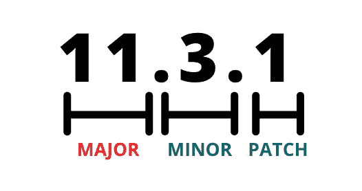
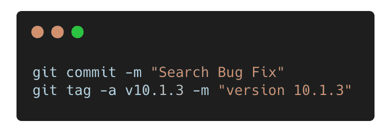
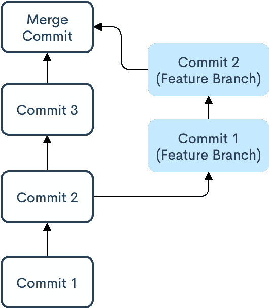
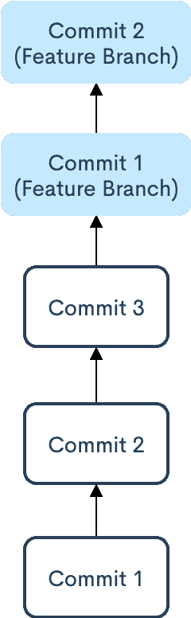

# 3 个人项目中的事情不会教你

> 原文：<https://blog.devgenius.io/3-things-working-on-solo-projects-wont-teach-you-44d14f655fb0?source=collection_archive---------24----------------------->

## 版本控制、测试和 Git

制造者在 [Unsplash](https://unsplash.com?utm_source=medium&utm_medium=referral) 上 [NESA 的照片](https://unsplash.com/@nesabymakers?utm_source=medium&utm_medium=referral)

虽然我从 12 岁就开始编程和开发应用程序，但本周标志着我在该行业作为软件工程师的第一年。回想我的第一年，我挑出几个我学到的概念。

# 版本控制

多年来，我已经构建了几个应用程序(用于黑客马拉松、个人项目，或者只是尝试了解一些工具)。构建这些项目对我理解开发工作流帮助很大，并让我接触了无数的工具和库。然而，由于这些只是个人项目，他们中的大多数都没有投入生产。这样做的非常简单，不需要任何版本支持。

正如你们可能已经猜到的那样，软件工程工作并不是这样的。

我了解了为什么版本控制软件是必不可少的，以及围绕它的一些最佳实践。在下一节中，我给出了为什么版本控制是必要的和一些常见策略的鸟瞰图。

对于本文，我们来谈谈版本控制软件是如何工作的。假设我们正在开发一个 SAAS 应用程序，该应用程序有一个客户端应用程序，它依赖于一个后端 API。我们的团队负责维护后端 API，客户端应用程序由另一个团队开发和维护。

> 因为客户端应用程序对后端应用程序有很强的依赖性，所以我们必须确保这两部分是兼容的。

本质上，我们需要一种方法让客户端应用程序团队知道后端应用程序是否有重大的突破性变化或微小的变化，或者只是一些错误修复，因为这将改变客户端应用程序与后端 API 的交互方式。

> 这就是语义版本控制发挥作用的地方。

在语义版本控制中，版本号可能看起来像

语义版本格式

根据语义版本规范:

1.  当有重大变更时，我们更新主要版本(即，依赖于这个工件的软件也需要更新)
2.  当我们以向后兼容的方式添加功能时，我们就更新了次要版本(也就是说，依赖于这个工件的软件几乎不需要修改)。
3.  当我们进行向后兼容的错误修复时，我们会更新补丁版本(即，除了错误修复或重构之外，没有任何更改)。

## 去哪里追踪这些数字？

跟踪这些数字的一种常见方法是使用 git 标签。每当我们提交时，如果我们想增加版本号，我们就用版本号标记回购协议。

标记存储库的命令

注意:许多第三方库会跟踪应用程序的版本，也会标记 git repos。

如果你有兴趣了解更多，你可以在他们的网站上了解更多。

 [## 语义版本 2.0.0

### 给定主要版本号。补丁，增加:主要版本当你做不兼容的 API 改变，次要…

semver.org](https://semver.org/) 

# 测试，测试，更多的测试

你们中有多少人为自己的项目编写测试？没有吗？嗯，至少我是这么做的。我从来没有意识到为什么测试是至关重要的，直到我有机会看到一个相当大的代码库(> 60，000 loc)。

> 如果你不喜欢对你的产品进行单元测试，很可能你的客户也不会喜欢测试它。

当我以前从事一个副业项目时，很容易发现是否有 bug，因为这个项目很小，可能只有几个屏幕(如果它是一个 web 应用程序)，或者几个脚本。通常，当我看到一个 bug 时，我知道问题出在哪里。

想象一下，您刚刚接触了一个大型的代码库，但还没有掌握所有的知识来理解整个应用程序和不同的移动部分。如果你不得不添加一个功能或者对现有的方式进行改变，那么要花很长时间才能弄清楚这个功能是否破坏了应用程序的任何其他部分，或者在应用程序的不同部分产生了不必要的副作用。

有了一个写得很好的测试套件，一旦你做了所需要的改变，你需要做的就是运行测试，看看其他的一切是否都正常工作，这样可以节省你几个小时的时间。

# 饭桶

所以，这有点尴尬。当我开始工作的时候，我已经从事版本控制系统的工作有一段时间了，并且认为自己对它相当满意。

然后，我发现了关于**改变基准**及其注意事项。

我在开始后不久就遇到了 rebasing，当我在学校被一些朋友认为是 git-master 时，我感到有些尴尬。虽然我听说过重置基础，但我从来没有使用过，因为我从来不觉得有必要。

## Git 重置基础

单独工作时，使用 git rebase 还是 git merge 并不重要。相反，当有许多开发人员`**committing**`和`**merging**`时，提交历史会变得混乱，让开发人员在单独的分支和`**rebasing**` 而不是`**committing**`上工作可能是一个更好的主意。

重置基础非常类似于合并(这是我一直使用的方法)。它们都将一个分支的变更集成到另一个分支中，例如，将一个特性分支的变更与主分支相结合。

> 区别在于如何将更改添加到目标分支。

为了理解其中的区别，让我们首先深入了解 git merge 是如何工作的。

Git 合并

当我们将一个特性分支合并到一个基础分支上时，git 会合并特性分支的提交并创建一个合并提交。然后，它将这个合并提交添加到基本分支。

另一方面，重置基础将生成一个线性 git 提交历史。Git 将把提交附加到基础分支，而不是创建一个合并提交。

Git Rebase

那么 git 是怎么做到的呢？

Git 从特性分支获取提交，并复制它们；然后将它们应用于主分支机构的负责人。

> 使用`rebase`命令，您可以获取一个分支上提交的所有更改，并在另一个分支上重放它们。

关于 git 重置有一些警告，在特定场景中可能不是最佳选择。本文深入解释了 rebasing 的工作原理、典型的开发人员工作流程以及一些注意事项。

 [## 合并与重置| Atlassian Git 教程

### git rebase 命令以神奇的 git 巫术而闻名，初学者应该远离它，但是它可以…

www.atlassian.com](https://www.atlassian.com/git/tutorials/merging-vs-rebasing#the-golden-rule-of-rebasing) 

这些是一些不难学的东西；然而，在从事个人项目时，我从未感觉到深入研究上述任何工具的紧迫性。

我很有兴趣听听其他开发人员是怎么说的，他们说你在参与一个更大团队的项目之前从未接触过这些东西。

下次见。