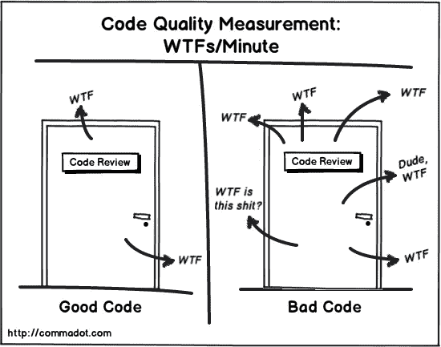

# 避免不良代码的 3 个技巧

> 原文：<https://blog.devgenius.io/3-tips-to-avoid-bad-code-7e25fe8e24c7?source=collection_archive---------4----------------------->

## 你不知道的坏代码


布里塔尼·伯恩斯在 [Unsplash](https://unsplash.com?utm_source=medium&utm_medium=referral) 拍摄的照片

**我们都写过糟糕的代码。截止日期越来越近，经理们四处追逐我们。我们忽略边缘情况，我们不测试代码。**

> 你是不是陷入这种境地了？

我写了几十万行 Java 代码，读了两倍。即使有这样的经历，糟糕的代码似乎总能找到自己的出路。

我们追捕臭虫，不考虑后果。编写未经测试且难以维护的代码每天都在发生。

我收集了三个关于如何对抗不良代码的技巧。

# 你写可扩展的代码吗？

人们应该始终牢记[开合原理](https://drive.google.com/file/d/0BwhCYaYDn8EgN2M5MTkwM2EtNWFkZC00ZTI3LWFjZTUtNTFhZGZiYmUzODc1/view)。您应该始终创建泛型类。根据您的特定需求创建扩展后。

> 它们是“开放扩展”的。
> 这意味着模块的行为可以扩展。随着应用程序需求的变化，或者为了满足新应用程序的需求，我们可以使模块以新的和不同的方式运行。
> 
> 它们“关闭以进行修改”。这样一个模块的源代码是不可侵犯的。不允许任何人对它进行源代码更改。罗伯特·马丁

我们常犯的一个错误是创建特定的代码。这导致了重复和难以维护。

一个例子是创建客户处理程序。假设我们需要对不同类型的客户应用折扣。

虚拟方法是为每个客户创建特定的方法。更好的方法是基于客户类型创建通用处理程序。

# 你写可测试的代码吗？

可测试的代码对于避免错误是至关重要的。坏代码存在于不可测试的代码中。

编写小函数，没有任何副作用，导致可测试的代码。将思维块提取到函数中，并给它们取一个有意义的名字。

为了更好地测试代码，编写纯函数。[纯函数](https://en.wikipedia.org/wiki/Pure_function)是没有任何副作用的函数。这些函数不改变输入参数，总是产生新的值。

让我们尝试开发一个函数，将 CSV 单元格解析为链接，并从这些链接下载图像。

函数错误命名的一个例子是:

```
convertCSVToImages(filePath) { ... }
```

想象一下测试这个方法。什么会出错？会有多少副作用？这个方法实际上是做什么的？

函数的良好命名示例如下:

```
readCSV(filePath) {...}getLinksFromColumn(column, cells) {...}downloadImages(links, downloadPath) {...}
```

**将功能分解成更小的部分要好得多**。你现在可以把它放在你的脑海里，因为它的尺寸变小了。

测试变得更容易，因为你不必担心副作用。由于您使用的是小函数，测试有时是不必要的。

写完可测试的代码后，测试它。尝试所有可能的场景，用单元测试和集成测试进行测试。[行为测试](https://medium.com/javascript-scene/behavior-driven-development-bdd-and-functional-testing-62084ad7f1f2)可以作为测试工具提供帮助。

**创建一个可测试的代码将会提高你的编码技能。**涵盖所有场景，包括正面和负面的，你将减少科技债务。

测试如何减少未完成的工作？简单。您为所有可能的流程创建测试。你需要写代码让它们通过。

测试软件意味着创建文档。测试应作为文件。通过查看测试，任何人都可以看到你在做什么。这样你就可以确定代码是完整的。

BDD 是进行开发的另一种方式。您定义代码需要满足的行为。

行为测试类似于集成测试。使用 Gherkin 语法，您可以创建场景。场景包含步骤，这些步骤在解析时执行代码。

有了定义的票证，您可以提前获得接受标准。使用这些来创建您的测试。

编写测试增加了更多的代码价值。你看到的是小细节，没有测试是看不到的。BDD 清理代码，删除死代码，留下漂亮的文档。

# 你了解你自己的代码吗？

复杂的代码会导致混乱。确定你输入的内容，并准备好简单地解释它。

**先给自己解释一下解决方案。我为什么要那样做？会有延期的可能吗？这种方法可能的论据是什么？**

我在编写复杂代码时遵循的一个标准是[圈复杂度](https://en.wikipedia.org/wiki/Cyclomatic_complexity)。Complexity 做静态分析，考虑所有可能的流程。拥有大量 if 分支会增加度量。

[阅读更多关于指标的信息](https://levelup.gitconnected.com/3-code-metrics-every-great-developer-must-measure-499b0b2b31ad)。

避免分支的一个简单技巧是创建一个通用的解决方案。然后指定。这将根除 if 分支。如果你有很多 if 分支，这是适用的。

对于更大的逻辑块，使用[多态](https://en.wikipedia.org/wiki/Polymorphism_(computer_science))会有所帮助。创建一个通用接口，然后针对特定场景实现它。这将分解代码，使其更易于阅读和测试。

# 额外收获:你得到代码评审评论了吗？



[http://reviewthecode . blogspot . com/2016/01/wtf-per-minute-actual-measurement-for . html](http://reviewthecode.blogspot.com/2016/01/wtf-per-minute-actual-measurement-for.html)

给你一个额外的提示，因为你已经通读了整篇文章。

正如链接文章所说， **wtf /min** 是代码质量的度量。度量随着复杂代码而增加。确保你的代码简单，并且有好的命名。

[阅读更多关于更好的代码评审的](https://levelup.gitconnected.com/how-to-become-a-high-quality-code-reviewer-230b007ea339)。

与团队成员讨论其中的逻辑。您可以在代码审查期间对不清楚的代码进行评论。

审查代码。审查代码让你意识到。意识到整个环境。

假设您正在处理结账流程。您需要获取当前用户。您创建了一个获取当前用户的方法。

这是常见的逻辑。在你之前有人实现了这个。可能在一个共享模块中，供您使用。

做代码审查，留下不好的代码。代码审查使您的代码更加整洁，有助于知识的转移，并提高项目意识。

感谢阅读！相关文章:

[](http://reviewthecode.blogspot.com/2016/01/wtf-per-minute-actual-measurement-for.html) [## 每分钟 WTF 代码质量的实际度量

### 汽车有 MPH(英里每小时)来衡量它们行驶的速度。车越好，时速就越快，或者…

reviewthecode.blogspot.com](http://reviewthecode.blogspot.com/2016/01/wtf-per-minute-actual-measurement-for.html) [](https://medium.com/better-programming/3-tips-to-become-a-better-code-reader-c84fcb4cedc3) [## 成为更好的代码阅读者的 3 个技巧

### 阅读代码和编写代码一样重要。以下是如何成为一个更好的读者

medium.com](https://medium.com/better-programming/3-tips-to-become-a-better-code-reader-c84fcb4cedc3) [](https://levelup.gitconnected.com/how-to-become-a-high-quality-code-reviewer-230b007ea339) [## 如何成为一名高质量的代码评审员

### 下面是您应该为质量代码审查做的事情

levelup.gitconnected.com](https://levelup.gitconnected.com/how-to-become-a-high-quality-code-reviewer-230b007ea339) [](https://levelup.gitconnected.com/3-code-metrics-every-great-developer-must-measure-499b0b2b31ad) [## 每个开发人员都应该知道的 3 个代码标准

### 这里有 3 个高质量的代码指标。

levelup.gitconnected.com](https://levelup.gitconnected.com/3-code-metrics-every-great-developer-must-measure-499b0b2b31ad)