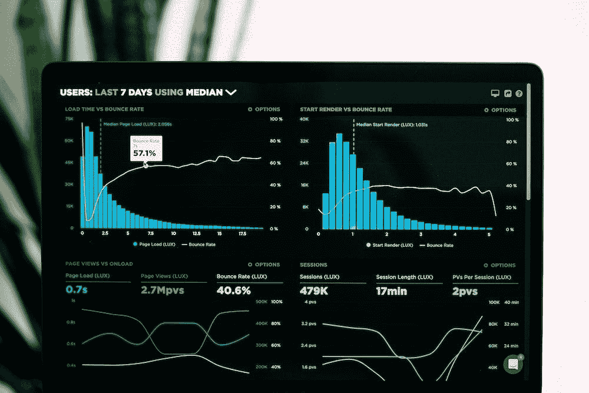
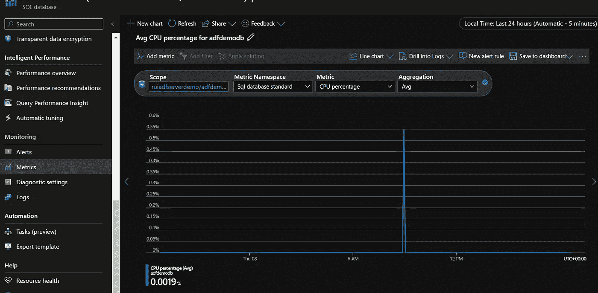
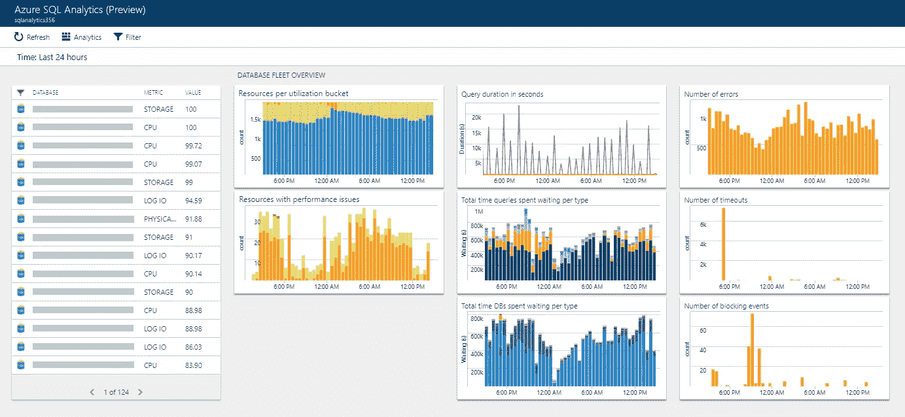
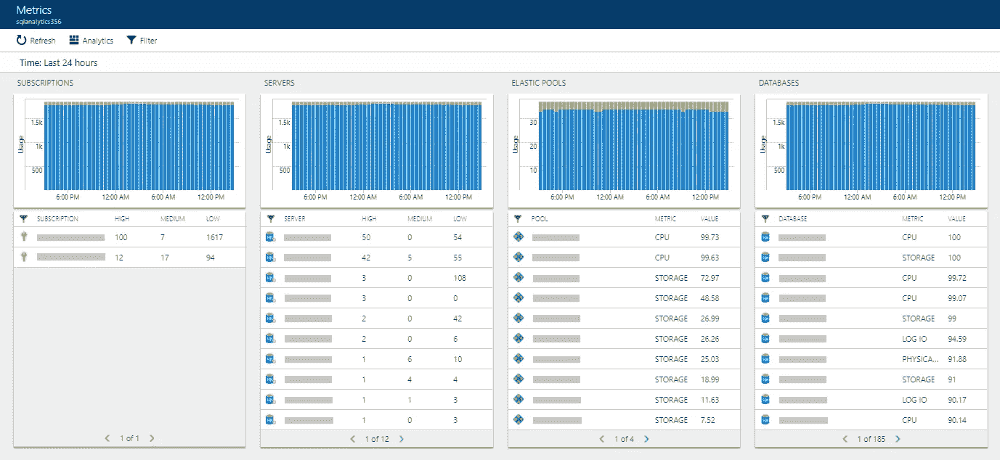
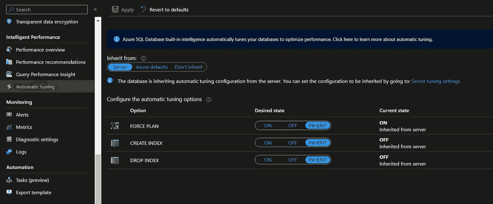
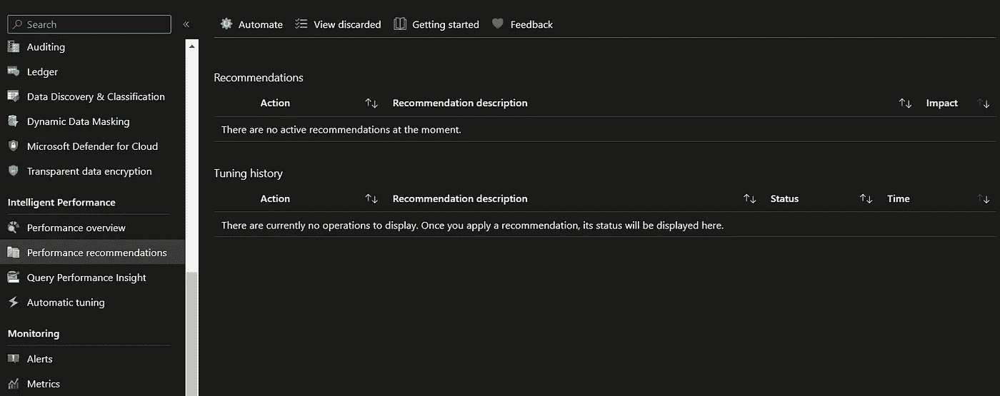
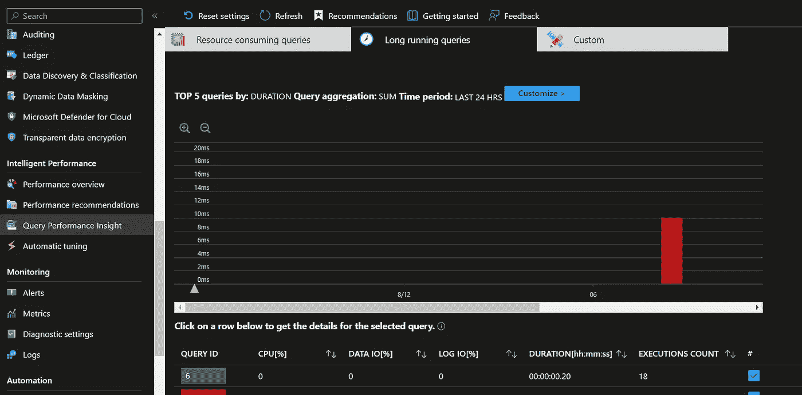
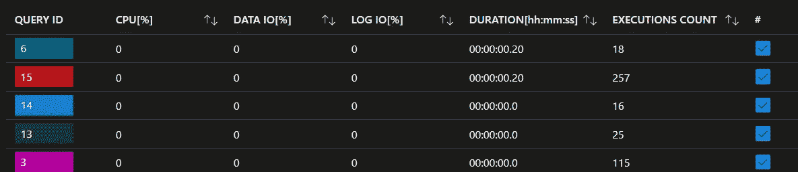
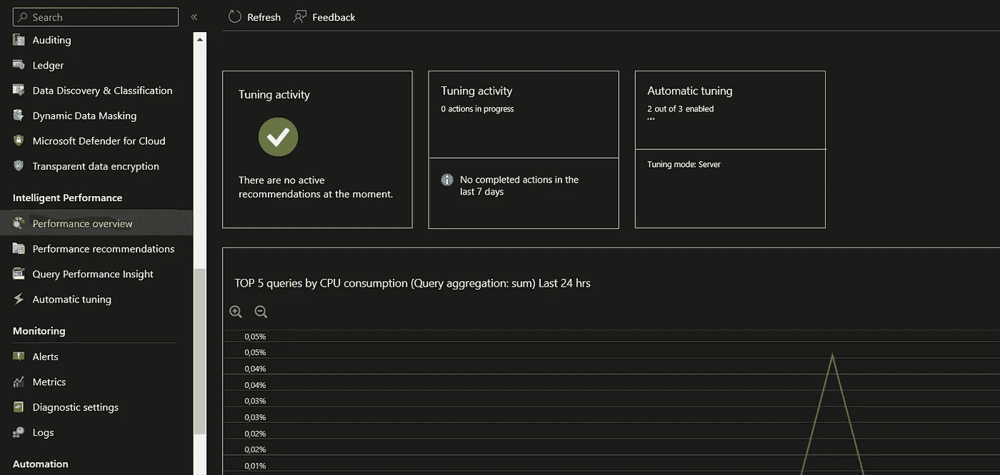

# 监控和优化 Azure SQL Server 性能的 3 个技巧

> 原文：<https://blog.devgenius.io/3-tips-to-monitor-and-optimize-azure-sql-server-performance-b399b988f106?source=collection_archive---------11----------------------->

Azure SQL Server 是一个强大的数据存储和管理平台，但监控和优化数据库实例的性能以确保其正常运行是很重要的。

由 Unsplash 上的卢克·切瑟

这里有 3 个技巧可以帮助你监控和优化你的 Azure SQL Server 性能:

## **1- Azure 监控仪表盘:**

使用**“Azure monitoring dashboard”**获得数据库性能的概览。Azure monitoring dashboard 提供关于 CPU、内存和存储使用情况的实时信息，以及网络流量和执行的查询。

你可以在 Azure 门户、数据库左面板、监控和度量中找到它。

通过**聚合**选择您想要分析的**指标**。

Azure 门户—监控

preview 上还有一个**Azure SQL Analytics**(*与 Azure Monitor* 的集成)，其中有一些关于数据库的更多信息，如超时、错误，以及查询和资源的一些见解。

更多信息请点击此处:[https://learn . Microsoft . com/en-us/azure/azure-monitor/insights/azure-SQL](https://learn.microsoft.com/en-us/azure/azure-monitor/insights/azure-sql)

通过 Microsoft 文档

通过 Microsoft 文档

## 2-性能和自动调整向导:

使用**“自动调优向导”**功能优化您的数据库查询。这是一个 Azure SQL Server 工具，它分析数据库中执行的查询，并建议可以提高这些查询性能的索引更改。

您可以在 Azure Portal 上找到它，在您的数据库页面上，您可以启用自动调整可以遵循的选项:

Azure 门户—自动面板

您还可以在“**性能建议**”上看到一些建议:

Azure 门户—性能建议

## 3-查询性能洞察:

使用**“查询性能洞察”**特性来识别性能问题。Performance insights 是 Azure SQL Server 的一项功能，允许您查看实时性能图表，并在性能问题影响系统运行之前检测到它们。

Azure 门户—查询性能洞察

Azure 门户—查询性能洞察

Azure 门户—性能概述

我希望这个故事对你有用，它给出了一些如何检查 Azure SQL 数据库性能的技巧。

别忘了每周订阅电子邮件来接收我的故事。

下次见！