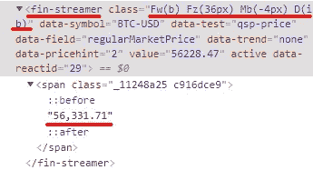

# 在 15 分钟内建立您的个人加密监视器

> 原文：<https://blog.devgenius.io/3-tools-5-steps-your-personal-crypto-watcher-heres-how-in-15-mins-c3a24ed48218?source=collection_archive---------5----------------------->

如果你正在读这篇文章，很可能你和我一样是一个秘密投资者。我们都知道密码价格在短时间内波动很大，有时我们会错过交易的好机会。

在撰写本文时，比特币的估值为:


你可能认为这是一个买入的机会。或者，您可能希望价格更低，例如 55，000 美元(11 月 26 日发生过一次)。但是，如果你因为价格的波动性而错过了价格再次下跌的好时机，该怎么办呢？这篇文章分享了我个人关注加密价格并尽快得到通知的方法。本文末尾的 GitHub 中的代码已经开源。如果您想复制一个，估计最多需要 15 分钟。

# 3 个工具

关于我自己的有趣事实，我是一个 Windows 用户，因为我出生。我使用的第一个工具是 Windows 内置的**任务调度器**。因此，如果你是 MacOS 或 Linux 用户，你可能需要寻找替代品。第二， **Python** 作为编程语言来开发我们的程序。如果你没有，你需要 Python 安装在 [**这里**](https://www.python.org/downloads/) 。第三， **pip** 是一个 Python 包助手，它帮助我们安装所有依赖的库。这里 可以安装 [**。**](https://pip.pypa.io/en/stable/installation/)

# 5 个步骤

## 1 —决定密码

有大量的加密货币可供你投资。对我来说，我是一个投资者，跟随主流，专注于“大”密码，包括 BTC，瑞士联邦理工学院和阿达。你可以选择任何你想要的，只要记下他们的票。

## 2 —获取信息

这是编码真正开始的地方。我们将使用 python 库 [Beautiful Soup](https://www.crummy.com/software/BeautifulSoup/bs4/doc/) 和[请求](https://docs.python-requests.org/en/latest/)从 [YahooFinance](https://sg.finance.yahoo.com/) 中获取实时价格。

```
def scrape(url):
    r = requests.get(url, headers=headers)
    data = r.content
    soup = BeautifulSoup(data, 'lxml')
    return soupdef find_real_time_price(crypto):
    yahoo_url = f"https://sg.finance.yahoo.com/quote/{crypto}-USD?p={crypto}-USD"
    soup = scrape(yahoo_url)
    price = soup.find('fin-streamer', attrs={'class': 'Fw(b) Fz(36px) Mb(-4px) D(ib)'})
    real_time_prices[crypto] = format_price(price.text)
    print(real_time_prices)
```

在上面的代码中，*find _ real _ time _ price(crypto)*接收 crypto ticker 并传递给 YahooFinance url。使用 url，我们将以“lxml”的形式抓取该页面上的所有内容。然后，为了找到价格，我们将找到一个 web 元素' **fin-streamer** ，其属性' **class** '为'**Fw(b)Fz(36px)Mb(-4px)D(IB)**'。你可能对此感到困惑，但这只是一个 css 选择器方法，从网页中获取所需的数据。然后，我们从这个元素的文本字段中获取价格。



BTC/美元价格的 Web 元素

## 3 —决定交易逻辑

我不像其他人那样有数据科学的专业知识，他们做大量的研究，计算标准偏差等复杂的术语来决定是买还是卖。我的目标是长期持有。我的策略相当简单:如果实时价格下跌到过去 7 天平均价格的一定百分比，我会考虑买入。

```
def decide_notification(crypto):seven_day_avg = calculate_seven_day_avg(crypto)
    if crypto == 'ADA':
        if real_time_prices[crypto] < seven_day_avg * 0.85:
            send_notification(crypto, real_time_prices[crypto], seven_day_avg)
    else:
        if real_time_prices[crypto] < seven_day_avg * 0.92:
            send_notification(crypto, real_time_prices[crypto], seven_day_avg)
```

上面的代码所做的是，计算过去 7 天的平均值，如果是 ADA，并且实时价格是 7 天平均值的 85%(下降 15%)，则向我发送通知。如果是 ETH、BTC 或其他货币，现在是 7 天平均值的 92%(下跌 8%)，也给我发通知。您可以在这里自定义自己的策略。

## 4-发送通知

您可以通过多种方式向自己发送通知，包括聊天工具、电子邮件和日历事件。就我而言，我喜欢使用 Gmail 接收通知，最可爱的是 Gmail 有一个功能，你可以为你的定制应用程序生成应用程序密码。你需要在这里生成你的[](https://support.google.com/mail/answer/185833?hl=en)**。使用应用程序密码，您现在可以发送自定义通知:**

```
def send_notification(crypto, current_price, seven_day_avg):
    port = 465
    smtp_server = 'smtp.gmail.com'

    drop = (seven_day_avg - current_price) / seven_day_avg
    drop = '{:.2f}'.format(drop * 100)

    seven_day_avg_str = "{:.2f}".format(seven_day_avg)

    message = MIMEMultipart('mixed')
    message['From'] = <YourEmailAddress>
    message['To'] = <YourEmailAddress>
    message['Subject'] = f'New {crypto}/USD Hits'
    body = f'{crypto} has hit {current_price} USD with 7 - day average {seven_day_avg_str} USD with drop of {drop} %.'
    body = MIMEText(body, 'plain')
    message.attach(body)
    message = message.as_string()

    try:
        context = ssl.create_default_context()
        with smtplib.SMTP_SSL(smtp_server, port, context=context) as server:
            server.login(<YourEmailAddress>, <YourAppPassword>)
            server.sendmail(<YourEmailAddress>, [<YourEmailAddress>], message)
        print('-' * 50)
        print("Email Notification -> Message has been sent.")
        print('-' * 50)
    except Exception as e:
        print(e)
```

**以下是几天前和今天我收到的一些截图，当时这些密码确实达到了预期的基准:**

********

## **5 —自动化**

**最后一步，Windows 用户，打开**任务调度器**并选择**创建任务…****

**在**常规**选项卡中，您可以自定义自己的任务名称，并选择登录配置等基本配置来运行任务。我在那里没怎么改变。**

**在**触发**选项卡中，选择您重复任务的方式，每日、每周或每月、重复频率和重复频率。我的方法是每天间隔 30 分钟重复这个任务(如果你在监视一个更不稳定的密码，你可以相应地缩短时间)。**

****

**在“操作”选项卡中，选择“启动程序”。在程序/脚本中，输入您安装的**python.exe**的路径。对于我自己，我把我的 python 安装在我的 *C:\Program Files* 中。在“添加参数”中，输入包含上述代码的 python 文件的存储路径，例如*C:\ Users \ Desktop \ crypto _ watcher \ main . py .***

****

**在“条件和设置”选项卡中，您也可以自定义您的设置。我选择在交流电源和睡眠时间启动程序。我在我的设置标签里没怎么改动。**

****

**点击确定，然后**嘣！你得到了你的实时加密价格监视器！****

## **遗言**

**这只是一个例子，你可以利用 Python 来实现你的交易逻辑，利用 Windows 来自动化你的程序。不仅是 cryptos，你也可以对普通股票、ETF 或其他金融产品实现同样的事情。使用 Python 的 web 抓取，您不仅可以抓取价格，还可以抓取公司描述、新闻和财务摘要，用于您的个人研究目的。这为投资者打开了一扇新的大门，他们可以获得实时信息，做出明智的决策，并转移工作量，让机器为您工作！**

## **开源代码库**

**此处的 为项目代码 [**。**](https://github.com/wdn0612/crypto_watcher)**

**我希望这篇文章对你有所帮助。如果你像我一样渴望学习一些与技术相关的东西，或者定期反思工作和生活，请关注我的频道，了解我在日常工作和生活中的小灵感和总结。**

## **放弃**

**以上内容仅用于教育目的。没有什么构成专业/财务建议。**