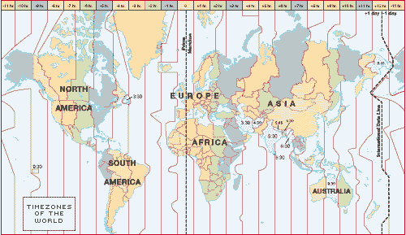
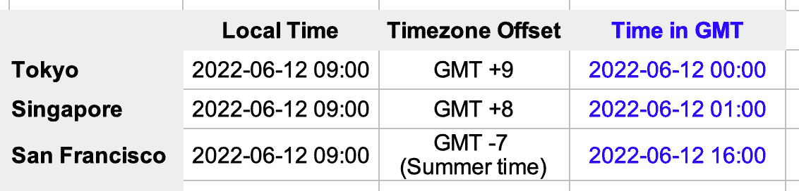

# 关于如何设计多时区系统的 3 个有用提示

> 原文：<https://blog.devgenius.io/3-useful-tips-on-how-to-design-systems-of-multiple-time-zones-a7404a51229c?source=collection_archive---------3----------------------->

## 成功的电子商务系统的关键设计概念

凯尔西·奈特在 [Unsplash](https://unsplash.com?utm_source=medium&utm_medium=referral) 上的照片

互联网的发展重新定义了软件的分布。随着互联网将世界连接起来，现在的门户网站和 API 可以立即部署，为世界各地的人们服务。许多国际企业都有自己的集中式系统，为一个地区和全球范围内的多个国家提供服务。

等一下，别忘了人们生活在不同的时区。

日本时间是下午 6 点，而纽约仍然是早上 5 点。当谈到日光节约时间(DST)的过渡时，情况就更复杂了。虽然夏令时的时钟向前/向后在亚洲并不常见，但北美和欧洲国家定期进行这种练习。如果您的系统要为多个时区的人服务，那么仔细处理时间的系统设计就至关重要。

在本文中，我将与您分享如何使用 Java 示例代码为多个时区构建系统的设计技巧

# 时区基础知识

随着地球自转，一些地方比其他地方更早观察到日出。例如，悉尼的早晨时间是上午 9 点，而土耳其仍然是凌晨 4 点。因此，整个世界被划分成不同的时区，主要受经度和管辖权的影响。

格林威治标准时间(GMT)是世界通用的参考时间点，根据该时间点向每个时区分配时差，以确定当地时间。因此，悉尼的时区是 GMT +10。当 GMT 为凌晨 1 点时，悉尼当地时间为上午 11 点(1am + 10 小时)。

世界时区(来源:https://www.infoplease.com)

在 Java 编程中， **LocalDate** 和 **LocalDateTime** 表示没有时区的本地时间，而 **ZoneId** 表示时区。**瞬间**是格林威治时间。下面的示例代码演示了时间类的用法。

除了时区偏移，夏令时(DST)也是一个重要的概念。这个想法是为了充分利用夏令时和节约能源，在春天把时钟调快，在秋天把它调回来。例如，在洛杉矶，时钟从 2021 年 3 月 14 日的凌晨 2 点调至凌晨 3 点，当地时间从 2021 年 11 月 7 日的凌晨 2 点调回到凌晨 1 点。

除了时区偏移，夏令时(DST)也是一个重要的概念。这个想法是为了充分利用夏令时和节约能源，在春天把时钟调快，在秋天把它调回来。例如，在洛杉矶，时钟从 2021 年 3 月 14 日的凌晨 2 点调至凌晨 3 点，当地时间从 2021 年 11 月 7 日的凌晨 2 点调回到凌晨 1 点。

下面的示例 Java 代码使用“America/Los_Angeles”作为时区标识符。应用时区的时间从凌晨 2 点转移到凌晨 3 点。

# 设计技巧 1——如何保持日期时间？

想象一家跨国公司在世界各地经营工厂。有一个在线平台可以收集和监控工厂每小时的生产率。因此，该平台接收来自不同时区工厂的数据。

由于东京和旧金山工厂的生产率数据是在当地时间上午 9 点收到的，所以如果我们只存储当地时间会令人困惑，因为当地时间是相对的，这意味着不同时区的地方有不同的当地时间。例如，东京的上午 9 点意味着旧金山前一天的下午 5 点。反之，旧金山的上午 9 点是东京第二天的凌晨 1 点。

为了使数据易于维护，设计技巧是在保存到数据存储时将本地时间转换为 GMT 时区。例如，当记录存储到数据库中时，东京当地时间 2022–06–12 09:00 将转换为 GMT 时间 2022–06–12 00:00。现在，我们有东京、新加坡和旧金山在标准格林威治时间的记录。

在数据库表定义中设置带有**时间戳**数据类型的时间戳列。此列类型存储不带时区/时差信息的日期时间。

使用 Java 代码的转换非常简单。您需要做的是获得一个带有本地日期时间和时区的 **ZonedDateTime** ，然后获得一个用 GMT 表示时间的 **Instant** 类型。下面是示例代码:

使用 JPA 注释持久化实体模型。再次，在 **Instant** 类型中定义时间戳字段

另一种方法是用数据类型`**TIMESTAMP WITH TIME ZONE**`定义时间戳列。数据库将存储时间戳和时区，而实际时间戳存储在 GMT 内部。

# 设计提示#2 —使用 IANA 时区而不是时差

从 GMT 时间到当地时间的转换似乎是基于时差的。虽然它适用于亚太地区的大多数国家，但不适用于夏令时过渡的国家。那些实行夏令时的国家一年有两次时差。例如，旧金山的时差在 3 月到 11 月是 GMT -7，然而，在 11 月到 3 月，时差被转移到 GMT -8。因此，时间转换的硬编码偏移不是通用的解决方案。

使用 IANA 时区数据库是一个更好的解决方案。不使用 offset，时区格式为**【地区】/【城市名称】**。

IANA 时区数据库中没有“America/San _ Francis co ”,因为该数据库没有所有城市，它提供了代表该地区时区的城市。因此，旧金山的 IANA 时区是“美洲/洛杉矶”。

下面的示例代码演示了 2021 年 3 月 14 日从 02:00 到 03:00 的时钟向前移动，使用的是 IANA 时区:

相反，基于时差的时区不应用夏令时转换。下面的示例代码没有显示任何过渡，偏移量保持不变:

# 设计技巧 3——在用户界面上显示当地时间

按照设计技巧#2，通常的做法是在系统上以 GMT 时间转换和存储日期时间，以便于处理。但是，仅仅因为系统记录的日期时间是 GMT，就用 GMT 来显示时间肯定不是一个好主意。

我曾经在一个地区交易系统上工作，这个系统保存了所有交易的电子日志。它以 GMT 显示日志查询功能的交易提交时间，与当地时区无关。手动将时间转换为本地时间以计算出交易的本地时间是一件很麻烦的事情。

如果系统能够自动显示当地时间的交易记录，以便使数据更具相关性和可读性，那就更好了。

按照设计技巧#2，通常的做法是在系统上以 GMT 时间转换和存储日期时间，以便于处理。但是，仅仅因为系统记录的日期时间是 GMT，就用 GMT 来显示时间肯定不是一个好主意。

我曾经在一个地区交易系统上工作，这个系统保存了所有交易的电子日志。它以 GMT 显示日志查询功能的交易提交时间，与当地时区无关。手动将时间转换为本地时间以计算出交易的本地时间是一件很麻烦的事情。

如果系统能够自动显示当地时间的交易记录，以便使数据更具相关性和可读性，那就更好了。

请参考设计提示 2 中的示例代码，了解从**时刻**(GMT 中的时间戳)到时区日期时间的转换。

对于采用夏令时的地区，过渡时钟向前/向后的信息对用户很有帮助。下面的示例代码检查夏令时转换:

# 最后的想法

一个成功的电子商务系统服务于不同地理位置的客户。处理不同时区的日期时间是基本的设计概念。

首先，将本地日期时间转换为内部存储和处理的 GMT 时间，避免了操作时区的混乱和复杂性。请记住，时区不仅仅是偏移，还包括使用 IANA 时区数据库时夏令时的转换。最后，确保您的系统显示的信息对用户来说是可读的，因此日期时间最好根据用户的当前时区正确地转换为本地日期时间。