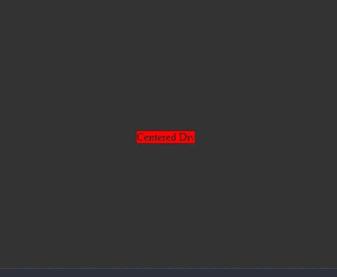
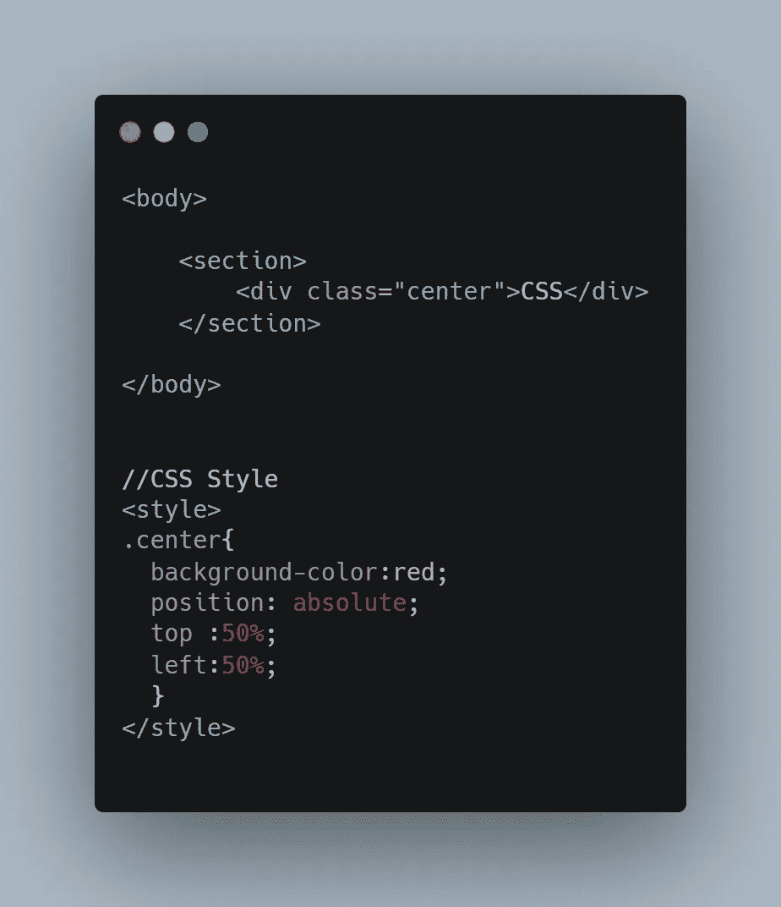
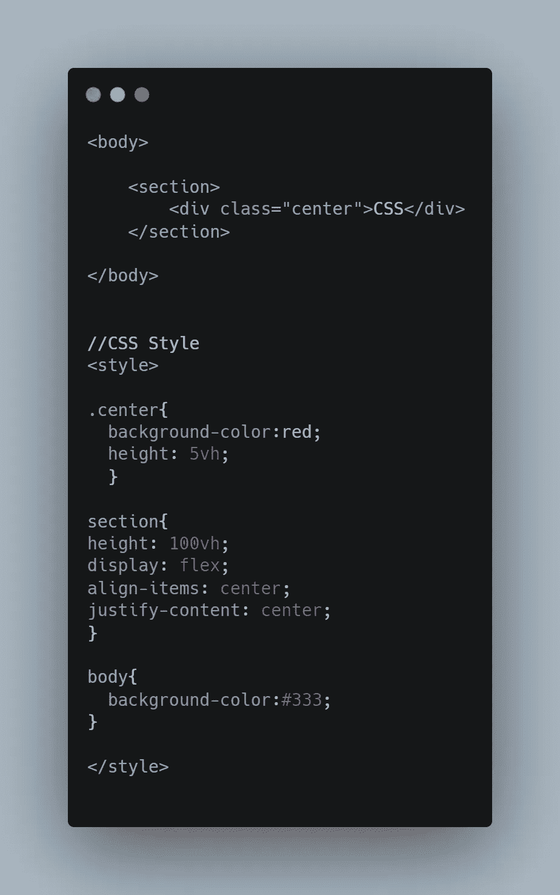
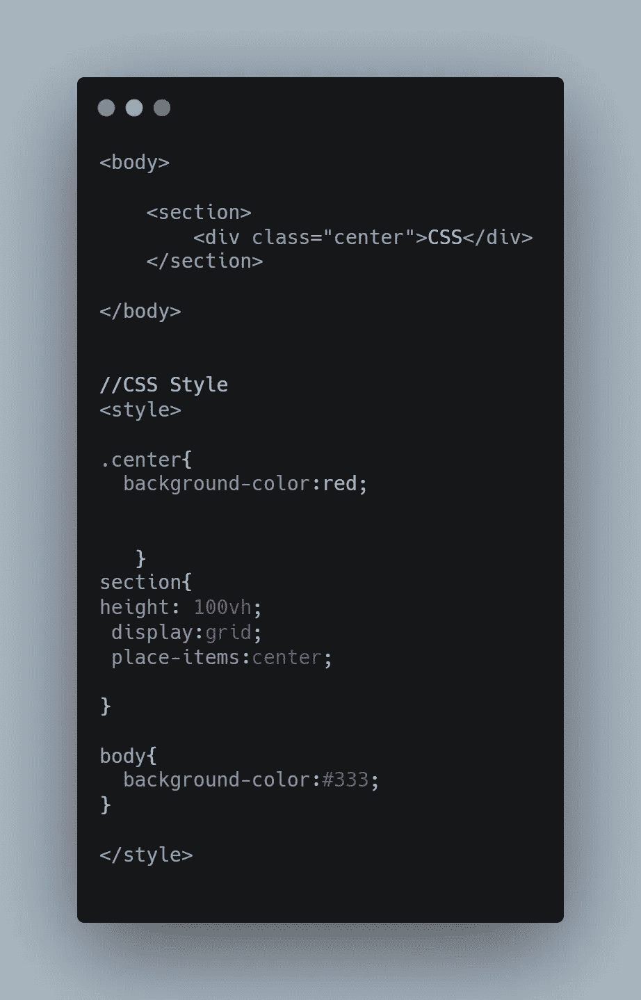

# 用 CSS 居中 Div 的 3 种方法

> 原文：<https://blog.devgenius.io/3-ways-to-center-a-div-with-css-3df9e66dbd42?source=collection_archive---------2----------------------->

使用 CSS 垂直和水平居中 Div 的指南

[潘卡杰·帕特尔](https://unsplash.com/@pankajpatel?utm_source=medium&utm_medium=referral)在 [Unsplash](https://unsplash.com?utm_source=medium&utm_medium=referral) 上的照片

任何 web 开发人员都可能面临的一个常见问题，尤其是在他们职业生涯的早期，就是如何使用 CSS 将 div 居中。在本文中，我将向您展示三种不同的方式来居中 Div 元素，包括水平和垂直。我们将用单词“居中 div”创建这个简单的居中 Div，如下所示

# 1.使用绝对位置

在 CSS 中使 div 居中的一种方法是将位置设置为绝对，并将 *left* 和 *right* 属性值设置为 50%,这将使 Div 移动到中心。

# 2.使用 Flexbox

在 CSS 中将 div 居中的第二种方法是将 div 的父元素设置为显示 flex，并将 *justify-conten* t 和 *align-elements* 属性设置为居中。

# 3.使用 CSS 网格

在这个列表中水平和垂直居中 div 元素的最后一种方法是使用 CSS Grid。我们通过将 div 的父元素设置为 display 和 grid 并将 *place-items* 属性设置为 center 来实现这一点。

*注意:section 的高度值为 100vh，因为默认情况下，像 section 和 div 这样的元素只占用它们的子元素正确显示所需的高度。*

# 结论

希望到目前为止，您已经知道如何使用 position absolute、flexbox 或 CSS Grid 将 div 垂直和水平居中。感谢你阅读我的文章，我希望你有一个伟大的休息你的一天，这里是我的一些进一步阅读。

## 进一步阅读

 [## 编写 CSS 助手类如何提高我的生产力

### 为什么在编写 CSS 时应该开始使用助手类

medium.com](https://medium.com/dev-genius/how-writing-css-helper-classes-improved-my-productivity-c2360d0dab78)  [## 每个开发人员都应该知道的 10 个 VS 代码快捷键

### 简单的快捷方式可以极大地提高你的生产力

medium.com](https://medium.com/dev-genius/10-vs-code-shortcuts-every-developer-should-know-f2d1058cfe8e)