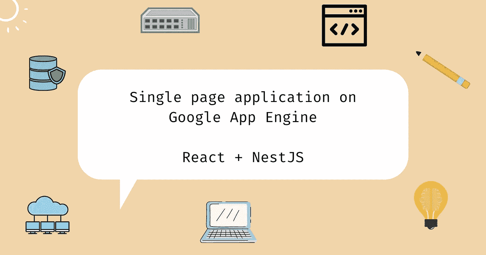

# 在 Google App Engine 上托管单页面应用程序的 3 种方式💡

> 原文：<https://blog.devgenius.io/3-ways-to-host-a-single-page-application-on-google-app-engine-cf757d373f92?source=collection_archive---------8----------------------->

## React + NestJS 在 GAE 上的应用



这更多的是描述我个人的开发和调试经验，而不是关于这个主题的一步一步的教程。欢迎对任何错误进行更正！如果这篇文章对你有帮助，你可以阅读我的其他文章:[https://hungvu.tech/](https://hungvu.tech/?utm_source=medium.com&utm_medium=referral&utm_campaign=medium_crossposting)。

# 问题陈述🍀

我有一个用 NestJS 作为后端的 React 应用程序。Google App Engine 是我的目标部署环境。在我的 [Google App Engine 部署文章](https://hungvu.tech/brainstorm-a-deployment-process-from-github-to-google-app-engine-and-cloud-sql-part-2?utm_source=medium.com&utm_medium=referral&utm_campaign=medium_crossposting)中，我成功地制作了一个虚拟 NodeJS 应用程序部署到 App Engine，但是，它不包括前端。现在，我应该如何在那里托管我的单页应用程序呢？

我的文件夹结构如下。

```
- root
   - .github/workflows
   - front-end
   - back-end
```

# 有哪些做法？🤔

我知道有三种方式。

1.  使用两个 App Engine 服务和`dispatch.yaml`。
2.  使用一个应用引擎服务来托管 React 和 NestJS 应用。
3.  使用一个应用引擎服务来托管 NestJS 应用，使用另一个服务器来托管静态 React 文件。

# 使用`dispatch.yaml`🔑

当后端和前端是松散耦合时，这可以工作，我想利用谷歌身份感知代理。

# 什么是`dispatch.yaml`？

这是一个用于**应用引擎服务**的配置文件。术语**服务**在这里类似于**一个计算引擎实例**(虽然不是直接等价的)。一个`dispatch.yaml`文件在应用引擎服务级别覆盖路由规则。意思是，在请求到达我的 API 之前。

# 使用

假设我的`front-end`在`react.uc.r.appspot.com/`部署到**服务 react** ，而`back-end`在`api.uc.r.appspot.com/`部署到**服务 api** 。

```
# dispatch.yaml
# Put this one in my 'front-end' folder
# Assuming this is a configuration for service "react"
# All requests to 'react.uc.r.appspot.com/api/*' are routed to 'api.uc.r.appspot.com/'
dispatch:
  - url: "react.uc.r.appspot.com/api/*"
    service: api
```

# 优点和缺点

1.  优势

*   无需担心同源问题(例如，CORS)，因为资源是通过同一个域提供的。
*   可以将前端和后端的部署分开(例如，创建仅当某个路径上的文件被更新时才运行的工作流)。固有地增加冗余和弹性。
*   减少服务器负载。
*   两者都可以受到谷歌身份感知代理的保护。

2.不足之处

*   当前端严重依赖后端时不适用，这将在下一个方法中进一步讨论。
*   可能会增加成本，因为有 2 个在线应用引擎服务。

```
# Sample of CORS error
   Cross-Origin Request Blocked: The Same Origin Policy disallows reading the remote resource at ...
```

# 后端存储反应资产并静态地为它们服务🔑

与第一种方法不同，当前端在第一次加载时需要来自后端的资源时，这种方法会有所帮助。例如，我的 React 应用程序需要一个 CSRF 令牌来使用我的 API。CSRF 令牌必须在用户第一次访问我的网站时可用。为此，我的 React 应用程序必须作为来自 NodeJS 后端的静态文件。

# 使用

以下说明适用于 NestJS 框架。我的应用程序只部署到一个域`back-end.uc.r.appspot.com`。

*   在我的 GitHub 工作流中，在 React 构建过程完成后，我将静态 React 文件复制到了`back-end`文件夹中。

```
# CI/CD pipeline
  steps: 
    ...
    - name: Build front-end
       ...
    - name: Copy front-end built to back-end folder
      working-directory: front-end
      run: |
        mkdir -p ../back-end/assets
        cp -R build ../back-end/assets
```

*   在`nest-cli.json`中，使用`compilerOptions`将 React 资产复制到 NestJS `dist`构建中。

```
{
    ...
    "soruceRoot": "src",
    "compilerOptions": {
      "assets": ["../assets/"]
    }
}
```

*   仅将`back-end`文件夹部署到应用引擎。包含 React 文件，可以静态提供。

# 优点和缺点

1.  优势

*   降低成本，因为只有一个在线应用引擎服务。
*   无需担心同源问题(例如，CORS)，因为资源是通过同一个域提供的。
*   可以由谷歌身份感知代理保护。
*   使用紧密耦合的 web 应用程序。

2.不足之处

*   增加服务器负载，因为整个单页面应用程序都依赖于相同的应用引擎服务。
*   无法单独部署后端和前端。一个地方的改变需要全新的部署。固有地降低冗余和弹性。

# 静态服务，但是 React 文件托管在另一个服务器上🔑

一种常见的策略是使用(例如 Google 云存储桶),这种策略针对托管静态文件进行了优化，可以极大地提高性能。您还可以针对其他方面进一步微调服务器。

# 使用

它本质上与第二种方法相同，但是根据情况有不同的配置，所以我不深入讨论。使用 App Engine 从 Google 云存储桶提供静态文件的示例可以在这里找到[(官方 Google Cloud 文档)](https://cloud.google.com/appengine/docs/standard/go/serving-static-files)。

# 优点和缺点

1.  优势

*   更好的冗余和弹性。
*   更好的性能和更容易微调。
*   可以将前端和后端的部署分开(例如，创建仅当某个路径上的文件被更新时才运行的工作流)。固有地增加冗余和弹性。

2.不足之处

*   可能面临同源问题(例如，CORS)，因为文件托管在另一个域中。
*   可能无法为前端激活 Google 身份识别代理。
*   使用紧密耦合的 web 应用程序。
*   你需要有使用另一个静态文件托管服务的经验，使用不同的平台可以分散你的控制。

# 包裹🍀

总而言之，我可以

1.  如果我的 React 应用程序和后端是松散耦合的，则使用 2 个应用程序引擎服务。
2.  当我需要更好的性能、冗余和弹性时，使用 App Engine 托管后端，而使用另一个服务托管静态文件。
3.  如果紧密耦合，使用 1 个应用程序引擎来托管整个单页面应用程序。