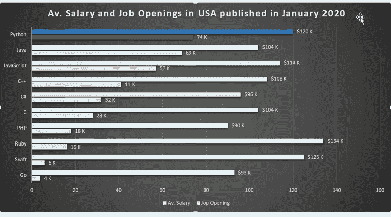
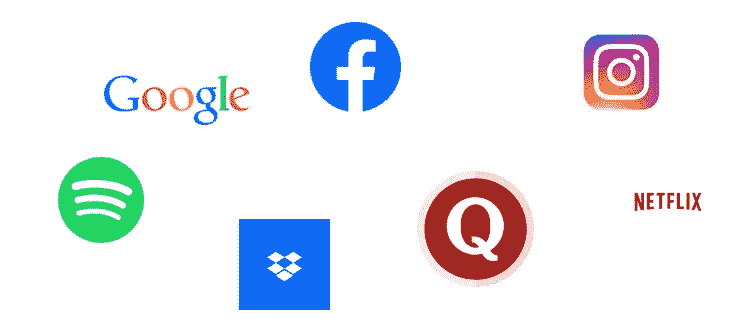

# 什么是 Python:Python 完整教程—第 3 部分

> 原文：<https://blog.devgenius.io/3-what-python-is-c92b5656bd6d?source=collection_archive---------14----------------------->

玛利亚·沃诺特娜在 [Unsplash](https://unsplash.com/s/photos/python) 上拍摄的照片

**在我们开始之前，让我告诉你:**

*   这篇文章是 Python 完全初学者到专家课程
    的一部分，你可以在这里[找到它](https://medium.com/@samersallam92/python-complete-beginner-to-expert-course-f7626916df30)。
*   这篇文章在 YouTube 上也有视频[。](https://www.youtube.com/watch?v=8FUJd44CKSg)

[https://www.youtube.com/watch?v=8FUJd44CKSg](https://www.youtube.com/watch?v=8FUJd44CKSg)

## 介绍

首先，让我问你:

想知道为什么你必须学习 Python？如果答案是肯定的，那我告诉你，这篇文章要回答的正是这个问题。

**本文将涵盖以下要点:**

1.  [Python 是什么？](#6908)
2.  [Python 的历史](#f77a)
3.  [Python 特性](#1172)
4.  [Python 用户](#7093)
5.  [为什么一定要学 Python？](#9357)
6.  [使用 Python 的公司](#901b)

所以让我们开始吧…

## 1.Python 是什么？

照片由 [Hitesh Choudhary](https://unsplash.com/@hiteshchoudhary?utm_source=unsplash&utm_medium=referral&utm_content=creditCopyText) 在 [Unsplash](https://unsplash.com/s/photos/python?utm_source=unsplash&utm_medium=referral&utm_content=creditCopyText) 上拍摄

Python 是一种**高级**编程语言，被设计成具有高度可读性，其中频繁使用英文关键词，而不是使用机器语言(二进制语言)。
而且，Python 是一种**解释的**编程语言，也就是说 Python 情况下的翻译器类型是解释器而不是编译器。

另外，Python 支持**面向对象**编程(OOP)和**脚本**编程。

如果 OOP 这个术语让你感到困惑，不要担心:

*   OOP 是一种新的编程风格，我们将程序定义为一组抽象类，代表我们生活中的抽象概念。
*   而脚本是一种旧的风格，我们用自由式写程序，没有任何抽象。

有关 Python 中面向对象编程的更多信息，请访问我的课程:

[Python 面向对象编程完整教程](https://medium.com/@samersallam92/object-oriented-programming-course-f54c104271e0)。

现在让我们来谈谈这种语言的历史。

## 2.Python 的历史

当我们谈论 Python 编程语言时，我们不得不提到这种语言的开发者**吉多·范·罗苏姆**，这种语言是在 18 世纪末到 9 世纪初由荷兰国家数学和计算机科学研究所开发的。

照片由 [Pinterest](https://www.pinterest.com/pin/268456827774909697/) 上的 [qz](https://qz.com/1624252/pythons-creator-thinks-it-has-a-diversity-problem/) 拍摄

此外， **Python** 相对于其他较老的编程语言(如 **C** 和 **C++** )被认为是相对较新的。

接下来，我们将快速讨论 Python 的一些优势。

## 3.Python 特性

照片由 [HT-Pix](https://www.istockphoto.com/portfolio/HT-Pix?mediatype=photography) 在 [Unsplash](https://www.istockphoto.com/photo/red-exclamation-mark-on-wooden-floor-and-concrete-wall-3d-illustration-warning-gm1128969284-298073708?utm_source=unsplash&utm_medium=affiliate&utm_campaign=srp_photos_bottom&utm_content=https%3A%2F%2Funsplash.com%2Fs%2Fphotos%2Fattention&utm_term=attention%3A%3A%3A) 上拍摄

*   **非常好学**:它频繁使用英文关键词的地方，还有一些地方当你用 Python 写你的代码的时候，你会觉得你是用英文写的，而不是用编程语言写的。
*   **一个动态数据类型**:这意味着当你要定义一个新的数据值时，你不必指定这个值的类型(只需定义值)。稍后，解释器将负责从数据值本身确定数据类型。
*   **一种可移植的编程语言**:比如你在 Windows 平台上写你的程序，你可以简单的拿着这个程序在 Linux 或者 Mac 平台上运行，不做任何改动。
*   一种扩展的编程语言:这个特性非常重要，因为它允许我们编写一个接口，连接到用其他编程语言编写的其他程序，比如 C++，我们可以从 C++的速度中获益。
*   一种免费和开源的编程语言:这意味着如果你想使用这种语言，它的内置库，或者任何第三方开发和发布的在线库，你都不必付费。

所有这些特性使 Python 成为最常见的编程语言之一。现在，让我们更详细地看看谁会使用 Python？

## 4.Python 用户

[金属制品](https://www.istockphoto.com/portfolio/chombosan?mediatype=photography)在 [Unsplash](https://unsplash.com/s/photos/python-users) 上拍照

如果您是以下人员之一，或者您正计划成为以下人员之一:

*   数据工程师
*   数据分析师
*   数据科学家
*   机器学习工程师或研究员
*   深度学习工程师或研究员
*   Web 开发人员
*   软件开发人员

那么 **Python** 对你来说就是一个很棒的工具。这会让你的生活变得更轻松，而且在简历中大放异彩也是一项非常重要的技能。

在我们看到了 Python 的伟大特性以及谁可以使用它之后，是时候用 numbers 语言来谈谈 Python 了。

## 5.**为什么一定要学 Python？**

根据**indeed.com(世界上最大的招聘公司之一)的数据，2020 年 1 月，Python 在美国拥有最多的职位空缺(约 74，000 个)。**

此外，Python 开发人员的薪水是美国最高的 30 名开发人员之一，每年大约 12 万美元。参见图 1。

图 1:2020 年 1 月公布的美国薪资和职位空缺([https://nl.indeed.com/](https://nl.indeed.com/))。

请记住，今天是**数据科学**、**人工智能**、**机器学习**和**深度学习**的时代，其中 **Python** 被认为是世界上在这些领域使用的头号编程语言。

在我看来，**高要求**和**高薪**是你今天开始学习 Python 之旅绰绰有余的理由。

最后，我们必须知道 Python 是他们的技术栈语言之一的公司。

## 6.**使用 Python 的公司**

如今，许多公司在他们的技术堆栈中使用 Python 作为编程语言，如谷歌、Spotify、脸书、Dropbox、Quora Instagram、网飞等。参考图 2。

图 2:一些在技术栈中使用 Python 的公司(图片由作者提供)

## 现在，让我们总结一下我们在这篇文章中学到的内容:

安·H 在[像素](https://www.pexels.com/)上拍摄的照片

*   **Python** 是一种高级的解释性编程语言。
*   Python 是由**吉多·范·罗苏姆**开发的。
*   它有许多特性，包括简单易学、动态数据类型等等。
*   **高要求**和**高薪**足以成为你今天开始学习 Python 的理由。

***附言*** *:万分感谢您花时间阅读我的故事。在你离开之前，让我快速地提两点*

*   *首先，要直接在您的收件箱中获得我的帖子，请在此订阅***并且您可以在此关注我***。***
*   ***第二，作家在媒介上制造了成千上万的***。为了无限制地访问 Medium stories 并开始赚钱，* [***现在就注册成为 Medium 会员***](https://medium.com/@samersallam92/membership)**，其中* *每月只需花费 5 美元。通过此链接* [***报名***](https://medium.com/@samersallam92/membership) *，可以直接支持我，不需要你额外付费。*****

**

萨梅尔·萨拉姆** 

## **Python 初学者到专家的完整课程**

**[View list](https://medium.com/@samersallam92/list/python-complete-beginner-to-expert-course-32d3a941c05e?source=post_page-----c92b5656bd6d--------------------------------)****21 stories**************

**要回到上一篇文章，您可以使用以下链接:**

**第二部分:计算机算法**

**要阅读下一篇文章，您可以使用以下链接:**

**[第 4 部分:Python 在 Windows 上的设置](/4-python-setup-on-windows-e5e2a810fa43)**