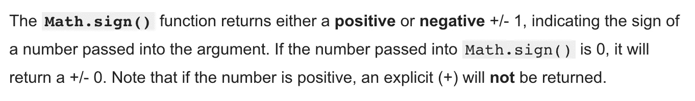

# 3minAlgo⚡️:逆整数

> 原文：<https://blog.devgenius.io/3minalgo-%EF%B8%8F-reverse-integers-73f7ce5e8d04?source=collection_archive---------7----------------------->


只需几个简单的步骤就能快速解决整数的逆序问题！

任务如下:给定一个整数，返回一个数字逆序的整数

```
Examples:*//   reverseInt(15) === 51**//   reverseInt(981) === 189**//   reverseInt(500) === 5 [with no zeroes!]**//   reverseInt(-15) === -51 [with the minus sign in front!]**//   reverseInt(-90) === -9* 
```

## 🤔画出来！(初始版本。) :

1.  将数字拆分成一个数组
2.  反转数组
3.  加入并返回数字……..

🚨因为你已经读过我在[上一篇关于反向字符串](https://medium.com/javascript-in-plain-english/5minalgo-%EF%B8%8F-reverse-strings-ef0b7296d3a9)的文章，你可能会立即使用。拆分→反转→。连接方法🤓

你离得不远了！然而，在这个问题中，我们使用整数作为给定的输入，而不是字符串。所以为了让我们最初的计划生效，我们必须首先把**这个整数变成一个字符串。**

🚨同样，我们必须**保留所有负整数上的负号**。通过使用**数学符号**方法，(*参见下面的定义* ) 我们可以解决这个小边缘情况。



[**MDN**](https://developer.mozilla.org/en-US/docs/Web/JavaScript/Reference/Global_Objects/Math/sign) 中数学符号的定义

Math.sign 函数返回一个数字的**符号**，表示该数字是正数、负数(还是零)。

```
*Example:**// Math.sign(4000) ==> 1**// Math.sign(-4000) ==> -1*
```

## ✏️地图出来(最终版本。) ✨ :

1.  将整数转换成字符串
2.  将字符串转换成数组
3.  在数组上调用 reverse
4.  反向连接成串
5.  把字符串变成整数* ←这部分别忘了！！
6.  使用*数学符号*返回带有正确符号(负数或正数)的整数

> **pareseInt()** 是一个函数，解析一个字符串参数，返回一个整数！

# 💡**解决方案:**

```
function reverseInt(n) { const reversed = n
      .toString()
      .split('')
      .reverse()
      .join('');return parseInt(reversed) * Math.sign(n)}
```

这只是解决问题的一种方法，我相信还有更多！

今天我只想保持简单，并强调以下方法，作为初学者的复习！

。toString / parseInt() / Math.sign()

下次见👋🏻