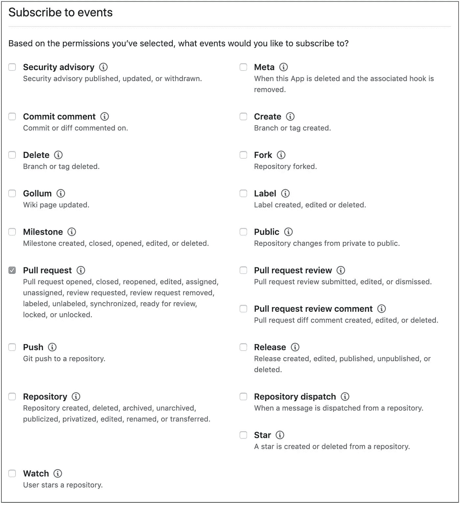

# 开发人员的 4 个自动化想法

> 原文：<https://blog.devgenius.io/4-automation-ideas-for-developers-5e0985fd83b9?source=collection_archive---------0----------------------->

## 而是专注于解决真正的问题

照片由[蒂姆·莫斯霍尔德](https://unsplash.com/@timmossholder?utm_source=unsplash&utm_medium=referral&utm_content=creditCopyText)在 [Unsplash](https://unsplash.com/s/photos/gears?utm_source=unsplash&utm_medium=referral&utm_content=creditCopyText) 上拍摄

有多少次你发现自己在做一些例行公事？我们每个人每天都要做一些重复的事情。在软件开发行业工作让我们有机会自动化许多与工作相关的过程。我们需要能够识别重复的动作，并提出一种自动化它们的方法。

> 我总是选择一个懒惰的人去做一件困难的工作，因为一个懒惰的人会找到一个简单的方法去做。
> 
> 老弗兰克·吉尔布雷斯

不幸的是，不是每个人都能马上找到自动化的好候选人。下面列出的想法会给你一些灵感，让你知道在下一个项目中自动化什么。

# 代码样式检查

就我个人而言，每当我的 pull 请求因为违反代码样式而失败时，我都会感到恼火。我这里说的是错误的缩进，字符串长度，或者类似的问题。这意味着我需要回到有问题的文件，修正代码风格，并提交更改。那听起来不太坏。但是如果可以自动化，为什么不去实现呢。我们至少可以节省时间来转换解决问题的焦点。

通过使用 [git 钩子](https://git-scm.com/book/en/v2/Customizing-Git-Git-Hooks)这个任务可以自动化。Git 提供了不同数量的挂钩。例如，在提交命令之前、推送命令之前或签出分支之后执行操作。所有的钩子都位于`.git/hooks`路径中，并遵循适当的命名规则，如`pre-commit`、`post-checkout`等。

对于我们的例子，我们必须在 hooks 目录中创建文件`pre-commit`。这个文件是一个 shell 脚本。我们在这个文件中编写检查代码样式的命令并保存它。从现在开始，每个提交操作都将运行代码风格的任务。如果有任何违反，提交操作将被中断，我们必须修复它才能继续。这样，我们将永远不会忘记在推进代码之前遵循所有的约定。

# GitHub 上的自动化

如果您使用 GitHub 来放置代码，有一些机会可以自动化工作流。自动化基于 GitHub 钩子。GitHub 在不同的用户操作上引发事件。例如，当用户打开问题或创建拉式请求时。通过钩子，可以订阅这些事件。

在 GitHub 上订阅的事件列表

处理这些事件最简单的方法是实现一个 [Probot](https://probot.github.io/) 应用程序。Probot 是一个基于 Node.js 的 GitHub 自动化流程框架，它使我们能够编写更少的样板代码。我们只需要实现一个处理函数来接收某个事件的回调。

在实现你自己的应用程序之前，检查一下已经存在的。可能有人已经自动化了流程。例如，为每个新问题应用一个标签，或者在特定条件下自动批准一个提取请求。

# 本地化集成

本地化应用程序不是一件容易的事情。尤其是当它是一个持续的过程并且翻译器不断发送更新的字符串时。所有的更新都需要定期集成到应用程序中。

然而，在这条道路上有一个障碍。通常，不同的应用程序使用不同的本地化资源格式。例如，在 Android 中，它是 XML 格式，而在 Ruby on Rails 中，它是 YAML 格式。这意味着翻译人员应该了解这些格式，并且应该有信心使用这些格式。这已经是一种容易出错的方法。

这项任务也可以自动化。无论您是使用第三方工具来管理本地化，还是拥有自己的内部系统。这个想法是获取新的字符串，将它们转换成适当的格式，并集成到代码中。这项工作的自动化节省了时间，更重要的是，防止了打字错误或任何其他与格式相关的错误。

# 部署管道

这个任务看起来更像是一个持续集成和持续交付的设置。但事实上，这是纯粹的自动化。简单地问问你自己，在合并你的核心或者部署之前，你运行了多少次所有的测试？

如果您的项目没有对每个拉请求运行所有的测试，那么它是自动化的第一候选。许多服务为构建项目和运行测试提供了简单的设置。这种方法将帮助您确保主分支上没有代码被破坏。

在组装项目和运行所有测试的同时，您希望在它们合并后立即部署变更。它们不应该部署在生产环境中，而应该部署在测试环境中。这个自动化任务比较复杂，但是会节省很多时间。对于每个合并的拉请求，您不需要担心手动执行部署。该功能几乎立即上线。

# 结论

自动化重复性工作有助于节省资源，并专注于最终产品的更基本需求。这有助于提高开发人员的工作满意度。自动化可能是一项具有挑战性的任务，当它完成时，会让工程师感到自豪。