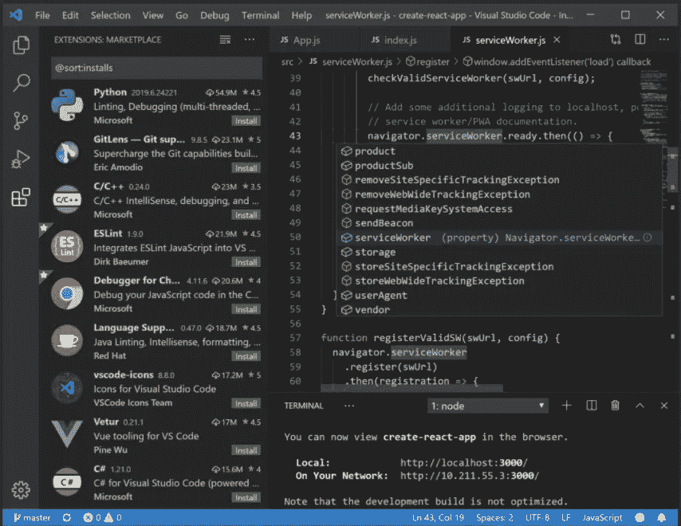

# 面向 Linux 开发人员的 4 款最佳开源文本编辑器

> 原文：<https://blog.devgenius.io/4-best-open-source-text-editors-for-developers-on-linux-d85f34a32ee7?source=collection_archive---------4----------------------->

## 任何初涉 Linux 代码开发的人的第一个问题是，哪一个是最好的文本编辑器。这里是免费和开源文本编辑器的列表

凯文·霍尔瓦特在 [Unsplash](https://unsplash.com?utm_source=medium&utm_medium=referral) 上的照片

与 Windows 相比，您可能喜欢 Linux 操作系统的优越之处，并决定继续在 Linux 上进行代码开发。在这种情况下，每个人做的第一件事就是试图在他们不太熟悉的操作系统中找到他们经常使用的工具的等价物。

对于习惯通过终端使用 Linux 的 Linux 老用户来说，最佳文本编辑器问题的答案可能是 vi、vim、nano。然而，有一些非常有用的 Linux 编辑器也有 GUI。

## 1.VS 代码

首先，我想从虚拟工作室代码开始，这是 Windows 用户近年来更喜欢的。

支持许多不同的编程语言，内置 Git 集成，丰富了数百个插件，并提供调试工具，这只是其中的一些优势。

可以下载。黛比和。不同 Linux 发行版的 rpm 包，链接[这里](https://code.visualstudio.com/#alt-downloads)。

VS 代码是 Linux 中第一个文本编辑器选项之一

## 2.括号

括号是网页设计师&前端开发者的首选之一。

您可以在感兴趣的代码部分中打开内联编辑器，在不同的部分中导航，而不是在选项卡中导航。此外，通过其实时预览功能，您可以在短时间内看到结果。拥有内置的扩展管理器和可扩展插件的其他积极方面

括号可能是前端开发者的首选

## 3.原子

Github 开发的 Atom 是最流行的文本编辑器之一。在 Atom 自己的网站上，它写着“21 世纪的可破解文本编辑器”。

拥有智能自动完成和分割窗口，能够在不同的操作系统平台上工作，内置的扩展管理器和丰富插件的能力只是其中的几个关键特性。

Atom 是 Linux 中最强大的文本编辑器之一

## 4.格迪特

gedit 是 GNOME 桌面环境的默认文本编辑器。有点老套，但能很好满足你需求的编辑。

自动补全和拼写检查特性、制表符的使用、对许多不同编程语言的支持是 gedit 的一些优势。

gedit 可能看起来过时，但却能满足您的需求

## 结论

您可能刚刚从 Windows 迁移到 Linux，在设置环境时遇到了困难。但是，在 Windows 中有很多你经常使用的工具的 Linux 版本，并且有很多专门为 Linux 开发的替代工具。不要忘记，您将在短时间内尝试这些工具，并决定哪一个最适合您。