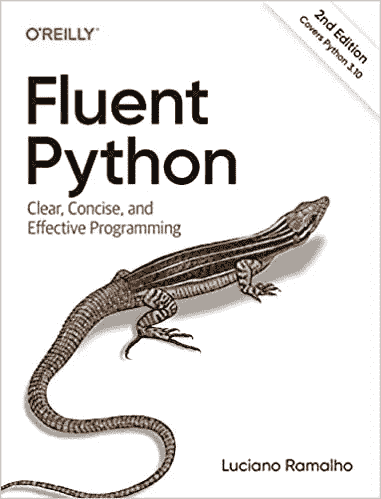
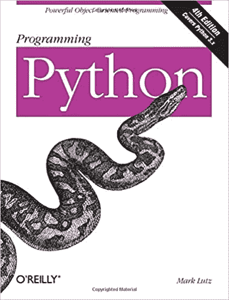
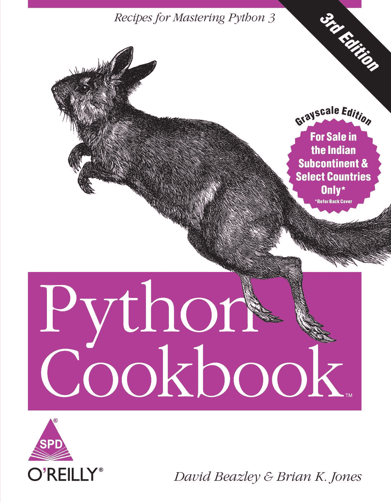
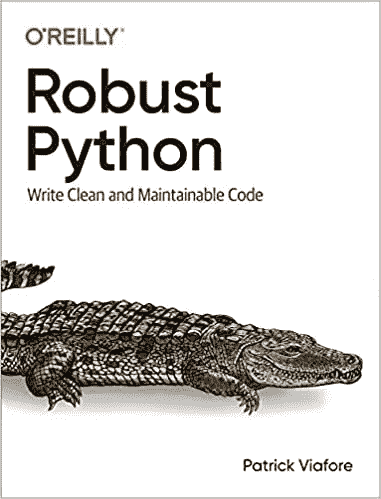

# 4 本书会让你成为一名 python 忍者。

> 原文：<https://blog.devgenius.io/4-books-that-will-make-you-a-python-ninja-943fe882249f?source=collection_archive---------3----------------------->

图片来源:pexels。

如果你偶然看到这篇文章..我敢打赌你喜欢 python……当你喜欢某样东西的时候，你应该照顾好它。在这篇小博文中，我整理了一份帮助我成为更好的 python 程序员的书单。

注意:列表没有任何特定的顺序，也没有附属链接:)。

我们都同意 python 是一种简单易学的语言。但是我在用 python 编码时注意到的最好的事情是，它很好地完成了隐藏不必要的抽象的工作，同时为程序员提供了最大的控制。

在这一节中，我列出了有助于您更好地理解 python 的书籍。这将帮助你在下一次工作时做出更好的决定，无论是我应该使用哪种数据结构，还是以哪种方式代码更易于维护..

让我们开始吧:

# 1.流畅的蟒蛇——卢西亚诺·拉马尔霍。

如果你想提高 python 的工作效率，并且只能选择一本书..这就是了。

卢西亚诺·拉马尔霍写的。这本书将为你开启 python 的多元宇宙。

我打赌你会得到一个啊哈..阅读每一页的时刻..总结它自己的标题，它会让你在 python 语言上很流利。并将帮助您在下次编写 python 时做出更明智的决定。

它的结构很好，从更容易获得的主题开始，逐步发展到更高级的主题，如元编程和并发性。

不适合谁:

如果你是一个刚刚开始使用 python 的程序员。这本书不会达到最佳目的，只会让旅程更加艰难。

# 2.编程 Python-作者马克·卢茨。

又一颗宝石。这本书为 python 以及如何在不同的用例中使用 python 提供了深入的指导。这本书不仅仅是一本关于语言语义的书，它在让 python 的用例变得清晰明了方面做得很好。

这本书分为几个部分，如 python 介绍、Gui 编程、Web 编程等。

我喜欢这本书，主要是因为它帮助我理解了 python 生态系统的浩瀚。并使用 python 提供不同领域的鹰眼视图。

# 3.Python 食谱

这本书有所有 python 的诀窍。David Beazley 是 python 社区中一个很有名的名字。而 Python 食谱就是他的代表作。

这不是一本魔术书，而是一个用 pythonic 方式解决问题的指南。David 不仅很好地解释了解决方案，还就缺点和边缘情况进行了开放式讨论..

我已经读了 2 -3 遍了，并继续在里面寻找日常的 python 问题..我从不心烦:)

# 4.健壮的 Python

在行业级别上编写代码可不是好玩的游戏。你的代码将会被大量修改和破坏，当然也不会对错误免疫。没有什么能阻止它。

编写干净的代码和重构是编写可伸缩和更好的代码的最重要的技能之一。

这本书只是帮助你写出更好的 python。这本书也揭示了现代 python 特性和最佳实践。

推荐给每一个想要编写更易维护的代码并在软件冲击中生存下来的人。

就这样..也有很多其他好书，但我个人认为这些是业内最好的。写下你将要阅读的书，以及过去对你有帮助的书。:)