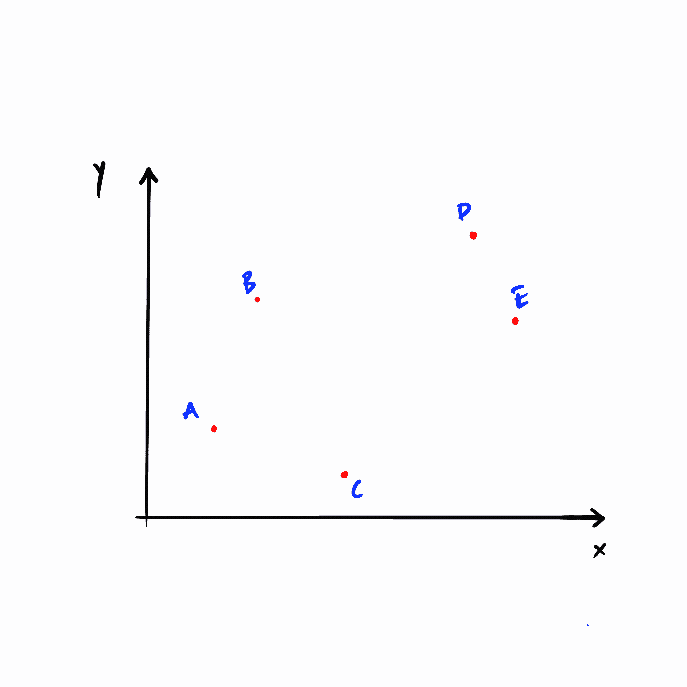

# 使用客户数据发展业务的 4 种数据驱动方式

> 原文：<https://blog.devgenius.io/4-data-driven-ways-to-grow-your-business-using-customer-data-bad64523ba88?source=collection_archive---------3----------------------->

## 高度概括了使用数据驱动的见解增强商业智能的最佳方式。

[医学家](https://unsplash.com/@medienstuermer?utm_source=medium&utm_medium=referral)在 [Unsplash](https://unsplash.com?utm_source=medium&utm_medium=referral) 上拍摄的照片

# 介绍

当你有数百、数千甚至数百万的客户时，很难给予每个人应有的关注。正因为如此，一些品牌可能会开始感到陈旧，或者好像不再迎合你的口味和兴趣。

为了纠正这一点，企业可以花费时间和资源创造技术，让品牌更好地适应每个客户的需求。

在这篇文章中，我将简要介绍 4 种数据驱动的技术，通过帮助你的品牌提高对客户的了解，让你的公司成长。请务必阅读最后一个，看看其余的是如何组合在一起的！

**首先，为什么还要花费资源去收集它？**

数据只是信息的另一种说法，我们周围都有信息。你可能坐的椅子具有对我们有用的信息特征。类似地，人们在他们的行为中提供了很多关于他们自己的信息——当他们与你的业务互动时，这些信息可以用来改善他们的体验。这可能包括了解他们的购买偏好，计算出他们的价值，预测他们什么时候会回来，或者确定你的客户群中的群体。首先，您需要做的就是记录每个客户交易的日期时间和销售价值，通过向您的客户群添加越来越多的描述性功能来展示一个分析世界。

# 1.客户终身价值

首先也是最重要的是客户终身价值。这是预测每个客户在某段时间内的价值的实践。一个简单的例子是，在一年的时间里，一位顾客 **A** 每月来你的商店一次，平均每次消费 20 美元。凭直觉，您可以预测到年底，给定客户将花费 12x 20 美元= 240 美元。假设有另一位顾客 **B** 每月光顾你的店铺两次，但每次只消费 8 美元。根据我们目前的等式，我们可以假设他们花费 2 x 12 x 8 美元= 192 美元。

在这个例子中，我们仅使用他们的频率和平均花费来估计他们将花费多少。然而，现实世界中的人并没有那么好预测。他们回到你的企业可能依赖于许多不同的因素。识别这些因素是每个数据科学项目的核心。在这里，我们可以利用机器学习来预测他们未来的支出。机器学习技术本质上只是函数估计器，因此我们可以尝试找到描述每个客户的许多因素与他们在某段时间内将花费的金额之间的关系。

预测 CLTV 的直觉

随着时间的推移，估计客户价值的潜力提供了一个相互比较客户的框架，并允许企业确定谁需要更多的关注，谁值得保留以及谁是企业最有价值的客户。此外，它还为您的客户添加了另一个描述性指标，用于报告、商业智能和数据分析。

你可以在[这里](/how-to-predict-customer-lifetime-value-using-machine-learning-in-python-4066344d0ab0)找到关于如何实现的更详细的指南。

# 2.客户流失风险

流失客户是指不断回到你公司的客户。因此，如果一个客户已经流失*了*，这将意味着他们不再与业务互动。这个“无互动”的时间间隔对于不同的店面来说是不同的，这取决于它们的商业模式。例如，订阅模型可以假设如果客户 3 个月没有支付订阅费，他们就会被解雇，而零售商店可以认为如果客户一年没有购买，他们就会被解雇。

通过将低流失风险客户的特征与高流失风险客户的特征进行对比，审慎地预见客户可能会在何时离开，更具体地说，在给定的时间范围内(比如 3 个月)他们有多大可能会回来，有助于深入了解您的客户群的健康状况。这归结为一种分类，即他们是否会在指定的时间段内与业务进行交互。

换句话说，在给定的时间段内:

***流失风险= 1 —互动概率***

对于这种分类，有两种建模框架似乎很有吸引力。

高斯混合模型提供了对客户行为的*概率理解，采用随机变量和概率分布来预测未来事件。另一方面，有 ***确定性的*** 模型，像更熟悉的机器学习和统计模型，旨在更精确地和数字地预测事物。根据所讨论的数据和手头的任务，我们可以进行一个实验，找出在给定的时间框架内预测客户交互概率的最佳路径。*

*具有高流失风险的客户可以被认为是容易脱离业务的，因此对他们给予一些关注可能是有益的。而随着时间的推移，客户流失风险较低的客户是忠诚的客户，因此他们的偏好必须在商业决策中发挥作用。就像客户终身价值一样，我们在描述您的客户群时获得了另一个有价值的指标。*

*[这里](/how-to-predict-customer-churn-risk-using-machine-learning-in-python-b11c09759491)是详细的实现教程。*

# *3.情感分析*

*虽然查看客户交易数据可以让我们更好地了解消费者行为，但对直接评论、评论和星级评分进行抽样可以了解客户的情绪。他们有多喜欢你的品牌会影响其他人对你品牌的看法，进而影响他们向新客户推荐你的企业的可能性。在这里，我们甚至可以利用任何沟通或推荐数据，如每个客户收到了多少封促销电子邮件并与之互动，或者除了他们留下的任何直接评论外，他们还推荐了多少新客户。*

*一旦收集了所有相关信息，我们就可以使用自然语言处理中应用的技术来训练深度学习模型，以:*

*   *查看注释中的文本以及描述每个客户的所有其他功能*
*   *确定什么样的客户可能对企业有正面的看法，谁可能传播对企业的负面评价。*

*正如我们将在下一节中看到的，这有助于制定营销决策，因为可能有一组人需要与其他人不同的信息，以保持对业务的积极评价，说明所提供服务的动态和热情好客的性质。*

# *4.客户细分*

*现在，我们已经收集了特定于客户的数据，并找到了量化这些数据的有效方法，还实施了另外 3 个数据驱动的指标来代表客户，我们最终可以将所有这些数据与客户细分结合起来。*

*分割是一种无监督的学习方法，因为我们不使用标签来“训练”这个模型。相反，我们只是从数据集中的观察值(行)的相似性和差异性中寻找组。有几种方法可以衡量两个观察值有多“相似”。*

*确定相似性的一种方法是找到每对观察值之间的**欧几里德距离**。假设 A、B、C、D 和 E 是客户，X 和 Y 是他们的数字特征(例如频率和销售额):*

**

*欧几里德距离动画*

*计算这些客户之间的距离，可以让我们看到哪些客户在每个特征上彼此几何接近。最接近(或最相似，根据定义)的客户将被分组在一起。这些组被称为**段**，有一些算法利用欧几里德距离进行分割，如 K-means 聚类和基于密度的空间聚类(DBSCAN)。*

*这项活动的价值在于解释所发现的细分市场，并理解为什么客户会被放在他们所在的位置。所揭示的见解可能会改变游戏规则，尤其是如果与终身价值、流失风险和情绪分析相结合的话。例如，可能会出现一个由终生价值高、流失风险低的客户组成的群体，表明他们对品牌的忠诚度。然而，另一个群体可能被描述为具有高流失风险和高终身价值，突出了赚大钱的零星买家。比较和对比不同客户群的能力为影响整体业务的审慎管理决策提供了信息。*

*最好的部分是，你如何在一个细分市场中包含客户的各种信息。如果我们根据客户交易的日期和时间对客户进行细分。假设，我们可能会发现低流失风险客户只在周末下午 2 点后购买，或者在高终身价值客户群中，有一个子群只在早上购买，一个子群只在晚上购买。有了这种洞察力，企业就可以个性化他们与每个客户的互动方式，从而产生信任和忠诚度。*

*我将很快在这里链接一个详细的实施指南！*

# *结论*

*好了，现在你知道了！使用数据驱动的客户分析发展业务的四种方式。虽然它们的真正价值只有在一起使用时才能看到，但实施每一项只会增加您的企业为客户带来的价值。*

*别担心，我会尽快在本文中链接详细的实现教程。一定要保持关注！*