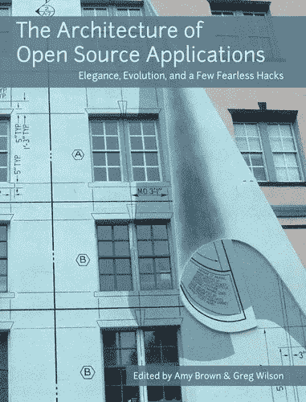
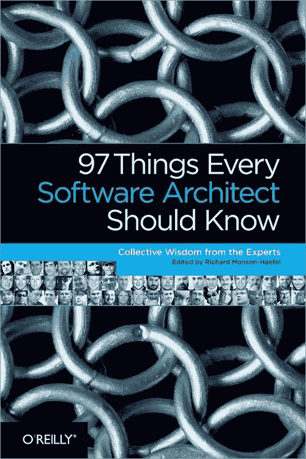
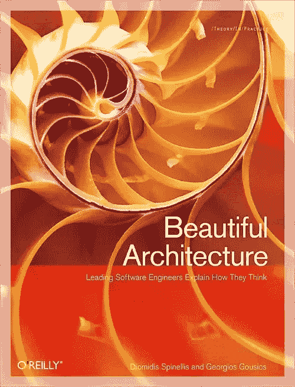
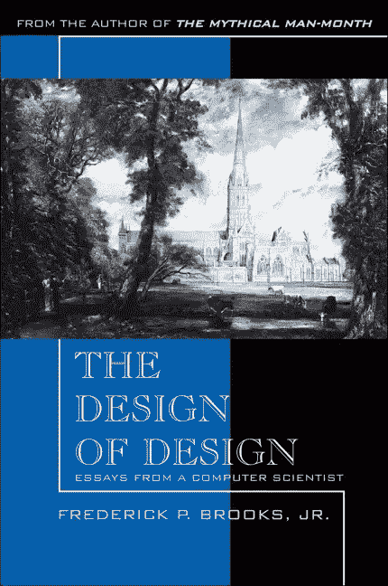

# 4 本软件架构实用书籍

> 原文：<https://blog.devgenius.io/4-practical-books-for-software-architecture-f953d072fb7e?source=collection_archive---------8----------------------->

照片由 [Aaron Burden](https://unsplash.com/@aaronburden?utm_source=medium&utm_medium=referral) 在 [Unsplash](https://unsplash.com?utm_source=medium&utm_medium=referral)

许多渴望成为软件架构师或解决方案架构师的高级开发人员喜欢做些什么来成为软件架构师呢？哪些书籍、资源或认证能有所帮助？

以及成为软件架构师需要多少经验等等。

因此，我建议阅读一些书籍来扩展他们的知识库，并从架构和设计的角度来看待软件，这篇文章是许多这样的建议的汇编。

由于很多书可能会混淆，我只从软件架构师的角度选择了 4 本最好的必读的书。

***1-*** [***开源应用的架构***](https://amzn.to/2DYdgCM)

在本书中，十几个开源应用程序的作者解释了他们的软件是如何构造的，为什么？

每个计划的主要组成部分是什么？

他们是如何互动的？

而他们的建造者在发展过程中学到了什么？

在回答这些问题时，这些书的作者提供了他们如何思考的独特见解。

如果您是初级开发人员，并且想了解您更有经验的同事是如何思考的，这些书是开始的地方。

如果你是一个中级或高级开发人员，想看看你的同行是如何解决困难的设计问题的，这些书也可以帮助你。

***2-***[***每一个软件架构师都应该知道的 97 件事:来自专家的集体智慧***](https://amzn.to/3isThLC)

在这本技术书籍中，当今领先的软件架构师提出了超越技术的关键开发问题的宝贵原则。

包括尼尔·福特(Neal Ford)、迈克尔·尼加德(Michael Nygard)和比尔·德·霍拉(Bill de hora)在内的 40 多位建筑师提供了与利益相关者沟通、消除复杂性、增强开发人员能力的建议，以及他们从多年经验中学到的许多更实用的教训。

在本书的 97 条原则中，你会发现一些有用的建议，比如:

不要把你的简历放在要求之前(尼廷·博万卡尔)，

你最大的问题不是技术(马克·拉姆)沟通才是王道。

清晰和领导，它谦卑的仆人(马克·理查兹)，

先简单后通用，先使用后重用(凯夫林·亨尼)

对于最终用户来说，界面就是系统(Vinayak Hegde)，

考虑表演永远不会太早(丽贝卡·帕森斯)

作为一名成功的软件架构师，你需要同时掌握业务和技术。

这本书告诉你顶级软件架构师认为什么是重要的，以及他们如何处理一个项目。

如果你想提升你的事业，每个软件架构师都应该知道的 97 件事是必读的。

***3-*** [***美丽架构:顶尖思想家揭示软件设计中隐藏的美***](https://amzn.to/2XSa3vL)

健壮、优雅、灵活和可维护的软件架构的要素是什么？

*美丽的架构*通过收集十几位当今领先的软件设计师和架构师的有趣文章来回答这个问题。

在每篇文章中，贡献者展示了一个著名的软件架构，并分析了是什么使它创新和理想。

***4-***[***设计的设计:来自计算机科学家的随笔***](https://amzn.to/30Kj5No)

有效的设计是从软件开发到工程再到架构的一切的核心。

但是我们对设计过程真正了解多少呢？是什么导致了有效、优雅的设计？

***外观设计*** 的设计解决了这些问题。

# 结论:

这是关于软件架构师、技术领导和解决方案架构师的一些最佳书籍。

如果你想在你的职业生涯中朝着成为一名软件架构师的最终目标前进，这些书可以扩展你的视野和知识。

一些您可能感兴趣的相关文章:

1- [专业说明跳到代码前的规格](https://selcote.com/2020/07/28/professional-illustrate-the-specifications-before-jumping-to-code/)

2- [设计不能被示教](https://selcote.com/2020/06/17/the-design-cannot-be-taught/)

3- [类图是最流行和最复杂的](https://selcote.com/2020/06/12/class-diagram-is-the-most-popular-and-complex/)

4- [如何成为一名出色的解决问题的软件工程师](https://selcote.com/2020/05/30/how-to-be-a-great-problem-solver-software-engineer/)

5- [成为专业软件工程师的关键](https://selcote.com/2020/05/29/the-key-to-becoming-a-professional-software-engineer/)

这个故事起源于:[selcote.com](https://selcote.com/2020/08/12/4-practical-books-for-software-architecture/)