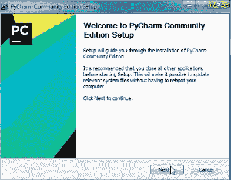

# Windows 上的 Python 设置:Python 完整教程—第 4 部分

> 原文：<https://blog.devgenius.io/4-python-setup-on-windows-e5e2a810fa43?source=collection_archive---------19----------------------->


[摄](https://www.pexels.com/@breakingpic)在[的桩子上](https://www.pexels.com/photo/desk-laptop-notebook-pen-3059/)

**在我们开始之前，让我告诉你:**

这篇文章是 Python 完全初学者到专家课程
的一部分，你可以在这里找到它[。](https://medium.com/@samersallam92/python-complete-beginner-to-expert-course-f7626916df30)

这篇文章也可以作为 YouTube 视频[在这里看到。](https://www.youtube.com/watch?v=KGyAnhkx7KA)

[https://www.youtube.com/watch?v=KGyAnhkx7KA](https://www.youtube.com/watch?v=KGyAnhkx7KA)

## 介绍

要开始学习 Python，你应该在你的机器上安装 **Python** 。另外，你需要一个编辑器来编写和运行你的代码。

如果你是 Windows 用户，这篇文章是为你准备的。以下文章是针对 Linux 和 macOS 用户的。

[【5】Python 在 Linux 上的设置](https://medium.com/@samersallam92/5-python-setup-on-linux-c111fd93982f?source=your_stories_page----------------------------------------)

[[6]MAC OS 上的 Python 设置](https://medium.com/@samersallam92/6-python-setup-on-macos-e1a39e8c25d0?source=your_stories_page----------------------------------------)

**本文将涵盖以下要点:**

1.  [Windows 上的 Python 设置](#3eb1)
2.  [Windows 上的 PyCharm IDE 设置](#642e)

## 1.Windows 上的 Python 设置

要在您的 Windows 上安装 Python，请遵循以下步骤:

1.  进入 Python 官方网站[**Python.org**](https://www.python.org/downloads/)，从**下载**下拉菜单中选择 **Windows** 。我将使用 3.6 版本。在这篇 but 文章中，
    请随意挑选你的版本。参见图 1。


图 1:Python Windows 下载页面(作者[https://www.python.org/](https://www.python.org/)截图)。

2.然后选择 Python 版本，下载[Windows x86–64 可执行安装程序](https://www.python.org/ftp/python/3.8.3/python-3.8.3-amd64.exe)(**amd64.exe 文件**)。如果你用的是只带 **32 位**的机器，你必须选择只带 X86 的。

3.一旦 amd64.exe**文件下载到你的电脑上，**打开下载的文件**。**

**现在，您可以看到安装向导在您的计算机上安装 Python。选中选项**“将 Python 3.6 添加到路径”**后，点击设置窗口中的**立即安装**。参考图 2。**

****

**图 2: Python 3.6.8 (64 位)安装(作者截图)。**

**4.设置过程完成后，点击**关闭。**参考图 3。**

****

**图 3: Python 3.6.8 (64 位)成功设置(作者截图)。**

**现在，向导已经成功地在您的计算机上安装了 Python。**

****确保一切顺利**:**

1.  **从开始菜单打开**命令提示符‘cmd’**。**
2.  **类型:**

```
python –version
```

**点击**进入**运行命令。**

**3.如果你找到了 Python 3.6.8 ，那就意味着你已经准备好使用 Python 了。参考图 4。**

****

**图 4: Python 安装成功(作者截图)。**

**4.要退出解释器，请键入 **Ctrl + Z.****

**让我们继续安装 PyCharm IDE。**

## **2.Windows 上的 PyCharm 设置**

****

**照片由[帕维尔·丹尼柳克](https://www.pexels.com/@pavel-danilyuk)在 [Pexles](https://www.pexels.com/photo/person-using-silver-and-black-laptop-computer-5496464/) 上拍摄**

****简单来说，按照步骤:****

1.  **从您的互联网浏览器访问 [**PyCharm 下载页面**](https://www.jetbrains.com/pycharm/download/) 。**
2.  **选择**社区**版本然后点击**下载**。参考图 5。**

****

**图 5:用于 Windows 的 PyCharm 下载页面。(作者 https://www.jetbrains.com/pycharm/download/#section=windows[截图](https://www.jetbrains.com/pycharm/download/#section=windows))。**

**3.一旦 **exe** 文件下载到您的计算机上，打开下载的文件并点击**下一步。**参考图 6。**

****

**图 6: Pycharm 社区版设置(作者截图)。**

**4.选择安装位置后，点击下一个的另一个**。参见图 7。不要忘记通过选择以下选项来检查您的安装选项:****

*   **创建桌面快捷方式。**
*   **将启动器目录添加到路径中。**
*   **添加“将文件夹作为项目打开”。**
*   **创建关联。**

**然后点击**下一步——安装。****

****

**图 7: Pycharm 社区版设置—安装选项(作者截图)。**

**5.一旦**完成**，它会问你是否重启你的设备。
重启不成问题，稍后再点击**完成。**参考图 8。**

****

**图 8:完成 Pycharm 社区版设置(作者截图)。**

**6.接下来，您将在桌面上找到一个 PyCharm。**双击**打开程序。**

**7.之后你可以选择你想用的**主题**(德古拉主题哪个是暗的或者亮的主题)。参见图 9。**

****

**图 9:自定义 PyCharm 环境-UI 主题(作者截图)。**

**8.最后，您可以下载并安装任何 PyCharm 插件，或者跳过它。点击**开始使用 PyCharm** 创建您的第一个项目。
参考图 10。**

****

**图 10:下载特色插件(作者截图)。**

****恭喜你！
你可以在电脑上开始编码了……****

## **现在，让我们总结一下我们在这篇文章中学到的内容:**

****

**照片由[安 H](https://www.pexels.com/@ann-h-45017/) 在[像素](https://www.pexels.com/)上拍摄**

**在这篇文章中，我们谈到了:**

*   **如何在 Windows 上设置 Python？**
*   **如何在 Windows 上设置 Pycharm IDE？**

*****附言*** *:万分感谢您花时间阅读我的故事。在你离开之前，让我快速地提两点***

*   ***首先，要想直接在你的收件箱里看到我的帖子，请在这里订阅*[](https://medium.com/@samersallam92/subscribe)**，你可以在这里关注我*[](https://medium.com/@samersallam92)**。*****
*   *****第二，作家在媒介上制造了数以千计的****$****。为了无限制地访问媒体故事并开始赚钱，* [***现在就注册成为媒体会员***](https://medium.com/@samersallam92/membership)**其中* *每月只需花费 5 美元。通过此链接* *报名* [***，可以直接支持我，不需要你额外付费。***](https://medium.com/@samersallam92/membership)*****

****

萨梅尔·萨拉姆**** 

## ****Python 初学者到专家的完整课程****

****[View list](https://medium.com/@samersallam92/list/python-complete-beginner-to-expert-course-32d3a941c05e?source=post_page-----e5e2a810fa43--------------------------------)********21 stories****************************

****要回到上一篇文章，您可以使用以下链接:****

****[第三部分:什么是 Python](/3-what-python-is-c92b5656bd6d)****

****要阅读下一篇文章，您可以使用以下链接:****

****[第 5 部分:Linux 上的 Python 设置](/5-python-setup-on-linux-c111fd93982f)****