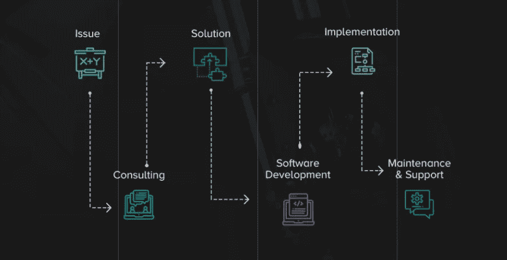

# 值得了解的 4 种软件开发定价模式

> 原文：<https://blog.devgenius.io/4-software-development-pricing-models-worth-knowing-ac13ef8352c9?source=collection_archive---------11----------------------->

软件开发定价模型决定了实际软件开发过程的成败。在软件外包中，选择一种能够完美响应需求变化的软件开发方法是至关重要的。

如果你正确地管理软件开发过程，与一个可信的软件开发公司合作是小菜一碟。软件开发定价模型是成功 IT 外包的决策步骤之一。在本文中，我们回答并详述了以下关于软件开发定价模型的常见问题。

●什么是软件开发方法论？

●哪些是最好的软件开发模型和方法论？(软件开发模型有多少种？)

●您能给出最佳软件参与模式的例子吗？

●每种软件开发模式的主要优缺点是什么？

在开始回答这些问题之前，让我们先弄清楚什么是软件开发定价模型或软件开发参与模型。

软件开发中的[软件开发方法](https://www.coderiders.am/software-development-process)或约定模型是基于特定客户需求的结构化软件开发流程，例如:

**IT 外包服务需求**

要开始实际的软件开发生命周期(SDLC ),您应该有一个清晰的 IT 外包服务需求表。软件供应商和客户都应该评估这些需求，并就最佳参与模型达成一致，该模型将为所花费的资源和时间带来应得的结果。反过来，需求表也有基于您选择继续进行的模型的规范。例如，如果您确切地知道您想要什么以及如何进行您的软件开发项目，建议您在求助于软件供应商之前先准备好您的工作范围(SOW)或技术需求文档。在这种情况下，您的软件供应商将能够给出精确的估计。如果你心中有这样一个项目，请查看我们全新的指南，了解如何像老板一样写一份附有真实例子/样本的 SOW 文档。下面下载。

 [## 如何撰写可靠的工作范围| code riders 白皮书

### 里面是什么？

www.coderiders.am](https://www.coderiders.am/white-papers/how-to-write-a-solid-scope-of-work) 

**您对项目的预期结果和您的主要业务目标**

即使您还没有每个细节和 IT 外包服务需求表，您也应该清楚地定义您对项目的期望。这应该在软件开发人员开始编码之前，在软件设计阶段就勾勒出来。

**项目规模**

你是需要一个单独的开发者，还是在寻找一个值得信赖的软件开发公司？您是否需要其他 IT 专业人员，如项目和产品经理、QA 专家、业务分析师、业务开发专家等。？你的团队决定了你的工作日程。后者在选择正确的软件开发定价模型中起着主导作用。

**付款方式**

您想要一个在实际软件开发生命周期(SDLC)中没有变化的精确估计吗？你需要每小时收费的开发人员吗？你方便按里程碑付款吗？没有这些信息，软件供应商就不能提供最佳的软件开发参与模型。

**时间表和发布日期**

在求助于软件供应商之前，您应该知道以下问题的答案。我希望我的项目什么时候上线？我想为我的产品的特定功能设置发布日期吗？或者我希望我的产品在完成后上线？

**你想保留多少控制权？**

IT 外包或离岸软件开发是软件供应商和客户之间的远程合作，以构建预期的软件解决方案。关键词“合作”有不同的定义。这取决于客户主动参与软件开发过程的意愿，或者相反。

**SDLC 阶段**

软件开发过程分为几个阶段，认识到您在 SDLC 中的位置是至关重要的。例如，如果您想从头开始开发一个全新的解决方案，那么您正处于需求收集的初级阶段。这使得接洽模式的选择更加灵活。另一方面，如果你想重建或改造你已经存在的软件，你应该在雇佣这个新的软件供应商之前仔细地重新检查已经完成的工作。

**软件开发模型有多少种？**

ICLT 行业中有太多的软件开发定价模式，使得选择过程有点挑战性。此外，没有固定的软件开发参与模型。每天都有新的混合模式基于公司的定制需求而诞生。目前，有几种经过测试并证明有效的方法总是被拿来作为例子。这些模式各有利弊。它们的有效性取决于一些情况。

在选择其中一个模型之前，讨论您的项目和需求的细节。如果您不确定，欢迎您通过[快速留言](https://www.coderiders.am/contact-us)，我们的业务发展专家将与您联系。

在 CodeRiders，我们确保我们的客户在整个 SDLC 中都感到舒适，不管他们在软件外包方面的经验水平如何。我们从发现问题、咨询和澄清解决方案开始，开始实际的软件开发和实施过程，并在需要时提供维护和支持。

如果你想更多地了解我们的公司，一定要看看我们的文章[“与 CodeRiders 一起工作的感觉如何”](https://www.coderiders.am/blog/how-it-feels-to-work-with-coderiders)。

**固定价格软件开发参与模式**

如果您需要清晰的软件开发服务评估和任务规划，固定价格的软件参与模型是一个合适的解决方案。但是，您应该确保有现成的文档(SOW 文件、技术文档等)。)定义你的应用/网站的目标，包括模型和线框。

在 CodeRiders，我们制作了一个指南，通过真实的例子来编写一个有用、简单、精确的 SOW 文档。免费下载指南。

 [## 如何撰写可靠的工作范围| code riders 白皮书

### 里面是什么？

www.coderiders.am](https://www.coderiders.am/white-papers/how-to-write-a-solid-scope-of-work) 

**固定价格软件开发项目模式的主要优势是:**

●业务和技术要求的规范(完整的 SOW 文档、技术文档等)。)

●为特定功能或整个产品的发布日期设定明确的时间表

●引用明确的固定软件开发服务成本

**什么时候选择固定价格的型号比较有利？**

●小型和短期项目更喜欢固定价格的软件开发模型，因为这些项目通常需要很少或不太复杂的功能，这些功能需要快速和简单的实现。

● MVP(最小可行产品)是一类产品，它包括足够多的功能，供早期客户使用和评审产品。这些项目的目的通常是在发布最终产品之前验证市场需求。因此，固定价格的软件外包模式自然是一个合适的选择。

●由于固定价格的软件开发模式加快了花费在项目上的时间，因此对于期限紧张和时间不够的项目来说，这是一个有益的解决方案。

●具有预先确定的特征且项目未来不可能发生变化的项目。

**固定价格软件外包模式的弊端:**

●很少或没有灵活性。虽然确保您的项目在固定价格框架内完成是一个优点，但是在软件开发过程中不能进行更改、必要的添加和改进是一个缺点。

●没有机会做出改变或翻转项目目标。一旦项目结果确定，软件开发人员开始编码，因此产品创建过程按计划进行并记录在案。如果你对即将到来的合作有详细的了解，并有相关的背景，选择固定价格模式会安全得多。

●合作前阶段和规划需要更多的时间和精力。一旦开始，就没有改变的机会。很明显，与其他软件开发定价模型不同，固定价格模型需要更多的时间、细节和长时间的讨论。

●客户和软件开发公司之间不需要不断的交流和互动。这有点主观，因为它高度依赖于客户的态度。例如，如果所有者想要对软件开发过程有更多的控制，这是一个陷阱，反之亦然。

**时间和材料合同(T & M)**

对于那些没有明确软件开发需求的人来说，时间和材料软件开发定价模型是一个合适的解决方案。在这种情况下，客户期望从软件外包公司得到每小时或每月的费用，而不是固定的估计。软件开发时间和价格尚不清楚。

**时间和材料定价模式的主要优势有:**

●灵活且可协商的预算，双方均无风险。

●在开发过程中有机会更改请求，

●你对软件开发过程有更直接的控制，

●有机会通过跟踪系统仅对已完成的工作进行支付。

●合作前流程花费的时间较少，因为没有需要详细讨论的具体和严格的要求。

●你的项目可能与不断变化的市场、新技术和未经测试的设施有关。

**什么时候选择时间和材料模型有好处？**

●需要大量时间实施和不断测试的大型项目受益于 T&M 软件开发定价模式。在大型项目中，更有可能遗漏微小的细节，尤其是在没有具体要求的情况下。因此，转向 T&M 软件开发方法对双方来说是一个双赢的解决方案。这种模型非常灵活，开发人员可以在软件开发过程的某些阶段对项目进行必要的修改。

●复杂的项目要求客户和软件开发公司提交完整的规范文档、技术文档或 SOW 文档。因此，很自然地，有机会做出一些改变，排除或包括额外的和不必要的功能对双方来说都是一种双赢的方法。

**时间和材料软件外包模式的缺点:**

●由于没有固定的要求，软件供应商的管理团队将努力工作，使项目得以进行。与固定价格模型不同，这将消耗更多的时间。

●在 T&M 合同中，所有者可以在开始实际软件开发之前定义最高价格。因此，如果承包商未能在预算范围内完成项目，就有可能导致项目不完整。在这里，找到一个值得信赖的软件开发公司是至关重要的。然而，大多数情况下，T&M 系统合同的归档方式是，在没有合法变更单的情况下，费用超支的风险由承包商承担。查看 CodeRiders 关于[的文章，向软件供应商提出 8 个简单的问题](https://www.coderiders.am/blog/top-8-decisive-questions-you-need-to-ask-software-vendors)。

●由于最终目标不明确，T&M 模式的时间框架和时限都不明确。

●如果您不想积极参与 SDLC，时间和材料模型不是最佳解决方案。这种模式需要与软件开发人员不断地来回沟通，以明确任务和需求。业主应该获得一些远程沟通和项目管理技能。例如，与 Trello、吉拉、Asana、Slack 以及类似的项目管理平台一起工作的基本技能。

**专职软件开发人员或外派或 OTD**

从软件外包公司雇佣专门的个人软件开发人员是雇佣自由职业者的理想选择，因为它更安全，并承诺更好的结果。另一方面，如果你需要多个拥有不同技术的开发人员，雇佣一个长期合作的团队是有益的。

继续阅读 CodeRiders 博客下面的文章。

 [## 值得了解的 4 个简单的软件开发定价模型

### 软件开发定价模型决定了实际软件开发过程的成败。在软件中…

www.coderiders.am](https://www.coderiders.am/blog/4-simple-software-development-pricing-models-worth-knowing)