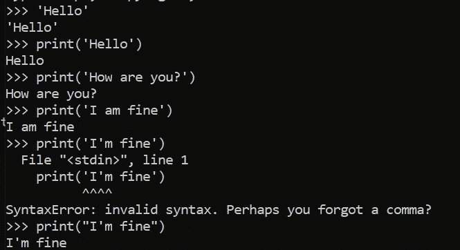
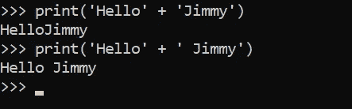
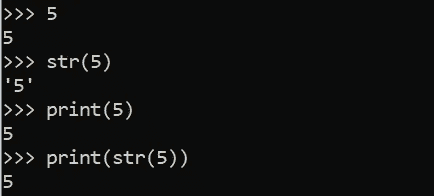
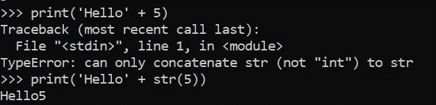

# Python 中的#4 字符串——面向初学者的 Python

> 原文：<https://blog.devgenius.io/4-strings-in-python-python-for-beginners-7c47738b392e?source=collection_archive---------9----------------------->

## 下一个重要的数据类型

我们在这个系列的上一篇文章中提到了数字。现在我们需要信。让我们在本文中看看它是如何工作的！

照片由[简·kopřiva](https://www.pexels.com/@koprivakart?utm_content=attributionCopyText&utm_medium=referral&utm_source=pexels)从[派克斯](https://www.pexels.com/photo/photo-of-a-red-snake-3280908/?utm_content=attributionCopyText&utm_medium=referral&utm_source=pexels)拍摄

## 什么是字符串？

就像我告诉你的，我们需要字母，例如，写“你好，世界！”。我们用两个像这样的问号''来写我们想说的话。就像这样:“你好，世界！”你也可以使用双引号""，但是我建议你使用单引号，你可以在你的键盘上的分号和标签旁边找到,@也位于同一个键盘按钮上(对于英文键盘布局)。

我们来试试吧！我们用 print()打印出我们想写的东西。

摆弄琴弦并把它们打印出来

你看，在第一个例子中，我向你展示了当你输入字符串时会发生什么。在普通代码中什么都不会发生(在 Visual Studio 代码中尝试一下)。**所以要打印出某样东西我们用 print()。**而且很管用！只有一个像“你好”这样的词或一句像“你好吗？”。但是有一点要记住:当你使用单引号(')时，你不能使用像' I'm '这样的缩写形式。那是因为 python 认为你想在这里结束字符串，但是你不想，对吗？所以你有两个选择，用完整形式(我是→我是)，这是首选版本或者你用双引号。那么 python 不会认为你想在那里结束字符串，因为‘和’是两个不同的引号。它看起来像这样:打印(“我很好”)。这些只是需要记住的几件事。现在让我们做一些有趣的事情吧！

## 串并置

**字符串串联是指我们将两个字符串连接成一个字符串。当我们有一个变量(我将在下一篇文章中解释)和一个字符串并想要连接它时，它有时是有用的。**

字符串串联示例

你看，我们可以打印“你好”+“吉米”。**需要记住的一点是，我们必须向其中一个字符串传递一个空格，这样我们也可以在整个字符串中获得空格(第二个例子)。**如上例所示。否则，我们会以一种丑陋的方式将两个字符串连接在一起(第一个例子)。

## str()方法

还可以使用 str()来转换字符串。让我们看一个例子:

用 str()方法将整数转换为字符串

这里你可以看到，当我们输入 5 这个整数时，它会返回 5。这很明显。如果我们现在键入 str(5 ),我们会得到“5 ”,这意味着我们现在将 5 作为一个字符串。所以像‘5’。但是用 print()打印出来就没有区别了。不要担心，我会给你看另一个例子，让这一点更清楚，我们也会看到，当我们使用变量时，这是有帮助的。

为什么我们使用 str() —将一个转换成字符串的整数和一个普通的字符串文本连接起来

你看，我们不能把一个字符串(' Hello ')和一个整数(5)连在一起。我们得到一个错误，说明*"只能将 str(不是" int ")连接到 str"* 。所以让我们试试 print('Hello' + str(5))！而且很管用！由于整数 5 现在被转换为字符串(“5”)，我们可以将它们连接起来。它给了我们 Hello5。完美！

**我希望这个例子能让你更清楚我们为什么使用 str()。**

今天的课到此结束。字符串在 Python 中很重要，所以要记住它们！**但就像数字一样，许多东西在“现实世界”中也是如此。**

如果你有任何关于字符串、Python 或编码的问题，请在下面的评论中提出。

否则，我会在下一篇 Python 初学者文章中看到你，在那里我们将学习 Python 中可能最重要的东西:**变量**。

**直到那时！**

*l0ckD2wN*