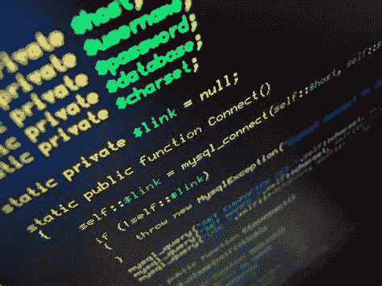

# 应对编码挑战的 4 个技巧

> 原文：<https://blog.devgenius.io/4-tips-to-prep-for-coding-challenges-2fd46a5e99c7?source=collection_archive---------12----------------------->

*免责声明:所有观点均为本人观点。*

[听播客版本！](https://devblabs.podbean.com/e/4-tips-to-prep-for-coding-challenges/)

如果你花了很多时间研究如何为软件工程面试做准备，那么你一定有过挑战编码的想法。我最近写了一篇关于[为什么你最终会在面试中做这些事情](https://rollingwebsphere.medium.com/why-you-wind-up-doing-coding-puzzles-in-interviews-a60c740b61a4)的文章，但现在我想谈谈如何为面试做准备。

这是没有办法的——在别人面前编码是令人生畏的。更糟糕的是，看着你的面试官知道答案，并积极评估你的表现。

我要再说一遍——编码挑战没有办法不令人生畏。但是如果你花时间为他们做好准备，他们会少一点痛苦。

以下是我为最有效的编码挑战做准备的建议。

# 不要看问题类别

大多数编码挑战网站，如 Geeks for Geeks 或 Leetcode，会在你选择它们时向你展示问题的类别。他们会告诉你是“图形问题”还是“数组和搜索”。

显然，在你薄弱的领域做问题是有用的，但是我的建议是做一些编码挑战准备，根本不用看类别。

原因是这给了你面试时不会有的优势。在真正的面试中，你不会知道你所面对的问题是图问题还是动态规划问题，你将被评估的部分内容是你辨别问题的正确解决方案类别的能力。

大多数编码准备网站都有一个“挑选问题”的功能，让你得到一个随机的问题，利用它来得到问题，而不知道他们有什么解决方案。

# 知道何时寻找解决方案

计算机科学是一个相当广阔的领域。有许多问题领域和许多解决方案，其中一些如果没有大量的时间和努力是很难直观了解的。

如果你的目标是准备你的博士学位，那么花时间在一个问题上来证明它是有意义的。

但是如果你的目标是准备软件工程面试，你的时间最好投资在理解你将看到的模式和能够应用它们之间的平衡上。所以，不要强迫自己完成每一个问题，在你上网搜索解决方案或在你使用的网站上寻找解决方案之前，给自己一段合理的时间去实验和尝试。

意识到当你陷入困境，没有取得有成效的进展时，后退一步，让自己仔细阅读解决方案。慢慢来，确定自己明白其中的来龙去脉，获得背后的直觉，然后关闭解决方案，尝试自己实现。

如果你能有效地实现解决方案，你将会对问题类别有更深的理解，这将使你在下一次看到它时更容易解决这个问题类别。

# 给自己计时，但不要疯狂

大多数软件工程面试持续 45-60 分钟，希望你在这段时间内解决一两个问题。了解一下你解决一个中等难度的问题需要多长时间是一个好主意，这样可以让你自己知道你是否能在面试中完成它。

也就是说，你做这种准备是有原因的，可能是因为你还没有为软件工程面试做好准备。准备的目的是让你自己做好准备，所以如果你解决问题的时间比你希望的要长，不要沮丧。

注意你解决问题所花的平均时间，用它来衡量你什么时候准备好申请或者你已经做了足够的准备工作。

# 跟随你的好奇心

如果你完成了一个问题，发现自己对一个变化或边缘情况感到疑惑，甚至只是质疑一个算法实际上是如何工作的，这是一个很好的迹象，表明你应该在那个领域做更多的工作。

这是关注特定问题领域的好时机。你是一名工程师，喜欢让事情有意义，喜欢理解解决方案。如果你发现自己感到好奇，那就照着做吧！

如果你喜欢我的作品，可以考虑加入 medium:[https://devblabs.medium.com/membership](https://devblabs.medium.com/membership)来支持我