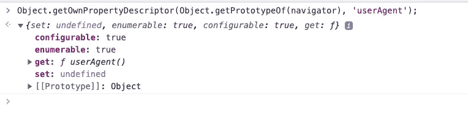

# 用 JavaScript 检测移动浏览器的 4 种方法

> 原文：<https://blog.devgenius.io/4-ways-to-detect-mobile-browsers-in-javascript-943b66657524?source=collection_archive---------0----------------------->

## `userAgent`不可靠，我们还能用什么？


[freestocks](https://unsplash.com/@freestocks?utm_source=medium&utm_medium=referral) 在 [Unsplash](https://unsplash.com?utm_source=medium&utm_medium=referral) 上拍摄的照片

在 web 开发中，我们可能需要知道当前用户是否在移动设备上。本文将向您展示如何在 JavaScript 中检测它。

# 1.导航器上的属性

我们可以使用`navigator.userAgent`，它返回一个包含设备信息的字符串:


所以我们可以使用正则表达式来匹配它，例如使用`/Android|iPhone/i.test(navigator.userAgent)`。

这可能是最常见的解决方案。但是我们可以自己修改这个字符串，例如使用`Object.defineProperty`、`Reflect.defineProperty`等等。因为它的属性描述是这样的:



这里有一个例子:


除此之外，我们还可以使用`navigator.platform`。它指示为其编译浏览器的机器类型。但它没有一个统一的公开名单，可以造假。不建议使用。


还有`navigator.userAgentData`，可以把`userAgent`解析成对象:


也可以造假，兼容性不好:


图片来自[can use](https://caniuse.com/?search=navigator.userAgentData)

# 2.触摸事件

触摸屏设备有一个`ontouchstart`属性，我们可以这样使用:


但是有些笔记本电脑也支持触控，如果需要检测的话可以用`[navigator.maxTouchPoints](https://developer.mozilla.org/en-US/docs/Web/API/Navigator/maxTouchPoints)`。它返回当前设备支持的同时触摸点的最大数量。

笔记本电脑处于键盘模式时，`navigator.maxTouchPoints`为 1；在平板电脑模式下，`navigator.maxTouchPoints`为 10 或以上。而移动一般是 10 以上。

# 3.窗口.方向

我们可以使用`window.orientation`来获取屏幕的当前方向，只有移动设备才有这个属性:

```
if (typeof window.orientation !== 'undefined') { ... }
```

但它已被标记为不推荐使用，因此不建议您使用它。使用`[screen.orientation](https://developer.mozilla.org/en-US/docs/Web/API/Screen/orientation)`代替在 [MDN](https://developer.mozilla.org/en-US/docs/Web/API/Window/orientation) 中提到。但是`[screen.orientation](https://developer.mozilla.org/en-US/docs/Web/API/Screen/orientation)`在桌面上也是支持的，所以不能用来确定移动。


`[screen.orientation](https://developer.mozilla.org/en-US/docs/Web/API/Screen/orientation)`的浏览器兼容性

# 4.Window.matchMedia()

`[Window](https://developer.mozilla.org/en-US/docs/Web/API/Window)`接口的`matchMedia()`方法返回一个新的`[MediaQueryList](https://developer.mozilla.org/en-US/docs/Web/API/MediaQueryList)`对象，该对象可用于确定`[document](https://developer.mozilla.org/en-US/docs/Web/API/Document)`是否匹配[媒体查询](https://developer.mozilla.org/en-US/docs/Web/CSS/Media_Queries/Using_media_queries)字符串。

例如，屏幕宽度不超过`768px`的设备被视为移动设备:

```
const isMobile = window.matchMedia('only screen and (max-width: 768px)').matches;
```


但是屏幕大小判断有时候比较宽松，我们也可以用`[pointer:coarse](https://developer.mozilla.org/en-US/docs/Web/CSS/@media/pointer)`来检测当前设备的指针是否精度有限。

```
window.matchMedia('(pointer: coarse)').matches;
```

但是`pointer:coarse`只用于确定主指向设备。对于那些可触摸的笔记本电脑，这将返回 false。在这种情况下，`any-pointer`可用于确定所有指点设备，`any-pointer: coarse`还指示是否至少有一个指点设备精度有限。

```
window.matchMedia('(any-pointer: coarse)').matches;
```

# 结论

据我所知，目前还没有完美的检测手机浏览器的方案。上面列出的 4 种方法都有一些缺陷，你可能需要根据你的实际情况来选择它们。

如果你正在适应小屏幕设备，纯 CSS 可能是最好的，并尽量避免在 JavaScript 检测。

你有更好的解决办法吗？请随意与我分享你的想法。

*感谢阅读。如果你喜欢这样的故事，想支持我，请考虑成为* [*中等会员*](https://medium.com/@islizeqiang/membership) *。每月 5 美元，你可以无限制地访问媒体内容。如果你通过* [*我的链接*](https://medium.com/@islizeqiang/membership) *报名，我会得到一点佣金。*

你的支持对我来说非常重要——谢谢。