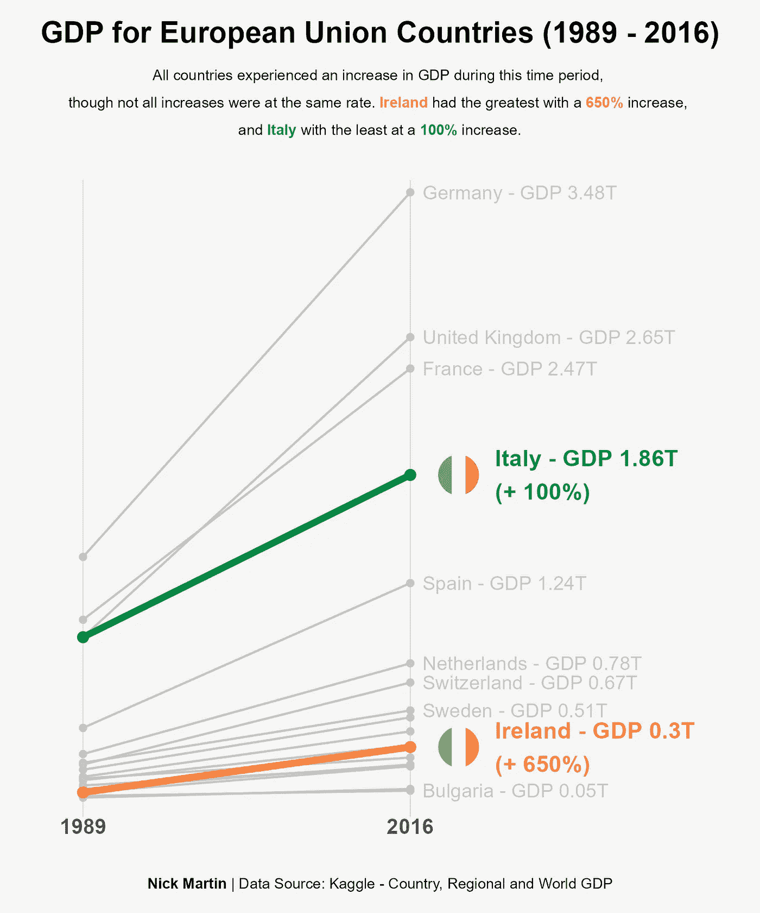
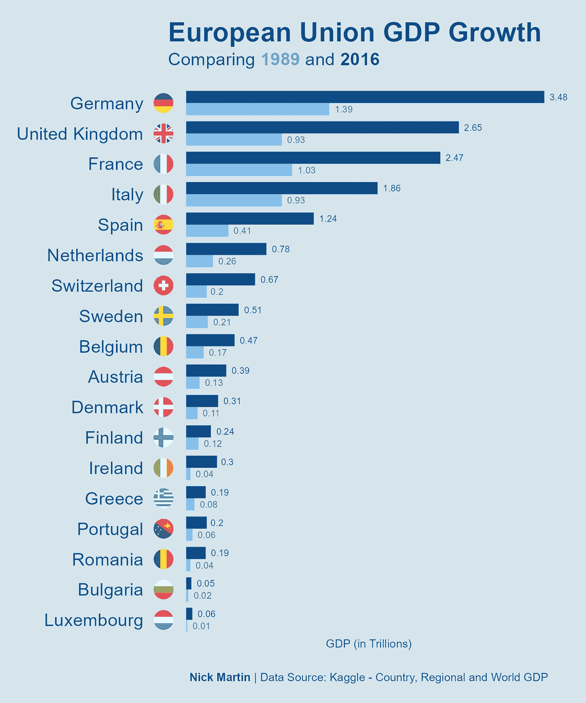
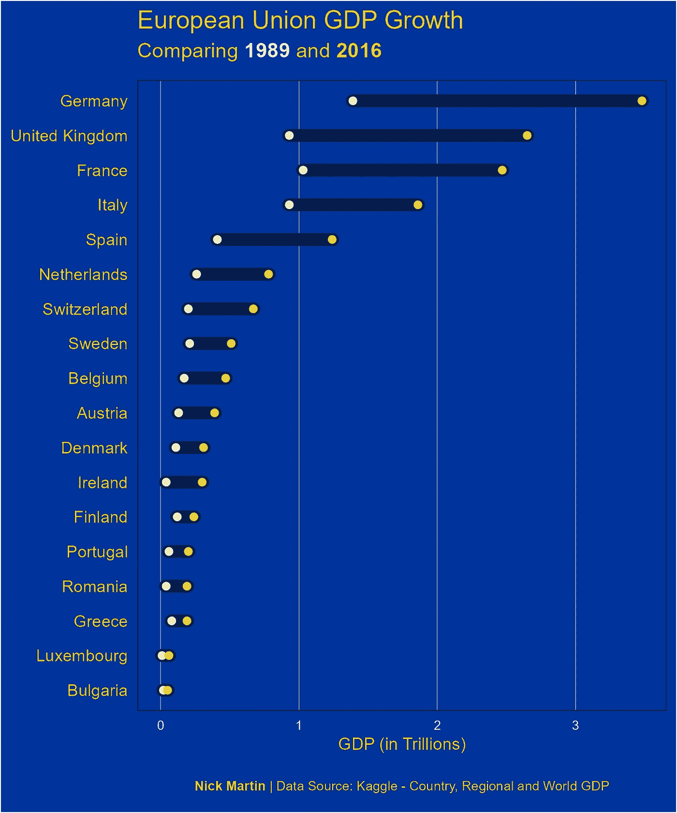
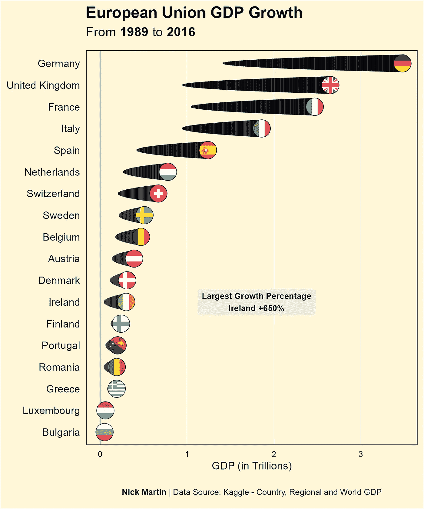

# 4 种可视化年度对比的方法

> 原文：<https://blog.devgenius.io/4-ways-to-visualize-year-to-year-comparisons-73e354ddf9cc?source=collection_archive---------12----------------------->

# 1.斜率图

斜率图类似于折线图，但只显示两个时间段。在这种情况下，我查看了 1989 年至 2016 年期间欧盟国家的 GDP 增长。正如我们所看到的，用这种方法可以清楚地看出一个国家的起源和终结。

# 2.分组条形图

分组条形图显示了每个国家每年的 GDP 值。这使得观众可以快速衡量一年的 GDP 与另一年的 GDP 之间的差异。我还添加了数据标签，使每个值的确切大小更加清晰。例如，德国在 2016 年以 3.48 的 GDP 排名第一，但在 1989 年，德国的 GDP 为 1.39。自 1989 年以来增长相当大，超过 2 万亿。

# 3.点状图

点状图沿同一轴提供了每年的 GDP 值。越靠右，GDP 值越大。这使得观众很容易看出不同年份之间的差异。这个图表也使得我们可以很容易地查看一年中不同国家之间的比较。例如，英国在 1989 年的 GDP 中落后于法国，但在 2016 年，它现在领先于法国。

# 4.彗星图

彗星图显示了每年数值的差异和增长的总体强度。在这个例子中，所有国家的 GDP 都在增长，所以彗星的尾巴总是在左边，但是如果这些国家中的任何一个在两年间 GDP 下降，那么尾巴就会显示在右边。在这种情况下，您还可以玩玩颜色，以便更清楚地看到增加与减少，比如红色表示减少，绿色表示增加。

## 参考

本文中使用的数据集是 Kaggle 的[国家、地区和世界 GDP](https://www.kaggle.com/datasets/tunguz/country-regional-and-world-gdp) 数据集。