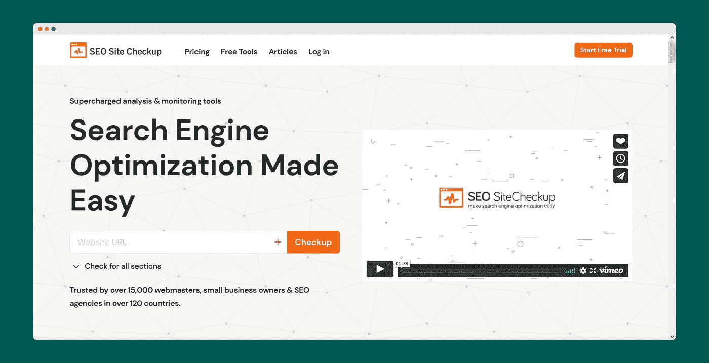
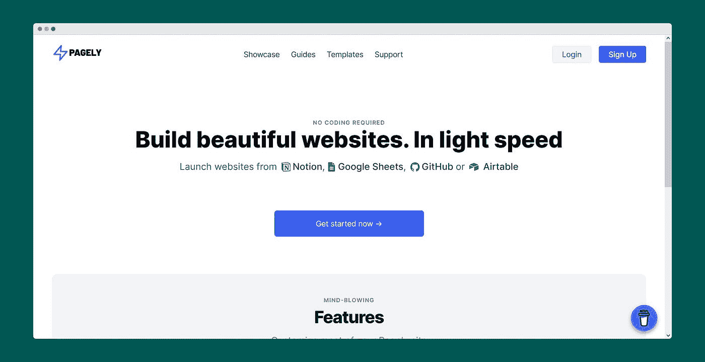
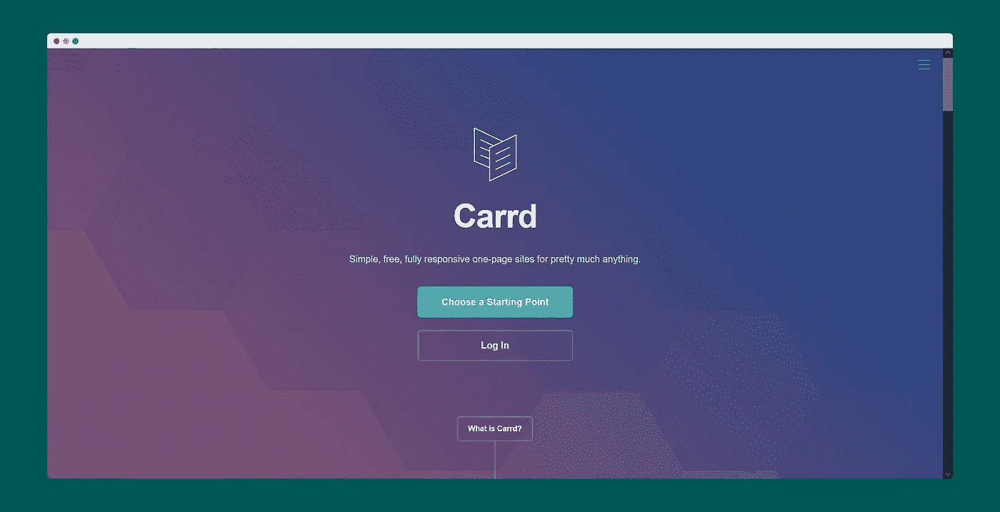

# 2022 年，面向开发者的 40+无代码/低代码工具和资源

> 原文：<https://blog.devgenius.io/40-no-code-low-code-tools-and-resources-for-developers-in-2022-a52d3bc0357c?source=collection_archive---------0----------------------->

有如此多的非代码工具可以让开发人员的工作变得更容易。任何人都可以创建一些有用的产品，甚至不用写一行代码就可以创业。在这篇文章中，我们将看到 **40+无代码/低代码工具和资源的开发者**将在 2022 年帮助你。

# 到底什么是无代码？

无代码编程是一个简明的定义。这是使用无代码工具，让您无需编写任何代码就可以创建一个功能齐全、响应迅速的 web 应用程序或网站。然而，它比那更深入一点。

每一项技术，包括无代码平台，都是用代码开发的。区别在于，无代码平台提供了任何网站或应用程序所需的构建元素，如页面、数据存储和显示、个人用户配置文件和文件上传。然后，人们可以使用拖放或其他不需要编码的“人类理解的”动作将它们链接到自己的程序中。

# 1.[扎皮尔](https://zapier.com/)

对于那些总是忙碌的人来说，自动化是节省时间的好方法。Zapier 自动在您的在线应用程序之间传输数据，让您专注于最重要的任务。

# 2.[字体翻转器](https://fontflipper.com/)

使用这个网站，你可以在你的设计上预览 500 多种谷歌字体。

# 3.[图玛](https://www.figma.com/)

Figma 整合了参与设计过程的每个人，使团队能够在更短的时间内生产出更好的产品。你可以为你的作品创造美丽的设计。Figma 的“始终在线”特性实际上提供了该工具的一些最大优势。其中一个优势是 Figma 允许实时的合作。免费+付费

# 4.[预览了](https://previewed.app/)

预览有助于创建智能模型，只需在浏览器中拖放。您可以创建设备快照和动画剪辑。

# 5. [NoCodeAPI](https://nocodeapi.com/)

NoCodeAPI 可以帮助你设置你的 Google Sheets、Airtable、Google Analytics、Twitter、Telegram、Open Graph API、MailChimp 和 50 多个其他应用程序，而不需要后端来节省时间和金钱。

# 6.[花键](https://spline.design/)

Spline 帮助您创建漂亮的 3D 设计，用于您的项目和网站。

# 7.[移除 bg](https://www.remove.bg/)

无需点击即可移除任何图像的背景。有很多漂亮的背景可供选择。

# 8.[酷派](https://coolors.co/)

闪电般快速的配色方案生成器！创建您理想的配色方案，或者从成千上万令人惊叹的配色方案中获得灵感。

# 9. [Webflow](https://webflow.com/)

Webflow 让您无需编写任何代码即可创建自己的网站。超过 3，500，000 名设计师和团队使用 Webflow 在完全可视化的画布上构建、协作和开发令人惊叹的网站，无需任何代码。这是一个数字界面的可视化界面生成器。它本质上使您能够定位和设计任何数字接口的部件。

# 10. [SEO 网站审查](https://seositecheckup.com/)

SEO Site Checkup 对您的网站进行快速审核，检查标签是否正确，并突出显示任何可能出现的错误。实时分析你的搜索引擎优化问题。你可以对 SEO 报告进行分析并采取行动。

# 11.[字体](https://www.typeform.com/)

制作人们想要填写的表格、调查和测验。您可以创建与各种应用程序的集成，享受节省时间的工作流程。免费+付费

# 12.[mockuups 工作室](https://mockuuups.studio/)

你对理想模型的搜寻已经结束了。设计师和营销人员可以在几秒钟内将图形拖放到 1200 多个模型中。

# 13.[扩展名. dev](https://extension.dev/)

extension.dev 是一个低代码平台，用于构建和部署帮助您发展业务的浏览器扩展。使用他们的示例扩展和模板库立即开始，或者从头开始。自由的

# 14.[扁平图标](https://www.flaticon.com/)

为您的项目下载免费图标和贴纸。由设计师制作和为设计师制作的资源。PNG、SVG、EPS、PSD 和 BASE 64 格式。访问 6M+矢量图标和贴纸。

# 15. [freepik](https://www.freepik.com/)

找到大量的图形资源，包括免费矢量，股票照片和 PSD。

# 16.[登陆 page.fyi](https://landingpage.fyi/index.html)

使用精选的示例和工具构建您的最佳登录页面。登录页面资源库。您将很快拥有最新的登录页面。

# 17.[成帧器](https://www.framer.com/fp/)

从头到尾在画布上创建令人惊叹的交互式设计。借助预制的交互组件、精美的资源、布局工具等，在几分钟内设计出逼真的网站和应用。

# 18.[尾巴](https://devdojo.com/tails)

Tails 是为 TailwindCSS 构建的终极拖放页面创建者。超过 220 个组件，让您的顾客看起来很漂亮。免费+付费

# 19. [Panelbear](https://panelbear.com/)

Panelbear 帮助您衡量网站最重要的指标，因此您可以提供出色的最终用户体验。

# 20.[仿艾](https://www.copy.ai/)

借助 copyi 的自动化创意工具，您可以在几秒钟内生成营销文案。

# 21. [PORY](https://pory.io/)

使用拖放块按照您喜欢的方式创建您的应用程序。连接您喜爱的所有应用程序中的数据。控制用户可以查看、创建和修改用户组的内容。

# 22.[大喊](https://shoutout.so/)

通过强调人们为什么信任你来增加你的消费者基础。“大喊”很容易将你目前的社会证明转化为可爱的“爱情之墙”在不到 3 分钟的时间内，您就可以捕捉、策划和发布一面墙。

# 23. [Coda](https://coda.io/welcome)

Coda 附带构建模块(如表格和按钮)和节省时间的模板，因此您的文档可以随着团队的需求而增长和发展。不再为了完成工作而在文档、电子表格和利基工作流应用程序之间来回穿梭。Coda 将您所有的文字和数据整合到一个灵活的界面中。

# 24. [BuildFire](https://buildfire.com/)

iOS 和安卓最强大的应用程序制造商。BuildFire 强大且易于使用的移动应用构建器使您可以在很短的时间内为 iOS 和 Android 创建移动应用。

# 25.[气泡](https://bubble.io/)

不用代码构建网络应用的最好方法。Bubble 是最强大的无代码平台，让企业家能够构建生产就绪的网络应用。

# 26. [PAGELY](https://www.pagely.site/)

以光速建立美丽的网站。不需要编码。从 idea、Google Sheets、GitHub 或 Airtable 推出网站。

# 27. [BUILDBOX](https://signup.buildbox.com/)

无需任何编码即可创建 2D 和 3D 游戏。试试这个令人敬畏的低代码游戏开发平台。从头开始构建任何游戏或使用模板。

# 28.[邪恶模板](https://www.wickedtemplates.com/)

在这里找到 HTML 登陆页面模板。你可以获得免费和优质的主题、UI 套件、模板和用 Tailwind CSS、HTML & Next.js 构建的登陆页面。

# 29.[气动工作台](https://www.airtable.com/)

Airtable 是一个具有数据库功能的现代电子表格工具。它简单易用，允许任何人快速建立数据库。这是众多越来越受欢迎的无代码工具之一。

# 30. [Splitbee](https://splitbee.io/)

分析平台帮助您跟踪和优化您的在线业务。实时跟踪传入流量。发现用户来自哪里，他们访问了哪些页面。深入你的广告活动，看看什么转换最好。

# 31.[语音流](https://www.voiceflow.com/)

Voiceflow 是一个对话设计工具，允许团队创建、开发和启动语音和聊天助手。Voiceflow 使创建上下文讨论变得简单。利用可重用的组件、健壮的上下文模型、交互模型导出，以及我们快速而漂亮的拖放画布中的更多内容。

# 32.[观念](https://www.notion.so/)

idea 是目前最受欢迎的生产力应用之一，拥有超过 100 万用户。它每天都在继续扩展，这要归功于 opinion 健壮的数据库、用户友好的页面和性能增强的适应性。你也可以使用概念来创建网页。

# 33.[任务完成](https://www.taskade.com/?via=mr)

如果你想在一个地方实现概念、缩放和松弛，那么你一定要使用这个。规划你的工作流程，从想法到行动。项目协作和任务管理。

# 34.[滑行](https://www.glideapps.com/)

创建强大的应用程序和网站，无需代码。使用基本的电子表格技能，你可以用 Glide 做出不可思议的东西。选择一个电子表格，Glide 会立即生成一个真正的、有效的应用程序或网站，让你开始工作。

# 35.[邦帕](https://getbumpa.com/)

从您的手机管理您的业务。你需要在网上、网下和社交媒体上销售的一切。跟踪订单。吸引客户。接收付款。免费网站。

# 36.[魔法图案](https://www.magicpattern.design/)

漂亮的图形，共有十个工具。毫不费力地，立即！只需点击几下，您就可以为社交媒体帖子、登陆网站和品牌创建独特的视觉效果。然后你可以将它们保存为照片甚至代码(SVG & CSS)。为您的客户和产品创建无限数量的高质量背景图片。

# 37.[购物化](https://www.shopify.in/)

Shopify 是一个电子商务平台，任何人都可以通过它开设在线商店并销售商品。借助 Shopify POS，商家还可以亲自销售商品。没有任何编程技能，你可以建立一个 Shopify 商店，并立即开始运营。只需点击一个按钮就可以安装主题，定制主题(取决于主题及其可访问的参数)就像填写在线表格一样简单。

# 38.[石墨](https://graphite.space/)

反应灵敏，像素完美，无代码。让网站设计感觉像一个舒适的环境。使用熟悉的可视化编辑工具，创建像素完美的网页，而不仅仅是实体模型。专注于创造性方面，忘记其他的。

# 39.[感言](https://testimonial.to/)

轻松获得客户的视频评价。很难获得视频证明。因此，奖状是为你准备的。你不需要一个开发者或网站托管来在几分钟内从你的消费者那里收集视频评价。

# 40.[运载](https://carrd.co/)

Carrd 是一个网站建设平台，类似于 SquareSpace 或 WordPress，在过去的一年里越来越受欢迎。Carrd 与其他网站的区别在于它专注于单页网站。它的几乎所有功能都是免费使用的，应用范围非常广泛。

# 41. [IFTTT](https://ifttt.com/)

IFTTT 是 If This Then That 的缩写，是集成应用、设备和服务的最佳方式。IFTTT 使设备、服务和应用程序以新的强大方式进行交互成为可能。IFTTT 是基于这样一个理念，即当所有的事情一起做的时候，效果会更好。对于任何想要设计智能家居或自动化生活的人来说，技术不兼容已经成为一个挑战。用 IFTTT 很简单。

# 42.[无编码视频](https://www.nocode.video/)

探索网络上热门的 Nocode 视频，了解新技术。查找与 Nocode 相关的教程。

# 43.[会员空间](https://www.memberspace.com/)

只需点击几下，你就可以把你网站的任何部分变成会员专用。只需限制对网站任何页面的访问，然后决定访问者将支付多少访问费用。为您想要的任何内容创建成员资格，包括课程、视频课程、成员目录等等，同时保持对设计的完全控制。

# 44.[无代码](https://dev.nocodery.com/)

Nocodery 是 nocoder 的工作板，由 nocoder 为 nocoder 创建。Nocodery 从各种来源收集 nocode 工作邀请和工作，因此您不必在工作公告板上手动搜索它们，从而节省您的时间！

# 45.[无码. how](https://codeless.how/)

Codeless 是一个网站，为任何经营互联网业务并希望无需编写代码即可实现日常操作自动化的人提供信息。您将学习如何使用 Zapier、Webflow 和 Airtable 等技术来自动化营销、销售、计费和其他活动。

# 46. [Softr](https://www.softr.io/)

Softr 是一个非常棒的在线开发工具，它允许用户在 Airtable 上只需十分钟就可以创建无代码的网站、门户和 web 应用程序。使用 Zapier，您可以将应用程序逻辑与外部服务集成，或者将多个站点互连。

几十年来，人们不用写一行代码就能使用计算机。随着无代码技术的普及，对于那些希望编写软件的人来说，一场类似的革命正在发生。虽然无代码革命仍处于早期阶段，但预计到 2023 年，这项业务的价值将超过 430 亿美元。另一方面，当前的繁荣是几十年艰苦劳动和进步的结果，不容忽视。

## 如果你❤️我的内容！在推特[上联系我](https://mobile.twitter.com/Astrodevil_)或者通过[请我喝咖啡](https://www.buymeacoffee.com/Astrodevil) ☕来支持我！您也可以在我位于 [Gumroad](https://astrodevil.gumroad.com/) 的商店购买数码产品