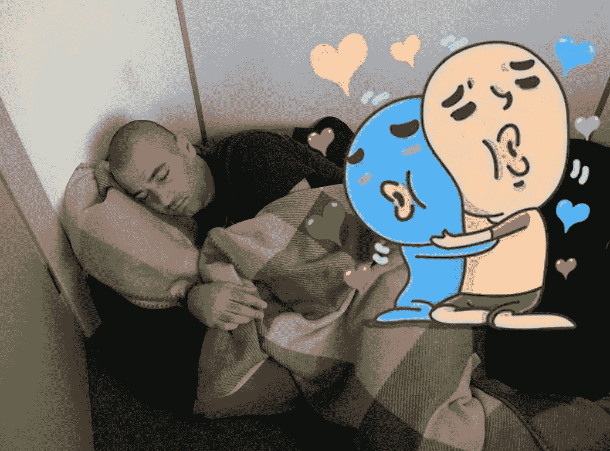
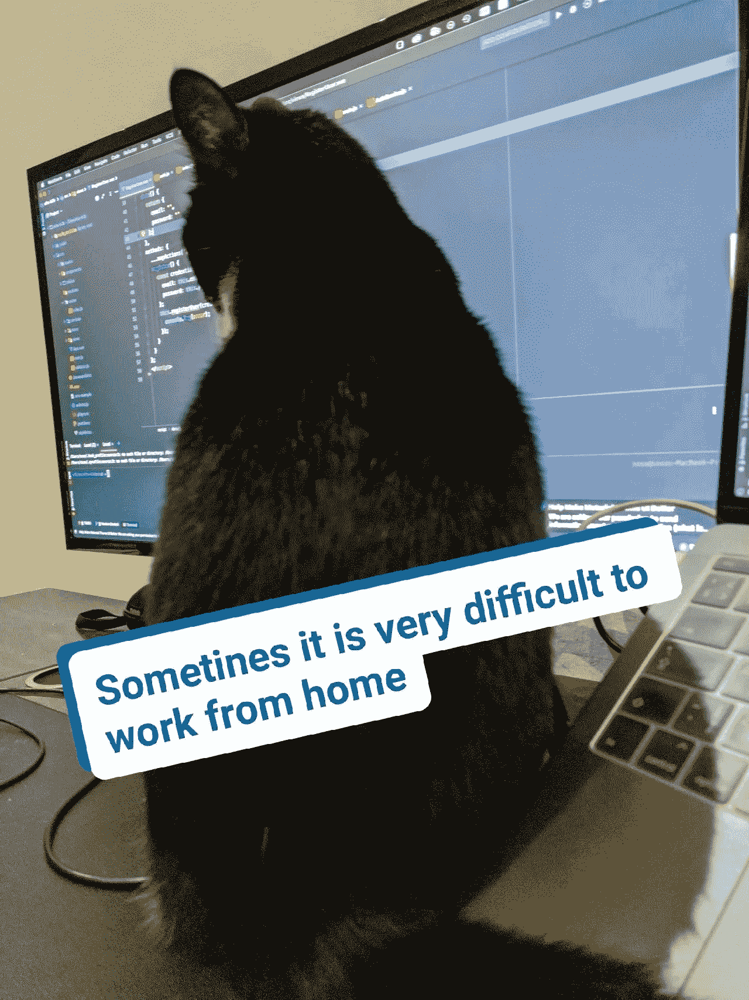

# 我讨厌做开发人员的 40 个理由

> 原文：<https://blog.devgenius.io/40-reasons-why-i-hate-being-a-developer-96c772d20874?source=collection_archive---------1----------------------->

昨天我发现了 Dan English 的一个帖子，40 个我喜欢做开发人员的理由，我感谢他发了这个帖子。这非常有趣，正如作者所要求的，我想在文章后留下我的评论，但我也找到了 40 个我讨厌做开发者的理由，所以我决定写一篇我自己的愤怒的开发者的文章。我相信大多数业内人士都同意这个观点。

1.为了坚持下去，不丢掉工作，我几乎每天都要学习一些新东西。

2.无论是周六还是周日，每天都被项目经理叫去上班。

3.能够看到科技让生活变得更简单。但是，仍然用自己的方式笨拙地写。

4.参加一个疯狂的社会，这个社会只考虑软件行业，编码，并以此为乐。

5.喝了很多咖啡却没有任何结果，因为昨天你一直工作到凌晨 2 点。

6.发现新的开源资源，互联网上有大量的开源资源，阅读所有的资源以了解哪个更好，即使你已经使用了一些库，你也需要了解新的版本，如从未使用过的版本…花一整天的时间来决定使用哪个库…

7.没有机会拥有自己的想法，因为周围的每个人都是对的，除了你。Scrum 大师、产品负责人、UX 设计师、UI 设计师，甚至项目经理都是对的，因为他们知道企业需要什么，而你只是一个必须编码、编码、编码的开发人员…

8.没有时间做你自己的生意或小项目，因为你必须编码，编码，编码。

9.在办公室增加体重，没有任何锻炼，没有疼痛-没有肌肉。

10.不能因为办公室人人爱你，请你品尝生日快乐蛋糕而节食。

11.编写 60 分钟的测试，解决算法，数据结构和获得技术面试，就像你开始在五角大楼工作一样，但同时，在实践中，你被赋予的最困难的任务是处理 HTML。

12.更多的咖啡，但我仍然不能工作。

13.不得不学习更多，没有时间只是工作和沉默，工作和稳定，工作和幸福。

14.担心新版本更新，总是有很多 bug。

15.使用网络风暴和 8Gb 的内存崩溃。

16.尽管 ie 浏览器已经死了很久了，但我们还是要把它考虑进去，因为还有怪胎和公司还在用这个该死的浏览器。

17.总是有新的任务，像三头龙，你完成一个，但得到 3 倍多。

18.所有对优秀开发项目的赞美都归于项目经理，而糟糕的代码则归于程序员。

19.当你喝了三杯咖啡，却感觉不到咖啡因的时候，这一点都不好玩。

20.如果你是一名自由职业者，每年都需要买一台新的笔记本电脑，并在上面花很多钱。

21.每当你重构或清理你可以写得更好的旧代码时，你都会对自己不满意。

22.午餐时间只有 10 分钟，没有休息时间。

23.每个人都需要远程工作，社会联系正在中断，唯一可以与之交谈的人是你的宠物。

24.意识到没有 StackOverflow 我就不是程序员。

25.软件业是“期望与现实”现实生活中模因的家园。

26.我玩的最后一个游戏是 2… 10 年前的半条命。

27.来自项目经理的更多蛋糕。

28.味道恶心的红牛:(但有时候也是必须的。

29.犯了一个可能给银行带来数十亿美元损失的错误，或者忘记保护个人数据而入狱。

30.能够开发一个网站 5 年不明白这他妈的疯狂好看的动画是怎么被别人创作出来的。

31.我爸以为我在 excel 工作。

32.警察邻居认为我是一个黑客，因为我可以在 youtube 上上传视频…他在监视我，想通过逮捕我来发展自己的事业:)

33.还要咖啡吗？

34.项目经理知道你可以带着笔记本电脑去海滩写代码，这就是程序员没有生活的原因。

35.拥有一份工作，即使你是世界上最差的程序员，因为开发人员严重短缺。

36.花点时间在新电脑上安装哪个主题，如果是 Linux，那就花一周时间决定如何定制它。

37.即使你在旅行，你的大脑也不能停止工作，因为你知道如何修复困扰你两周的 bug，但这只会发生在梦里，因为你没有精力为此兴奋。

38.对我的工作充满热情，忘记了我的个人生活。

39.有一些指南可以帮助你建立或学习任何你需要或不需要的东西，但是不去尝试你是不会明白的。

40.最后，咖啡起了作用，但是太晚了，因为手表上已经是凌晨 2 点了，你需要睡觉……:(

当然，这是一个玩笑，我喜欢做一名开发人员，我喜欢编码过程和我周围发生的所有事情，甚至张贴这个愚蠢的帖子……:)

感谢丹和你们所有人。

再见。

