# 条形图的 10 种替代方案

> 原文：<https://blog.devgenius.io/5-alternatives-to-the-bar-chart-f53660c0e57f?source=collection_archive---------1----------------------->

条形图是一个很好的可视化工具，但是在你的演示文稿/仪表盘上放太多的条形图会让它变得很乏味。

条形图是可视化数据最简单的方法之一。对于人类来说，理解一个群体与另一个群体在体型上的差异是很简单的，而且在视觉上也很吸引人。然而，由于其制作和理解的简单性，它可能被过度使用。但是看看它，它看起来太好了！

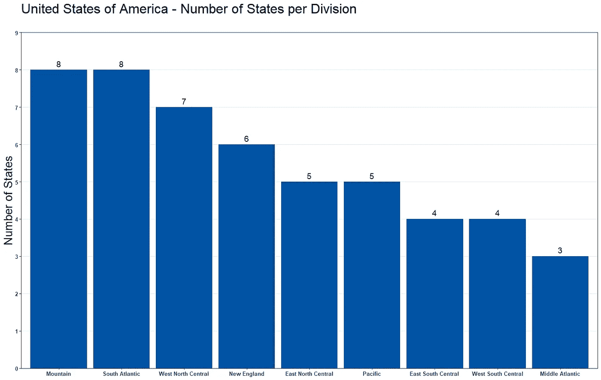

数据来自基数 R——州.部门和州. abb

这里有 10 种条形图的替代品，当你已经有太多的条形图时，你可以用它们来增加吸引力。

# 1.树形图

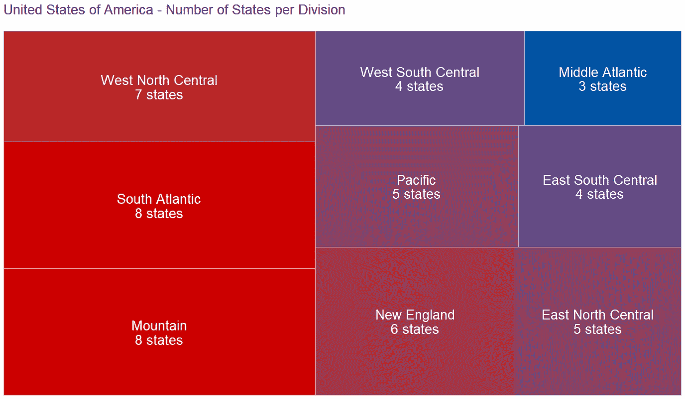

数据来自基数 R——州.部门和州. abb

树形图是取代条形图的一个很好的选择。这将使具有较大值的组具有较大的大小，而具有较小值的组则相反。因此，这将允许您和您的观众看到与条形图相同的大小差异。

*   **优势**:这最适用于包含少量类别的数据集，这样所有类别都可以看到。
*   **缺点**:对有时间序列信息的数据集不起作用。

# 2.圆环图

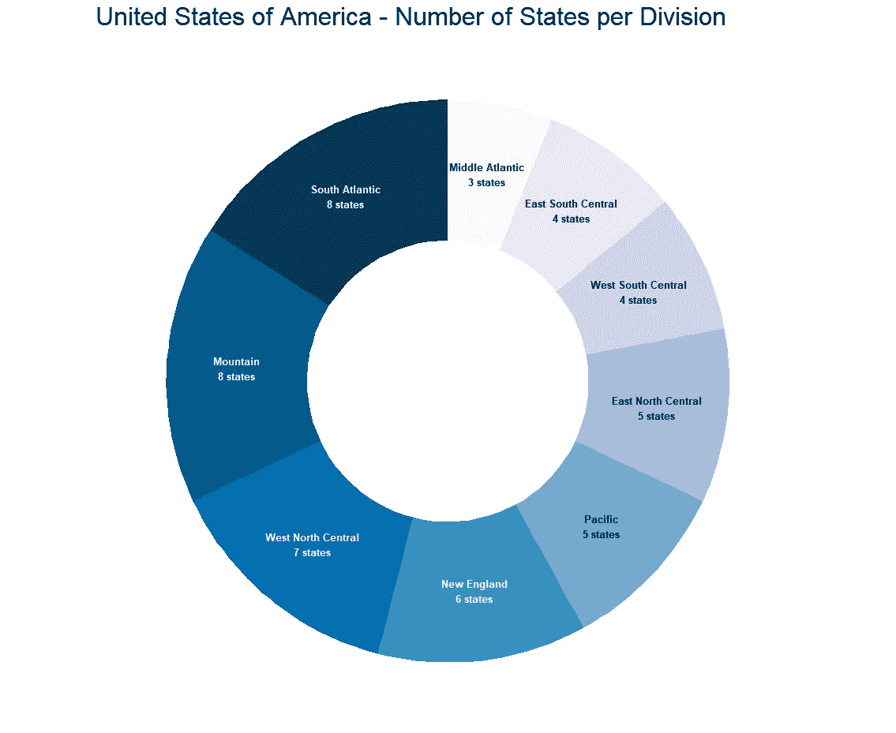

数据来自基数 R——州.部门和州. abb

环形图或饼形图(此处未显示)也是不错的选择。

*   **优势**:类别数少的数据集最好，可以很容易地显示出总量在 100%视觉(整圈)上的分布。
*   劣势:大型数据集，也就是我们在这里使用的数据集，在这里不太好用。因为很难看到标签和每组所占的百分比。最好将这些用于 4 组或更少组。

# 3.堆积条形图

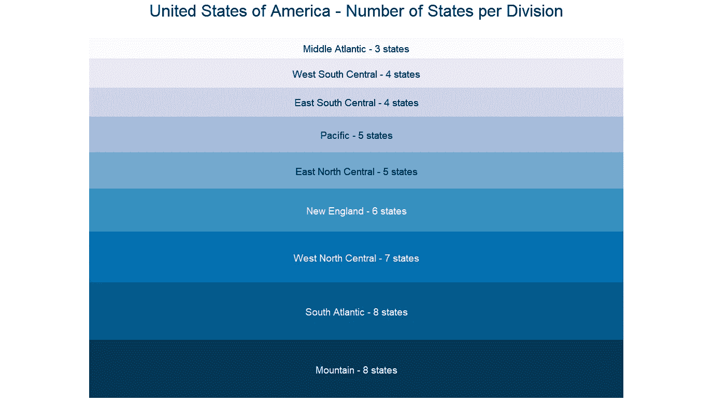

数据来自基数 R——州.部门和州. abb

堆积条形图是另一个不错的选择，当以特定的方式呈现时，它看起来不像条形图。在这里，它看起来真的只是一个包含标签的表格。在这里仍然很容易看到每一组的分布以及它们占总数的多少。当它们堆积在一起时，您可以将它们与总量的百分比进行比较。

*   **优势**:和大多数方法一样，这种方法最适用于较小的分组数据集。虽然这一个仍然可以显示比圆环图更多组的数据集的良好视觉效果。

# 4.包装气泡图

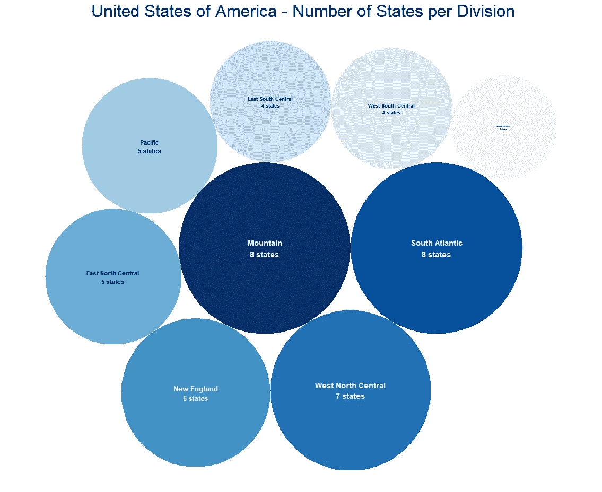

数据来自基数 R——州.部门和州. abb

填充气泡提供了每组分布的不同视图。将具有最大值的组放在中间，然后与所有其他组一起围绕它循环，从最大到最小。

# 5.热图

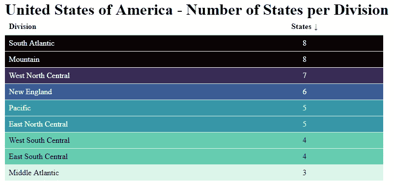

数据来自基数 R——州.部门和州. abb

热图，是的，表格，也是一个不错的选择。当你给表格添加颜色时，它仍然可以作为一个很好的视觉效果，随着颜色值的增加而增加颜色的强度。随着颜色的变化，你可以很容易地看到每一组相对于其他组的价值。

# 6.水平条形图

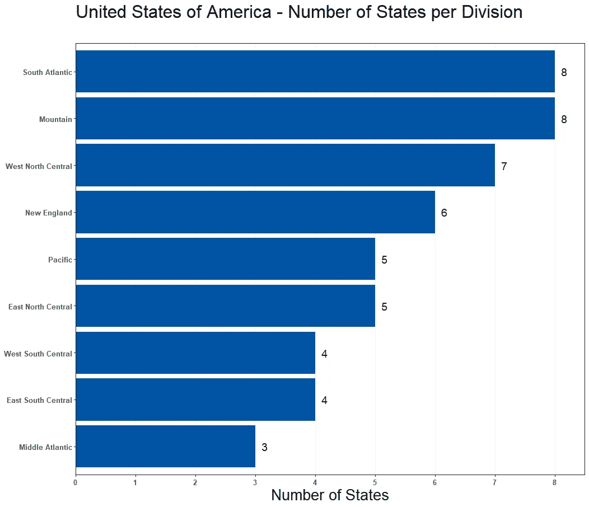

数据来自基数 R——州.部门和州. abb

您可以选择改变条形图，同时仍然保持密切的感觉，是通过水平而不是垂直地看它。

*   **优势**:这最适合像这样的数据集，其中我们有许多类别(部门)，并且每个类别都有一个很长的名称。更容易读出每个名字，并且能够在更紧凑的区域中保存更多信息。
*   **缺点**:不要对时间序列数据集这样做，看时间几乎总是应该像垂直条形图提供的那样从左向右看。

# 7.圆形条形图

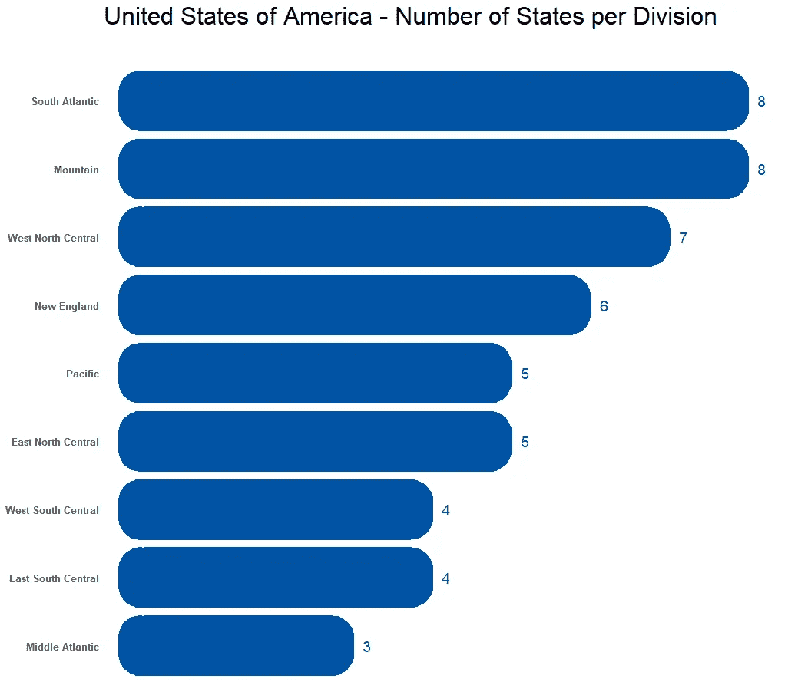

数据来自基数 R——州.部门和州. abb

您也可以扩展水平条形图，或垂直条形图，并通过圆化条形图的角来改变它的外观。这可能是一个很小的区别，但它改变了外观，足以吸引观众。

*   **优势**:优势类似横道图。也适用于普通的垂直条形图。
*   **缺点**:不要对时间序列数据集这样做，看时间应该总是从左向右看，就像垂直条形图提供的那样。

# 8.点状图

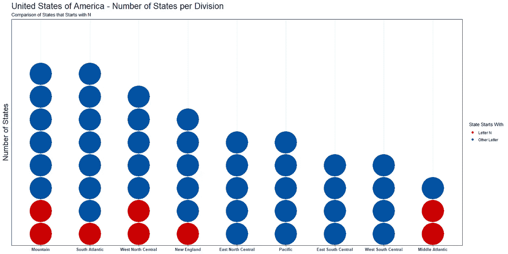

数据来自基数 R——州.部门和州. abb

另一种选择是点状图。使用此图，您不会将条形作为一个整体来查看，而是按组显示分布中的每个点(在这种情况下，每个状态)。

*   **优点**:显示分布，而不仅仅是最后的合计值。这也有助于突出显示。除了显示整体，您还可以显示突出显示的点，以显示分布中有多少类别(正如我们在这里显示的以红色字母 N 开头的州，以蓝色字母开头的州)。
*   **缺点**:对观众来说，阅读可能会有些困难，因为它要繁忙得多。

# 9.棒棒糖图表

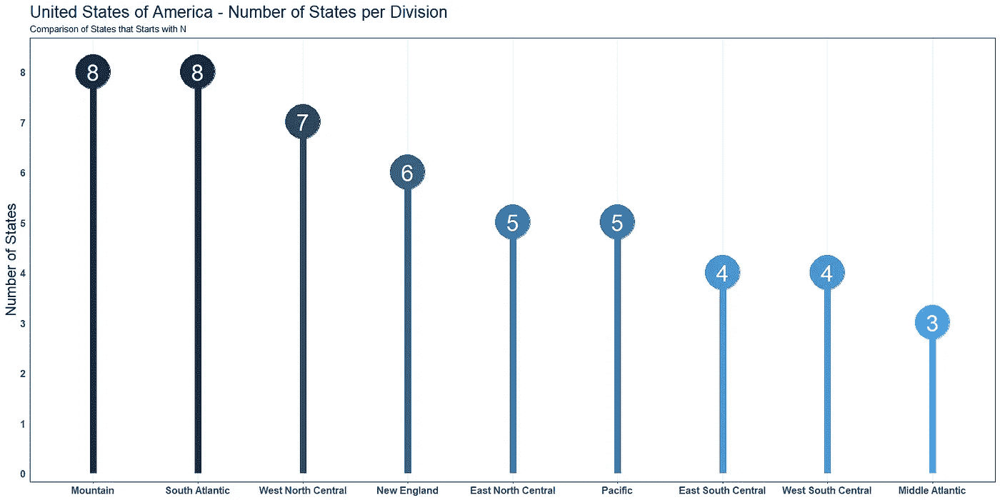

数据来自基数 R——州.部门和州. abb

您可能还想使用棒棒糖图。该图表能够准确提供条形图所提供的内容，但有更多的空白空间。我还根据每个部门的状态数量添加了颜色，以增加更多的洞察力。

*   **优势**:适用于较小的数据集或可以轻松突出显示的数据集。很容易看出每组之间的差异，并且能够将标签隐藏在圆点内。
*   缺点:更多空白，尽管这并不总是缺点，就像这里。

# 10.放射状柱形图

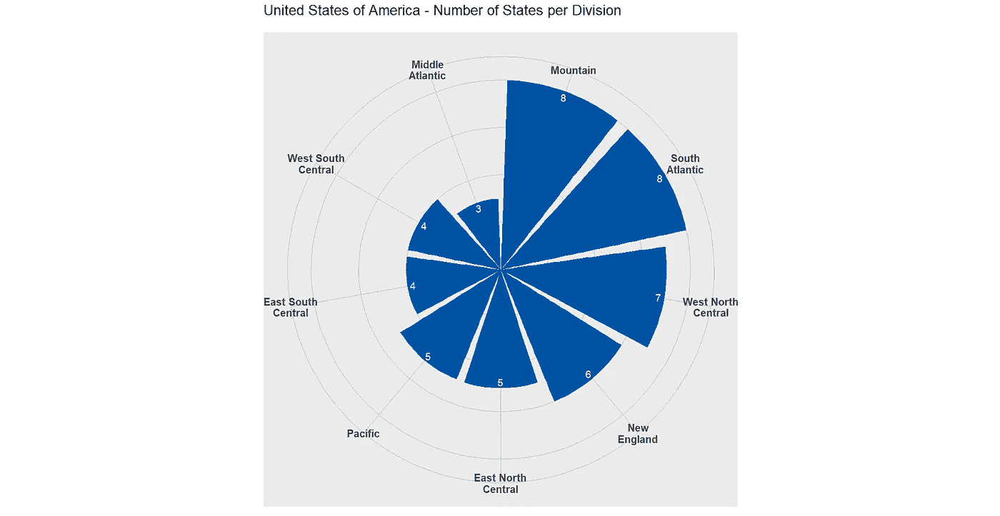

径向柱形图是你的另一个选择。这就形成了条形图，基本上是一个循环的形状。

*   **优点**:这个图表在更少的空间里显示了相同的信息，同时仍然保持了每根棒线大小的完整性。仍然很容易看出哪些是最高值，哪些是最低值，以及它们之间的差异。
*   **缺点**:空间越小，看起来就越忙碌。这可能需要观众花更多的时间来理解正在发生的事情。

如果您喜欢学习条形图的替代方法，您可能也喜欢在[How to R:Visualizing Distributions](https://medium.com/@nickmartin812/how-to-r-visualizing-distributions-49ea4141fb32)中学习可视化分布。