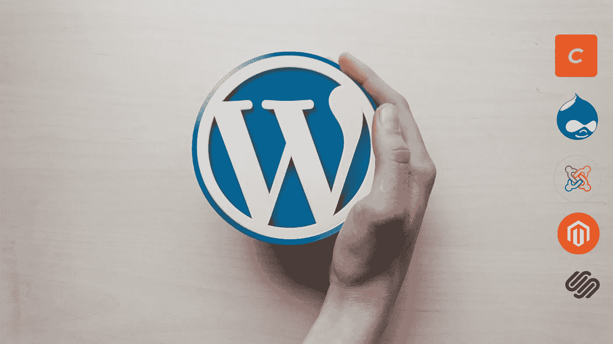

# 你应该尝试的 WordPress 的 5 个替代品

> 原文：<https://blog.devgenius.io/5-alternatives-to-wordpress-that-you-should-try-51e0625ed715?source=collection_archive---------9----------------------->

多年来，WordPress 一直是我们在线内容管理的首选。但是随着年复一年新的 CMS 加入，它面临着激烈的竞争。

我们整理了一份你可以考虑的 5 大 WordPress 替代品的列表。如果你计划转换你的 CMS 平台，这篇文章可以帮助你做出决定。

让我们开始吧！

# 珠姆拉。

作为 WordPress 的流行替代品，Joomla 在 CMS 社区中享有值得称赞的地位。它是免费的，可用于各种网站，并提供了广泛的内容管理功能。

Joomla 致力于 web 应用程序的 MVC 框架，内置了超过 64 种语言的多语言支持，易于用户管理、用户分组和联系人管理。这使得它非常适合构建社交网站、大型社区论坛等等。

默认的双因素身份验证确保您的网站更加安全，并被证明是黑客难以攻击的目标。生成的 URL 也有更好的 SEO 排名。谁不喜欢这样呢，对吧？

你不需要额外的插件来管理横幅和缓存，因为这些都是内置的功能。您有一个巨大的扩展库，包含 9000 多个选项可供选择。

然而，Joomla 对开发者更友好，因为它有技术管理控制台。这使得初学者很难理解和导航。学习曲线很陡，所以聘请 Joomla 专家很贵。

> 选择 Joomla 的理想场景是内容密集型网站，需要对用户进行大量分类，并迎合许多不同但相似的社区。哈佛大学的网站利用 Joomla！

# Magento

Magento 是一个自我托管的电子商务平台。社区版是免费的，企业版需要付费。

Magento dashboard 允许您在一个地方管理跨国家、语言、货币和商店的多项交易。它建立了搜索引擎优化友好的网页，为所有屏幕尺寸优化。

有 5000 多个扩展和插件可供你选择，但它们可能会比较贵。您可以跟踪您的订单，细分用户，保持库存更新，帐户运费，甚至优惠券管理都可以通过扩展来完成。

它提供了很大的灵活性，但是学习曲线很陡。它肯定不是即插即用的型号！在你建立并运行虚拟商店之前，你的团队必须了解它的扩展、集成和插件。

> **对于具有多个细分市场的大规模产品，Magento 是一个可行的选择。**

# Craft CMS

Craft CMS 是一个强大的开源内容管理平台。它通过 18 种不同类型的字段让你选择你的内容位置。它给了开发人员很大的灵活性来放置各种元素，并让他们随意使用布局。

Craft CMS 的一个突出特点是它的模板由 Twig 驱动，方便你创建你的设计。

您可以并排查看管理仪表板和网站。您可以实时查看所做的更改。类似于 WordPress，你可以将用户分组，并根据需要授予个人访问权限。

Craft 更倾向于开发者和精通网络的人。Craft CMS 对开发者友好的特性有它的优点和缺点。此外，没有太多的插件选项可供选择。你将需要做的情况下，现有的编码不符合你的需要。

> 如果你的团队有经验丰富的开发人员，并希望对内容风格、元素和分发有更多的控制，Craft CMS 值得你花时间。

# Drupal

Drupal 是一个灵活且高度可定制的 CMS 模型。推荐给在 PHP、HTML 和 CSS 方面经验丰富的开发人员。

Drupal 的复杂结构使它非常适合管理大型数据库和功能。

Drupal 的“分发”系统会为你完成网站的既定目标。通过这些发行版，你不必寻找插件、扩展、它们的配置等等。简单地定义你的目标，并为它找到一个合适的分布。

有用于建立虚拟商店的 Commerce KickStart，用于虚拟新行业的 OpenPublish，用于建立在线社区的 Drupal Commons，以及许多其他应用。

您可以完全控制您的内容及其呈现方式。主题、jQuery 集成和视图都可以按照您的意愿定制。

它是多语言的，支持 70 多种语言。在其目录中，您将拥有 44，000 个模块。你可以在 Drupal 的官方主题库和 ThemeForest 中分别获得免费主题和付费主题的组合。

> **预期流量大、需要大量定制的网站应该选择 Drupal。**

# 方形空间

Squarespace 附带一个完整的包，为您提供域名注册、模板、主题、电子商务插件、网站托管和支持。这里有你需要的一切，让你开始上网。但是这涉及到很大的成本。

您可以在网站中使用多个模板，也可以从针对移动设备优化的模板中进行选择。

不像许多其他 CMS 选项，你不必注册购买域名或托管。

拖放选项可让您根据自己的意愿放置内容。你也可以选择社交媒体整合。

你可以把你的 WordPress 博客迁移到 Squarespace，但是很多人不建议这么做。与同行相比，Squarespace 是一个昂贵的选择。

选择是有限的，Squarespace 子域名上的网站永远存在因合规问题而被关闭的风险。

> 如果你正在寻找一个视觉上很重(图片、视频、gif)但内容复杂的网站，你可以从 Squarespace 开始。

所有上述 CMS 平台都经过我们团队的测试。我们在他们身上下过功夫，所以我们知道他们的优势和不足。我们知道一个尺寸并不适合所有人，所以我们将很乐意帮助您选择[适合您业务的内容管理和托管选项](https://www.galaxyweblinks.com/digital-production/cms-integration/)。