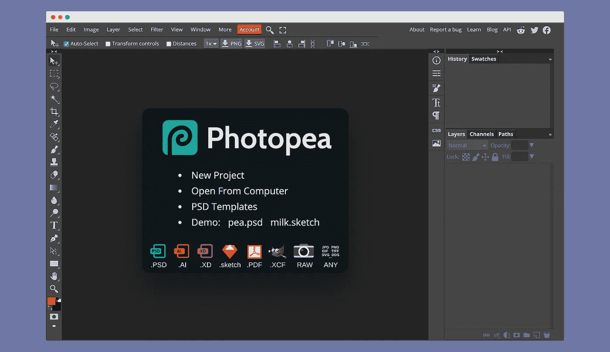
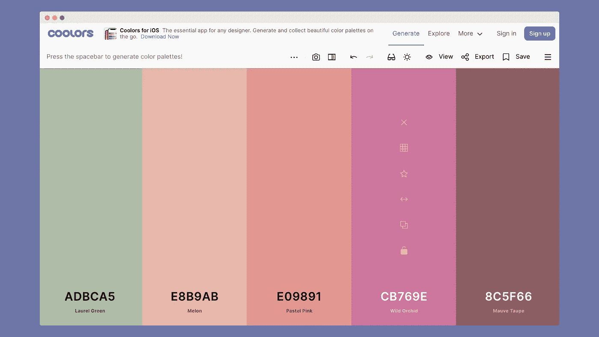
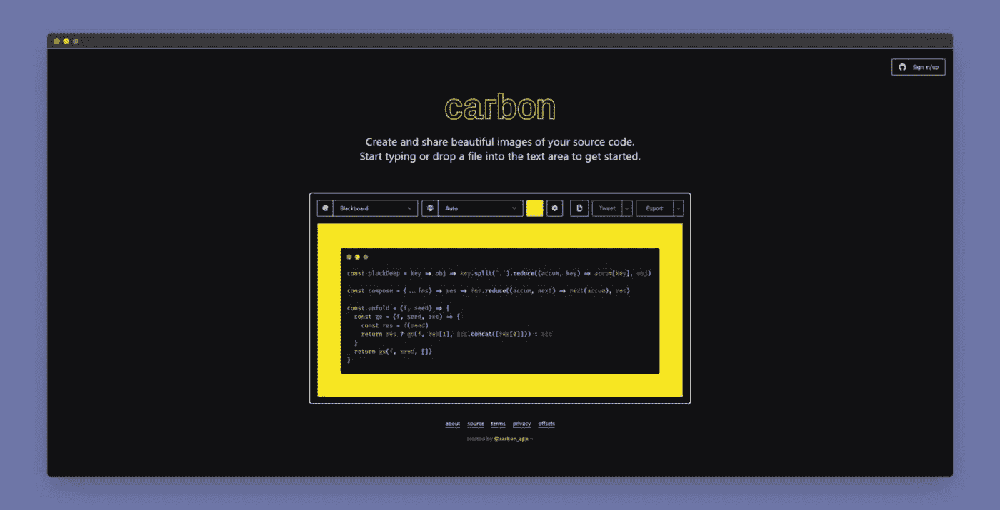
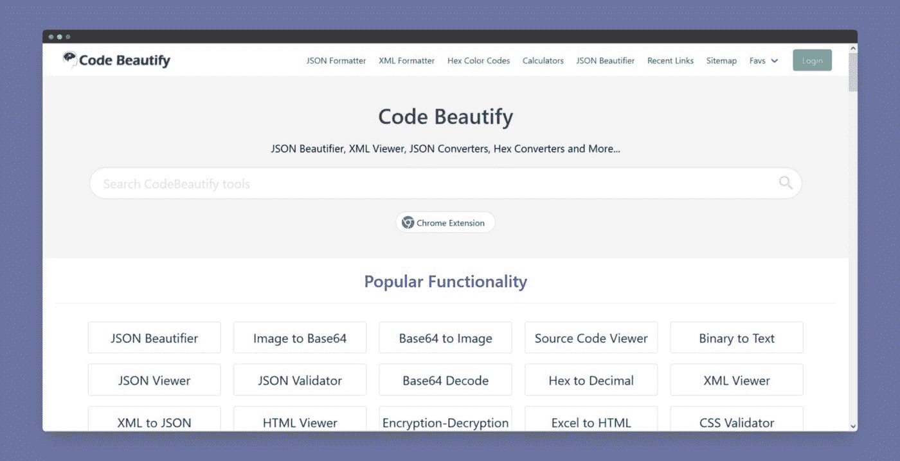
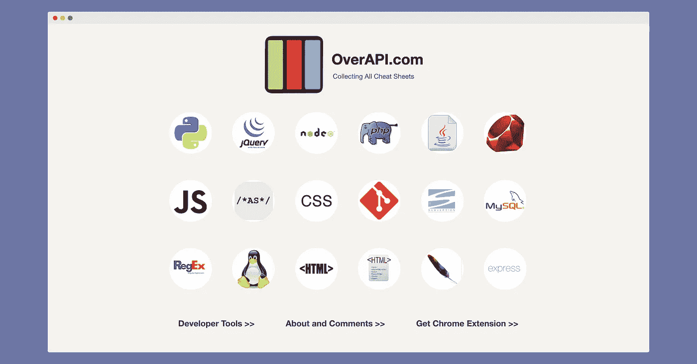

# 软件开发人员的 5 个惊人的免费在线工具

> 原文：<https://blog.devgenius.io/5-amazing-free-online-tools-for-software-developers-3b3536f05168?source=collection_archive---------9----------------------->

以下是我最喜欢的免费在线工具列表，它们可以帮助我解决日常任务。

Jo Szczepanska 在 [Unsplash](https://unsplash.com?utm_source=medium&utm_medium=referral) 上拍摄的照片

作为一名软件开发人员，您必须处理一些日常任务，并且您不想花费太多的时间和金钱。如果有人有免费网站列表来解决你的问题，那岂不是很神奇？所以，我决定分享一份拯救我的**免费在线工具**清单！

## [光视觉](https://www.photopea.com/)

[光视觉](https://www.photopea.com/)

Photopea 是一款在线 photoshop 工具，完全免费。如果你需要快速修改图片，这个网站正是你要找的！

## [酷派](https://coolors.co/generate)

[酷派](https://coolors.co/generate)

**Coolors** 是一个在线调色板生成器。按空格键生成冷调色板。:)

## [碳](https://carbon.now.sh/)

[碳](https://carbon.now.sh/)

Carbon 是一个在线工具，用来创建和分享你的源代码的可读图像。

## [代码美化](https://codebeautify.org/)

[代码美化](https://codebeautify.org/)

**code 美化**是一个在线的脚本编辑器和美化器。当您无法访问任何 IDE 时，您可以格式化您的源代码。它支持多种语言。

## [超额](https://overapi.com/)

[超额](https://overapi.com/)

OverAPI 是最伟大的作弊网站之一。您可以在这里找到大多数编程语言。

感谢您阅读我的文章。

你最喜欢的在线工具是什么？请与我们分享。:)

如果你在寻找精彩的内容，这里有一篇我很喜欢的文章:

 [## 您应该知道的 5 个强大的 Python 一行程序

### 如果没有 map()函数和理解，我真不知道该怎么办。

levelup.gitconnected.com](https://levelup.gitconnected.com/5-powerful-python-one-liners-you-should-know-469b9c4737c7)