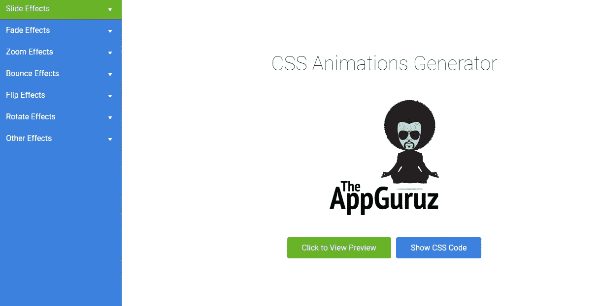

# 面向所有 Web 开发人员的 5 个超棒的 CSS 动画资源

> 原文：<https://blog.devgenius.io/5-awesome-css-animation-resources-for-all-web-developers-70bca71a5e1e?source=collection_archive---------2----------------------->

## 有用的资源，帮助您轻松创建真棒 CSS 动画。

[Zan](https://unsplash.com/@zanilic?utm_source=medium&utm_medium=referral) 在 [Unsplash](https://unsplash.com?utm_source=medium&utm_medium=referral) 上的照片

毫无疑问，每个 web 开发人员都使用 CSS。即使你没有使用普通的 CSS，你仍然会使用 CSS 框架，因为每个网页都需要样式，这样用户就可以轻松地导航。

如果你想让你的网页具有互动性和独特性，动画是非常有用的。幸运的是，您可以使用 CSS 来创建令人惊叹的动画。然而，从零开始创作好的动画是需要时间的。这就是为什么有很多工具和资源可以帮助我们轻松地创建漂亮的动画。

在本文中，我将为您提供一些令人惊叹的 CSS 动画资源，帮助您加快开发速度。所以让我们开始吧。

# 1.泛灵论者

[Animista](https://animista.net/) 是一个很棒的网络应用程序，在那里你可以找到不同的预先制作的 CSS 动画，你可以在你的项目中使用。

你可以在应用程序上重放动画，选择你喜欢的动画，并为它生成 CSS 代码。因此您可以直接将生成的 CSS 复制并粘贴到您的项目中。

由作者从 [Animista](https://animista.net/) 捕捉。

# 2.应用程序 Guruz

应用 Guruz 是另一个有用的工具，它允许你轻松地为工具中可用的不同动画生成 CSS 代码。

通过将代码复制到项目中，可以播放和使用不同的动画。

由作者从[App Guruz](https://www.theappguruz.com/)抓取。

# 3.盘旋。半铸钢ˌ钢性铸铁(Cast Semi-Steel)

[Hover.css](https://ianlunn.github.io/Hover/) 是一个包含链接、按钮、图像、SVG 等不同类型悬停效果的工具。

您可以将这些悬停效果应用到您的网页元素中，或者只是将它们用作灵感。

作者截取自 [Hover.css](https://ianlunn.github.io/Hover/) 。

# 4.动画。半铸钢ˌ钢性铸铁(Cast Semi-Steel)

[动画。CSS](https://animate.style/) 是一个非常有用的 CSS 动画库。您可以将其用于强调、滑块、登录页面等。

您可以使用 NPM、YARN 或 CDN 将它安装到您的项目中。该库包含不同类型的动画。

由作者从[动画中捕捉。CSS](https://animate.style/) 。

# 5.火箭

[Rocket](https://minimamente.com/example/rocket/) 允许你在一个元素被移动到另一个元素时创建一个动画。要使用动画，您必须将 CSS 和 JavaScript 火箭文件添加到您的项目中。

你可以阅读文档来获得更多关于如何在你的项目中使用 Rocket 的信息。

由作者从[火箭](https://minimamente.com/example/rocket/)上截取。

# 结论

正如你所看到的，这些都是很酷的 CSS 动画资源，你可以用它们来轻松地为你的项目创建令人惊叹的动画。然而，在我看来，作为一名开发人员，你不应该一直使用这些工具。只在必要的时候使用它们，或者作为一种激励。

感谢您阅读这篇文章。希望你觉得有用。

**更多阅读**

 [## 编写干净的 React 代码的 6 个重要技巧

### 作为 React 开发人员，编写干净代码的技巧。

javascript.plainenglish.io](https://javascript.plainenglish.io/6-important-tips-to-write-clean-react-code-5ef29d6a73a6)  [## 10 个令人敬畏的前端开发工具来提高您的生产力

### 你可能需要用到的有用的前端开发工具。

javascript.plainenglish.io](https://javascript.plainenglish.io/10-awesome-front-end-development-tools-to-boost-your-productivity-b1d2efc4c4ba)