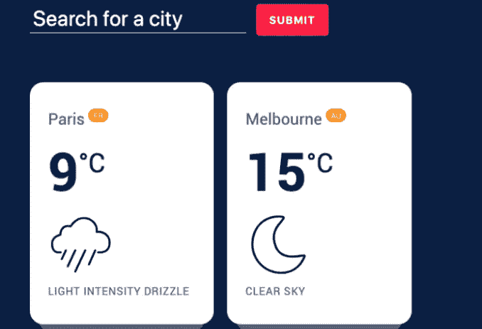
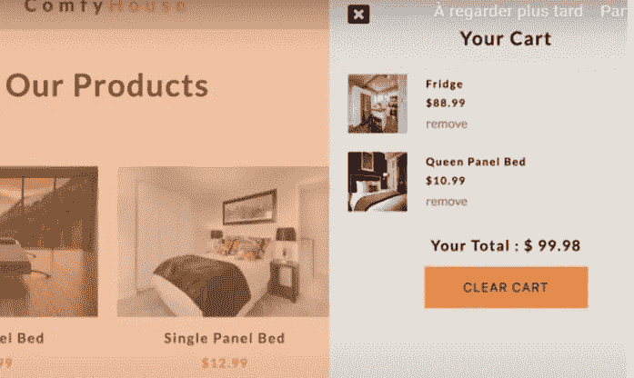
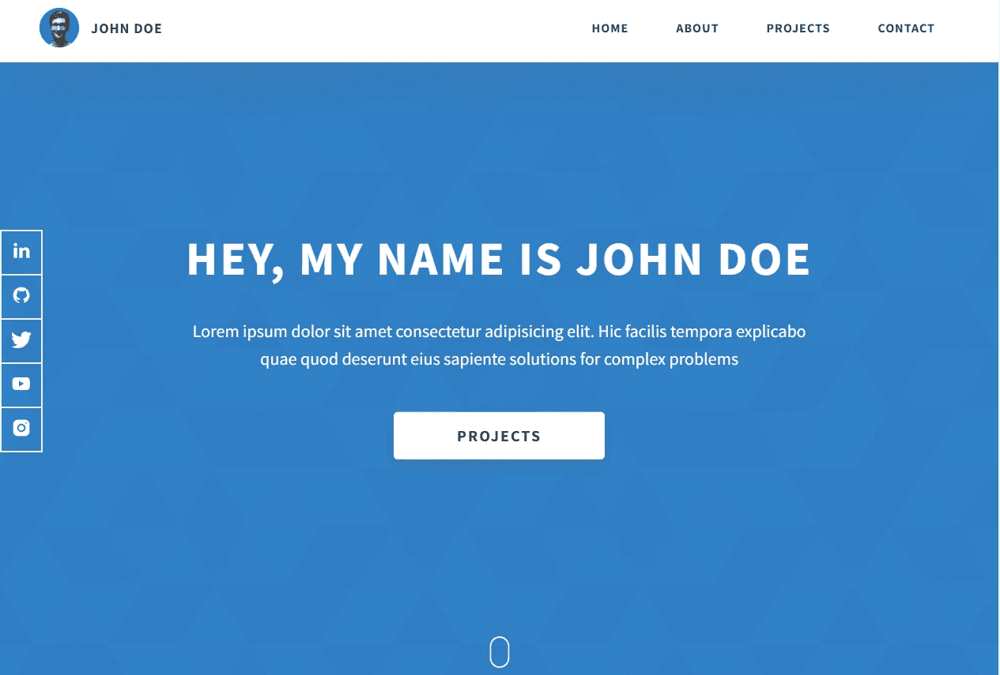
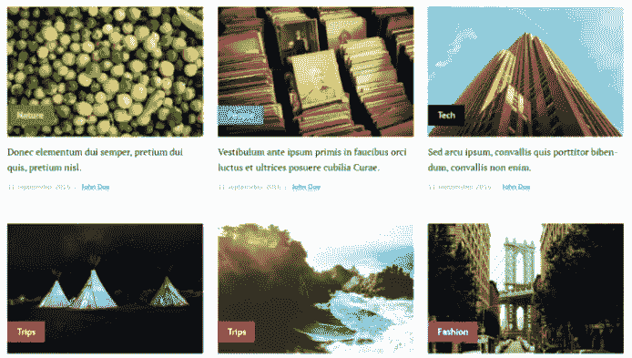

# 每个前端开发者应该在 2023 年构建的 5 个令人敬畏的项目

> 原文：<https://blog.devgenius.io/5-awesome-projects-every-frontend-developer-should-build-in-2022-fbe2575f88aa?source=collection_archive---------0----------------------->

## 前端开发人员提高技能的有用项目思路列表。

Nubelson Fernandes 在 [Unsplash](https://unsplash.com?utm_source=medium&utm_medium=referral) 上的照片

前端 web 开发在最近几年变得越来越流行。对有经验的前端 web 开发人员的需求不断增加。如今，web 开发行业中的角色越来越多。

这就是为什么现在很多人出于不同的原因选择成为前端开发人员。但是为了成为一名优秀的开发人员，你总是需要构建项目，而不仅仅是学习语言或概念。

所以为了提高你的技能，你必须不断练习你所学的东西。构建项目非常重要，尤其是如果你还是一个新的开发者。

项目将帮助你充实你的投资组合，成为一个优秀的有价值的开发者。把它放在你的投资组合中会为你打开大门，帮助你推进你的职业生涯。

除此之外，构建新项目也是摆脱[教程地狱](/how-to-escape-from-tutorial-hell-as-a-developer-54fdbf63fdb1)的一个好办法。所以你可以通过做一些项目来避免花很长时间看教程。

在这篇文章中，我将分享一个很棒的项目列表，你可以构建这些项目来提高你的前端技能。所以让我们开始吧。

# 1.一个好看的宣传册网站

作为一名前端开发人员，能够将任何类型的设计转换成功能性网页是你必须具备的重要技能之一。

擅长这个的唯一方法就是练习。通过建立一个静态的小册子网站，你可以学习所有这些并练习你的技能。

宣传册网站可以是任何内容，如个人网站、企业登录页面或时事通讯登录页面。你只需要对 HTML、CSS 和 JavaScript 有很好的了解，这样你就可以把任何模型转换成网页。

这是一个很好的方式来展示你可以创建吸引人的和高转化率的引人注目的登陆页面。你只需要遵循 UI 最佳实践，并确保网站看起来干净。

## 宣传册网站示例:

*   代理网站。
*   餐厅网站。
*   作品集网站。
*   企业的登录页面。

## 您将需要的技能:

*   HTML。
*   CSS。
*   响应式网页设计。
*   JavaScript。
*   设计眼光。

看看下面的项目示例:

来自 [Codepen](https://codepen.io/) 的宣传册网站。

# 2.使用 API 的简单 web 应用程序

作为前端开发人员，您可以添加到您的投资组合中的另一个好项目是使用 API 的任何类型的 web 应用程序。如今，有很多令人敬畏的 API 可以用来构建一个网络应用程序。

这个项目将证明你可以很容易地与第三方 API。简单来说，您将创建一个使用外部 API 的小型 web 应用程序。这可以是任何类型的 web 应用程序，例如电影应用程序、天气应用程序或热图生成器应用程序。

以下是一个天气应用程序的示例，您可以在其中搜索城市并查看天气情况:

天气 app(作者截图)。

你可以选择使用框架或者仅仅使用普通的 JavaScript。目标是你可以建立一个显示 API 数据或者做一些操作的网站。

## 使用 API 的小型 web 应用程序的一些示例:

*   天气应用。
*   求职 app。
*   电影应用程序。
*   迷因生成器应用。

## 您将需要的技能:

*   HTML。
*   CSS。
*   JavaScript。
*   Axios(用于从 API 获取数据)。
*   React/Vue(可选)。

# 3.电子商务购物车

这个项目是所有关于建立一个很酷的购物车与一些良好的功能。简单地说，你需要创建一个具有以下功能的电子商务购物车:

*   能够将产品添加到购物车。
*   能够查看添加到购物车的所有产品。
*   从购物车中移除产品的能力。
*   以及计算所有价格的能力。

购物车(作者截图)。

购物车的使用在电子商务网站和在线商店非常有用。当然，您需要创建的只是一个干净的带有一些功能的商店前端界面。

## 您将需要的技能:

*   HTML。
*   CSS。
*   JavaScript。
*   React/Vue。

# 4.你的个人投资组合

现在你有了一些简单的项目，下一步是创建你的个人作品集网站。

由作者从 [Dopefolio](https://dopefolio.netlify.app/) 捕捉。

网站需要看起来干净，视觉上有吸引力。确保你遵循了所有的网页设计最佳实践。所以你的投资组合需要以一种好的方式代表你。

它应该包含一个关于你的页面，一个人们可以联系你的联系页面，以及一个展示你以前所有项目的项目页面。此外，主页应该看起来干净，设计精美。

# 5.建立你自己的博客

作为一个前端 web 开发人员，你真的应该有一个博客网站。作为一名开发者，有很多很好的理由来拥有一个博客。

通过使用您所学的技能构建自己的博客，您可以撰写文章并与其他开发人员分享知识。除此之外，您还可以记录您的旅程，并将自己推销为行业中的开发人员。

博客实例(作者抓拍)。

博客网站是让你站在招聘者面前，为你的开发者生涯获得更多机会的好方法。此外，如果你认真对待博客，你可以在互联网上有一个坚实的存在。

因此，这是一个很好的项目，因为它可以让你分享知识，并为你的投资组合增加一个项目。

那么如何才能建立自己的博客网站呢？如果你使用 Vue 或 React，最好的方法是使用 Gridsome 或 Gatsby 这样的静态站点生成器。

它会让你创建一个可以快速发布博客文章的网站变得简单。如果你在 WordPress 上使用一个静态站点生成器，你可以让你的博客变得更加高效和快速。

## 您可以使用的工具和技能:

*   HTML。
*   CSS。
*   JavaScript。
*   做出反应。
*   Next.js。
*   MDX。
*   静态站点生成。

# 结论

正如你在上面看到的，这是一些你应该构建的项目的小列表，以提高你作为开发人员的技能。因为如果你想成为一名优秀的开发者，项目是非常重要的。

如果你构建东西，你只能提高你的编码技能。看教程而不构建任何东西总是不是一个好主意。

*感谢您阅读本文。此外，如果你发现我的内容有用，而你不是一个媒体成员，你可以抓住你的媒体成员* [***这里***](https://mehdiouss.medium.com/membership) *(媒体推荐链接)获得无限制的* ***访问媒体上的所有内容*** *并支持我们作为作家。*

 [## 通过我的推荐链接加入 Medium-Mehdi Aoussiad

### 阅读 Mehdi Aoussiad(以及媒体上成千上万的其他作家)的每一个故事。您的会员费直接支持…

mehdiouss.medium.com](https://mehdiouss.medium.com/membership) 

**延伸阅读:**

 [## 没人谈论的 7 个有用的 HTML 元素

### 作为一名 web 开发人员，你应该知道的一系列很棒的 HTML 元素和标签。

blog.devgenius.io](/7-useful-html-elements-that-nobody-is-talking-about-4b76ee877688)  [## 成为专业 React 开发人员的 11 个有用的 GitHub 库

### 2022 年每个 web 开发者都应该知道的 Awesome React GitHub 仓库。

blog.devgenius.io](/11-useful-github-repositories-to-become-a-pro-react-developer-530c565eac2a)