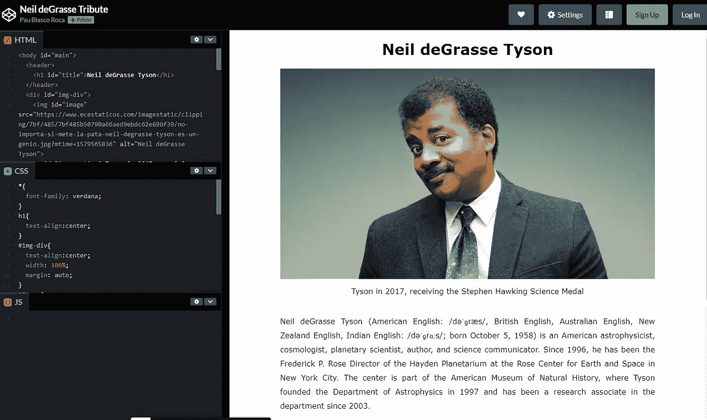
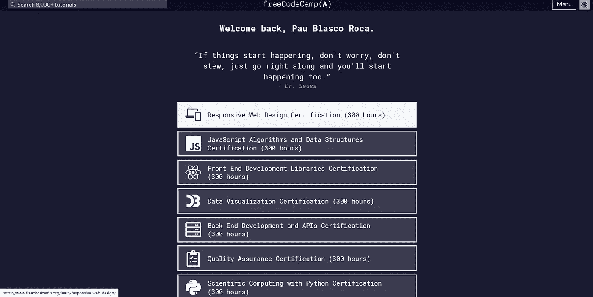
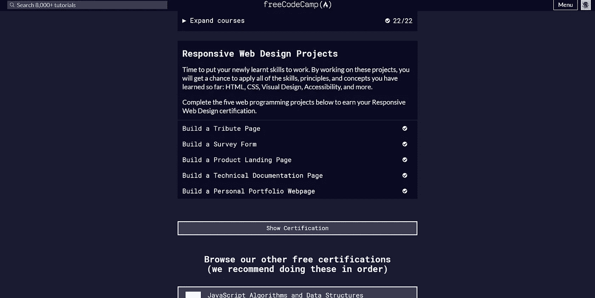
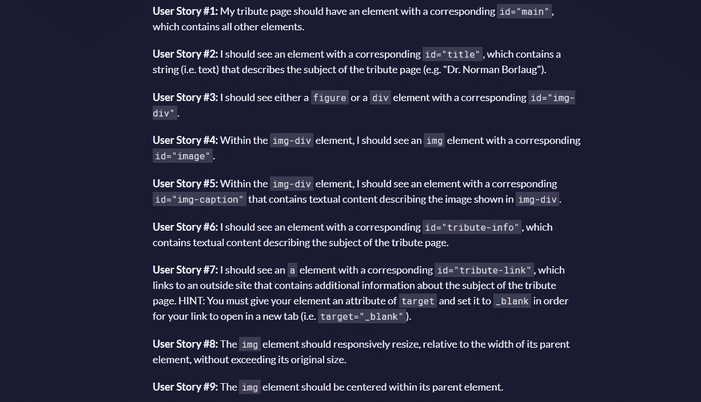
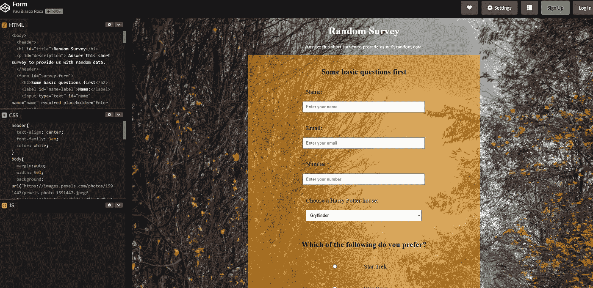
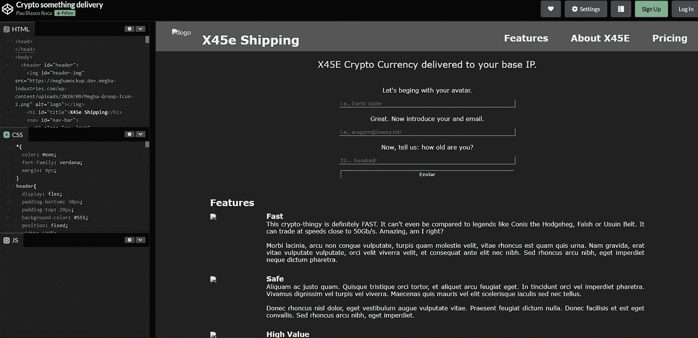
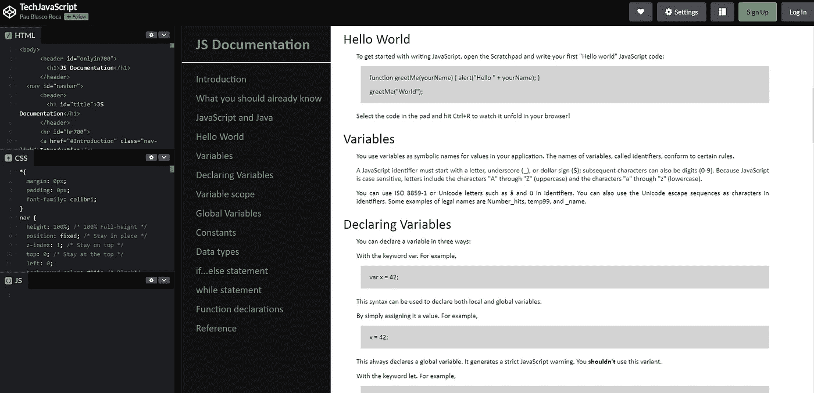
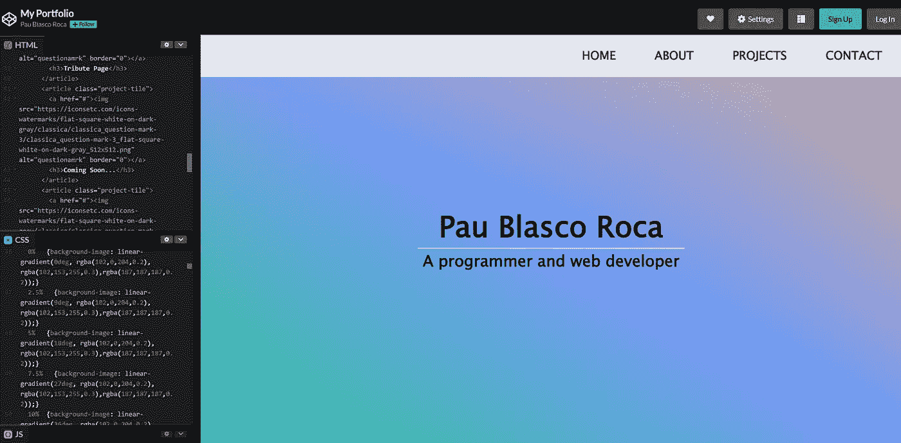

# 5 个初学者友好的编码项目

> 原文：<https://blog.devgenius.io/5-beginner-friendly-coding-projects-56ce3368d9dc?source=collection_archive---------9----------------------->

## 编程|编码| Web 开发

## 以及如何开始你的编程生涯

你可能已经开始学习一些 HTML5、CSS3 甚至一点 JavaScript。但是——很抱歉打断你——没有练习，你不会走得很远。所以让我们开始吧！

## 为什么要在项目上投资时间？

努力学习，学习基础知识，对开始编程编码至关重要。甚至学习如何[注释你的代码](/this-is-why-commenting-your-code-is-crucial-5d00f8a5211c)对初学者来说也是一个很好的练习。但是你应该争取更多。

在我看来，中小型项目是*理解*和*应用*你已经学到的东西的一个非常好的方式，也是最好的方式之一。所以让我们开始行动吧！

## 我应该从哪里开始编写项目代码？

[FreeCodeCamp](https://www.freecodecamp.org/learn/) 。简单的答案，我 100%有信心。FCC 在我的全栈开发职业生涯中给了我很多帮助，我也浏览了他们网站上提供的所有练习和项目。

我们将在这里找到可用的项目:

点击“响应式网页设计认证”按钮

之后，我们必须向下滚动，直到在屏幕上看到以下内容:

就我而言，所有的项目都已经完成了

如果你想了解更多关于 FreeCodeCamp 和其他有用资源的信息，请随时查看我的文章。

## 第一个项目:致敬页面

FreeCodeCamp 会给我们一些信息，告诉我们需要做些什么来完成我们的项目。对此的要求如下:

我们可以在 FCC 的页面上看到所有的要求

我做这个项目的时候才 17 岁，编码能力有限。但我还是设法从中学到了一些东西，所以不要害怕尝试它！它看起来是这样的:

我第一个项目的解决方案。如你所见，这并不惊人，但它是完整的！链接如下:[https://codepen.io/Orange_Thunder/pen/vYGoeOm](https://codepen.io/Orange_Thunder/pen/vYGoeOm)

## 第二个项目:调查表

这个更难，我想尝试一下。所以我优先尝试所有东西，理解代码，而不是页面的外观。

你几乎看不懂标题。这件的颜色不是最好的。你可以在这里找到:[https://codepen.io/Orange_Thunder/pen/RwaXLJM](https://codepen.io/Orange_Thunder/pen/RwaXLJM)

这个项目的要求比第一个项目更具体，我花了一段时间才让一切正常工作。

## 第三个项目:产品登录页面

哦，第三个项目我玩得很开心。我编造了某种奇怪的加密业务，并试图复制我在其他登录页面上看到的一些功能。

我使用了我在上一个项目中获得的知识——所有的表格和复选框——并试图去寻找一些有吸引力和有趣的东西。不仅如此，我甚至添加了一个导航条——我的第一个导航条——和一些其他细节，比如文本框的颜色匹配背景。这个结果对我来说足够好了。

你可以在这里找到代码:[https://codepen.io/Orange_Thunder/pen/gOrVejY](https://codepen.io/Orange_Thunder/pen/gOrVejY)

不幸的是，我使用的徽标和图像是由一个被关闭的网站托管的，所以它们已经从我的页面上删除了。

## 第四个项目:技术文档页面

这是迄今为止，我编写过的最干净、最有条理的模拟网页。看一看:

源代码可以在这里找到:【https://codepen.io/Orange_Thunder/pen/PozYqgd 

我决定复制一个实际的文档页面，但是从零开始。我没想到会得到这样的结果，但是实践和学习在我身上开始蓬勃发展。

左边的导航条非常难做。但是完成它是非常值得的，它看起来非常完美。

## 第五个项目:个人作品集

这是我花了大部分时间做的项目。除了动画渐变背景和花哨的动画，我还处理了 flexbox 组件的响应。这相当困难，但最终我完成了一个非常干净的项目。

我为这个项目创建的导航条是一件艺术品。我真的用所有其他项目提升了我的技能，我设法最终得到了一个半透明的、专业外观的导航条。

再一次，我使用的一些图片不再可用，因为一些服务器关闭了。

在这张图片中你看不到它，但是背景是完全动态的。代码片段的链接在这里:【https://codepen.io/Orange_Thunder/pen/BazBQeG?editors=1100

## 结论

你们可以自己去看。我在几个项目上取得的进展是惊人的。我真的很高兴我决定参加 FCC 的课程，并花了几个周末学习它的文凭。我通过练习学到了很多东西。现在我有一个很棒的作品集可以在我的工作面试中展示！

如果你有任何疑问或建议，不要犹豫，在下面评论，和我一起讨论！