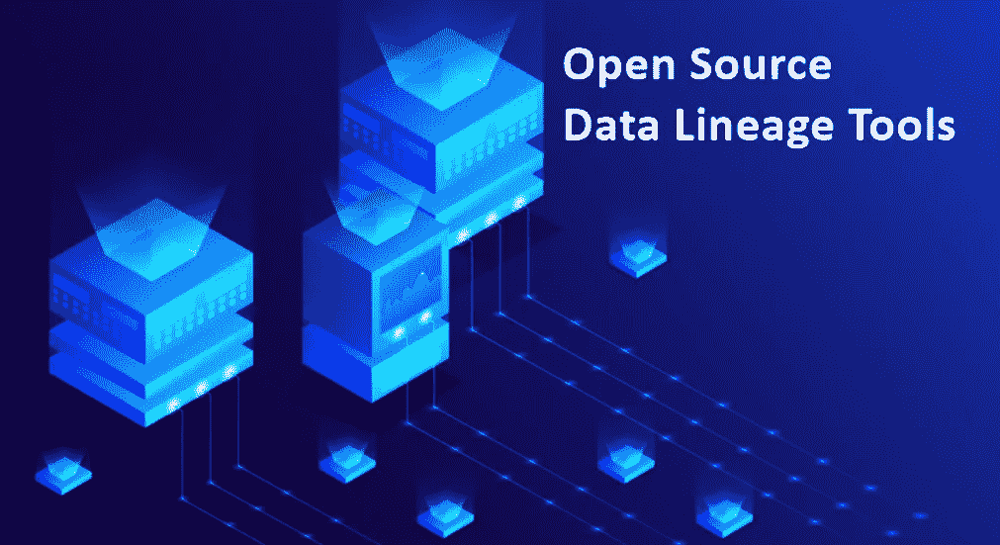

# 2022 年 5 款最佳开源数据传承工具

> 原文：<https://blog.devgenius.io/5-best-open-source-data-lineage-tools-in-2022-f8ef39a7d5f6?source=collection_archive---------2----------------------->

[**数据传承**](https://www.gudusoft.com/whats-data-lineage-why-important/) 在许多方面有利于组织，因为它帮助组织遵守法规，更好地理解和信任他们的数据，并节省手动影响分析的时间。而且你可以在现在市面上找到大量的 [**数据沿袭工具**](https://www.dpriver.com/blog/2022/05/11/best-data-lineage-tools/) 。然而，有这么多的数据沿袭工具，要找到最流行的并不容易。如果你碰巧在寻找最好的沿袭工具，那么你来对地方了。在本文中，我将为您介绍 2022 年 **5 款最佳开源数据血统工具**。

## **最佳开源数据沿袭工具— 1。托肯**

作为一个开源数据血统工具，Tokern 是为云数据仓库和数据湖而构建的，采用一种专用的方法，允许用户从 Google BigQuery、AWS Redshift 和 Snowflake 上托管的数据库和数据仓库中获得列级数据血统。SparkSQL、AWS Athena 和 Presto 等更多资源正在开发中。

除此之外，Tokern 具有相当大的集成能力，因为它与大多数开源 [**数据目录**](https://www.gudusoft.com/whats-data-catalog-why-data-datalog/) 和 ETL 框架配合得非常好。

不久前发布的 Tokern 考虑了最新的数据工程和设计模式。例如，除了从 dbcat(数据目录)构建数据谱系之外，Tokern 还允许用户从查询历史或 ETL 脚本构建数据谱系，这对于 BI 和 ETL 工具集成非常有用。

由于 Tokern 将数据目录和世系存储在 PostgreSQL 数据库中，因此用户可以访问该数据库以使用 SQL 进行进一步分析，或者将其输入其他可视化和分析引擎。

可视化引擎 Kedro-Viz 和名为 NetworkX 的网络图分析库是 Tokern 出色的可视化和分析能力的基础。这些库使用户能够跟踪、可视化和分析列级沿袭数据。此外，用户还可以使用 Tokern 的 SDK 或 API 与血统数据进行交互。

此外，必须指出的是，除了最先进的数据沿袭功能，该产品还使用 PIICatcher 提供 PII(个人身份信息)和 PHI(个人健康信息)检测。这个内置工具结合了正则表达式和几个用于 PII 检测的标准 NLP 库，如 Spacy 和斯坦福 NER。

## 最佳开源数据沿袭工具— 2。埃杰里亚

Egeria 被宣传为世界上第一个开源元数据标准，提供了一种无缝集成数据工程工具的方法，以获得可靠和一致的元数据视图。除了编目和搜索元数据之外，该标准使用户能够为数据沿袭跟踪、数据质量检查、PII 识别等构建更高级的解决方案。

与许多涉及不同数据工具之间的许多可避免的喋喋不休的数据工程架构不同，Egeria 工作在中心辐射模型上，所有东西都通过 Egeria，因此用户只需与一个工具进行对话。

Egeria 中的数据沿袭使用了一个众所周知的开放标准来捕获和存储数据沿袭，这个标准被称为 OpenLineage。此外，OpenLineage 还通过提供跟踪数据的水平和垂直沿袭，使用户能够更深入地了解您的数据。

为了捕获数据血统信息，Egeria 监听源系统发出的 Kafka 事件。获得数据血统信息后，Egeria 使 [**血统管家**](https://www.gudusoft.com/data-stewards/) 匹配并链接 Egeria 无法匹配的 [**血统图**](https://medium.com/@han.yu_47442/what-are-data-lineage-diagrams-872528bef649) 。之后的血统都是商务消费的好。

Egeria 的数据沿袭特性与数据发现和管理、元数据起源等保持一致。我们上面提到的特性和 Egeria 的血统设计和架构使它成为一个非常引人注目和经过深思熟虑的数据治理和数据血统工具。

## 最佳开源数据沿袭工具— 3。迟钝的人

Pachyderm 是另一个类似 Tokern 的专门化数据谱系工具。它旨在使开发人员能够以一种与语言和框架无关的方式建立机器学习管道，而不是专注于云数据仓库。

为了维护数据对象的血统，Pachyderm 实现了一个版本控制系统，如 lakeFS 或 Git。Pachyderm 捕获并存储这些对象上的更改(如提交)，维护完整的、不可变的事件审计线索。审计跟踪允许用户拥有数据谱系图以供查看和分析，并允许用户出于调试或合规性原因在任何时间点重新生成数据和代码。

Pachyderm 采用了一个中央存储库，该存储库在一个名为 Pachyderm File System 的自定义文件系统中使用 AWS S3 等对象存储来实现无缝的数据沿袭跟踪和数据版本控制。Pachyderm 文件系统帮助您的对象存储，如 S3，成为完整历史数据的唯一真实来源。

此外，Pachyderm 在用户的数据源中实施不变性，允许它为沿袭事件和数据对象分配全局 id。Pachyderm 允许您在 UI 中将不可变的数据谱系图作为 DAG 来查看。当处理 ML 管道时，上述两个函数都是有益的，并且您希望将结果追溯到它们的输入。

另外，值得一提的是，Pachyderm 集成了最广泛使用的数据库、数据仓库和数据湖。此外，您可以使用基于 SQL 的摄取工具将数据从任何数据库导入到 Pachyderm。

尽管如此，我们必须承认，作为一个通用的数据谱系工具，Pachyderm 有其局限性。这就是为什么大多数 Pachyderm 的企业客户将它用于 MLOps、非结构化数据 ETL 和 NLP 工作负载。

## 最佳开源数据沿袭工具— 4。开放血统

作为 WeWork 开源后负责接手 Marquez 开发的公司，DataKin 还创建了 OpenLineage。2021 年年中，DataKin 将 OpenLineage 项目作为沙盒项目移交给了 Linux 基金会。

OpenLineage 受 OpenTelemetry 的启发，旨在建立一个数据谱系收集和分析的开放标准。OpenLineage 的设计和使命的核心是集成，它集成了 ETL 框架、数据编排引擎、元数据目录、数据质量引擎以及数据沿袭工具。OpenLineage 采用 JSONSchema 作为 API 定义，支持各种语言和框架。流行的数据工具之一 Egeria 的核心元数据层构建在 OpenLineage 之上。

WeWork 的 Marquez 也是 OpenLineage 架构的核心，因为 Marquez 提供了 UI 和元数据存储库，元数据收集 API 来自 OpenLineage，它也通过 GraphQL 和 REST API 向您公开。

作为一个有吸引力的选择，OpenLineage 将与大多数现有的数据工程栈兼容，并为您提供广泛的收集、跟踪和分析数据谱系的令人兴奋和有价值的功能。

## 最佳开源数据沿袭工具— 5。真实数据

作为一个完整的数据治理解决方案，TrueDat 使您能够分类、搜索和详细跟踪数据。TrueDat 还通过其数据沿袭功能帮助您可视化数据的整个生命周期，让您了解数据是如何随着时间的推移而变化的。

TrueDat 由 IBM 公司 BlueTab 于 2017 年创建，此后一直在积极开发，其最新版本 v4.39 于 2022 年 3 月发布。TrueDat 使您能够利用数据沿袭来分析数据库更改的影响，并更好地理解报告业务逻辑，它还允许您通过时间点可见性来跟踪数据对象的沿袭。对于高级分析，还可以应用沿袭对象上的过滤器来检查沿袭图的特定部分。

除了 UI 中沿袭的图形表示，收集的数据沿袭信息也可以下载到 CSV 文件中。因为 TrueDat 提供了一组很好的数据治理和沿袭特性，所以它是解决数据沿袭问题的真正竞争者。

## **结论**

感谢你阅读我的文章，如果你喜欢，我会很高兴。然而，由于网上有大量的**开源数据血统工具**，如果我的列表中没有包括你最喜欢的，请原谅我。欢迎在下面留下评论，让我知道你最喜欢哪个**开源数据传承工具**，我会很快更新这个列表！