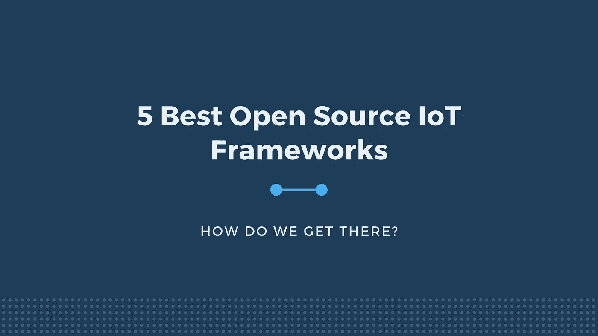

# 5 个最佳开源物联网框架

> 原文：<https://blog.devgenius.io/5-best-open-source-iot-frameworks-86f6927e49cb?source=collection_archive---------7----------------------->

物联网已经征服了数字世界。自 20 世纪末以来，智能互联设备和消费电子产品可以独立工作的想法一直在发展。

这项技术已经成功地导致了设备和用户应用程序之间的中间件的高度发展的远程系统。物联网战略的普遍流行可以很容易地解释为，在人类生活的各个方面，全球有数十亿台设备:医药、工业、商业、农业、生活方式，在某种程度上。

绝大多数企业将新兴技术趋势视为无价资产，并专注于下一次赚钱。坦率地说，一些公司选择将有竞争力的基于物联网的解决方案集成到他们的流程中，例如汽车和体育行业的这些功能实用案例。一些人决定加倍购买或创建他们自己的**开源平台**来增加收入。

# 开源物联网框架

简要概述 5 个已部署的开源 IOT 框架，因为许多公司都在寻找最佳 IOT 工具，以证明其互联设备之间的强大分析和互操作性。

> [device hive](https://docs.devicehive.com/docs/101-overview#:~:text=DeviceHive%20is%20an%20open%20source,smart%20devices%20communication%20and%20management.&text=Our%20platform%20covers%20the%20whole,Learning%20jobs%20and%20Artificial%20Intelligence.)
> 
> [**说话**](https://www.mathworks.com/help/thingspeak/)
> 
> [**主流量**](https://www.mainflux.com/)
> 
> [**Thinger.io**](http://Thinger.io)
> 
> [**泽塔**](https://www.zettajs.org/)

[*点击链接*](https://www.fugenx.com/services/internet-of-things-iot-solutions/) 阅读更多关于框架词的信息

# 利用 OSS:解释一些好处和缺点

乍一看，上面提到的物联网工具可能看起来非常相似，并记录了同质的功能，但这些平台可以远远超过这一点。

作为专有软件的替代方案，开源技术是完全可定制的，并且随着可扩展代码的开放，可以根据商业目的进行调整和修改。OSS 允许开发者和组织毫无问题地在不同的框架之间移动——提供了必要的工具包。大量的自动化协议和功能，这个 IOT 开源框架节省了大量的时间。

这种物联网解决方案有利于管理扩展灵活性问题和降低成本。作为重中之重，数据隐私和安全是任何企业的核心观点，因此您可以从全球各种开源框架供应商中进行选择。

在前进的道路上，你仍然会面临一些挑战:

> 开放意味着自由访问，这意味着助理并不总是专业人士。安全维护总是有害的。
> 数据隐私正引起越来越多的法律关注。
> 祝许多最好的开源平台好运。
> 错误确实会发生。
> 现有的标准功能并不能满足您的所有业务需求。
> 开源物联网平台不适合普通用户。

## 为什么选择富根克斯作为 IOT 解决方案？？

来自 Fugenx 的消息

我们是一家全球性的 IT 服务公司，位于 FugenX。我们清楚地了解组织对物联网的需求，并提供世界一流的物联网服务和解决方案。我们的物联网服务可帮助企业构建一体化组织、简化业务运营、提高员工生产力、改善客户体验并获得新的商业机会。

我们的使命是将您的设备转变为'[智能设备](https://www.fugenx.com/services/iot-applications-for-wearables/)'，并使您的组织成为“智能互联公司”。因此，它使您能够驾驭未来技术的力量，并在竞争中领先一步。我们在为许多全球公司提供以结果为导向的移动解决方案方面拥有丰富的经验，包括美国最大的工业气体公司 Proxer。我们也是物联网服务的供应商。我们拥有全套物联网应用程序开发人员和家庭自动化专家。他们对新兴的物联网平台有着深刻的理解，包括 Salesforce 物联网云和思科物联网系统。

我们为孟买、钦奈、班加罗尔、德里、NCR、海德拉巴、印度、美国和全球市场的企业提供尖端的物联网解决方案。

请联系我们，电话:[info@fugenx.com](mailto:info@fugenx.com)了解更多有关我们物联网解决方案及其实施策略的信息，或者分享您的需求。

了解更多:[https://www . fuge NX . com/services/internet-of-things-IOT-solutions/](https://www.fugenx.com/services/internet-of-things-iot-solutions/)