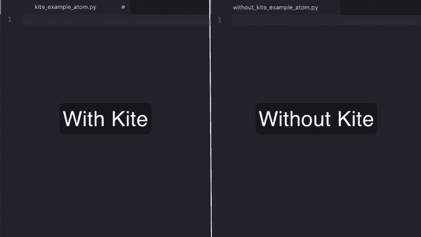
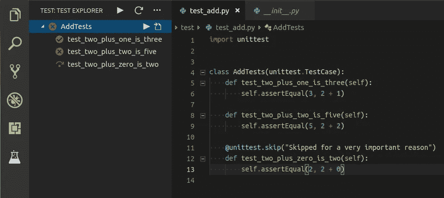
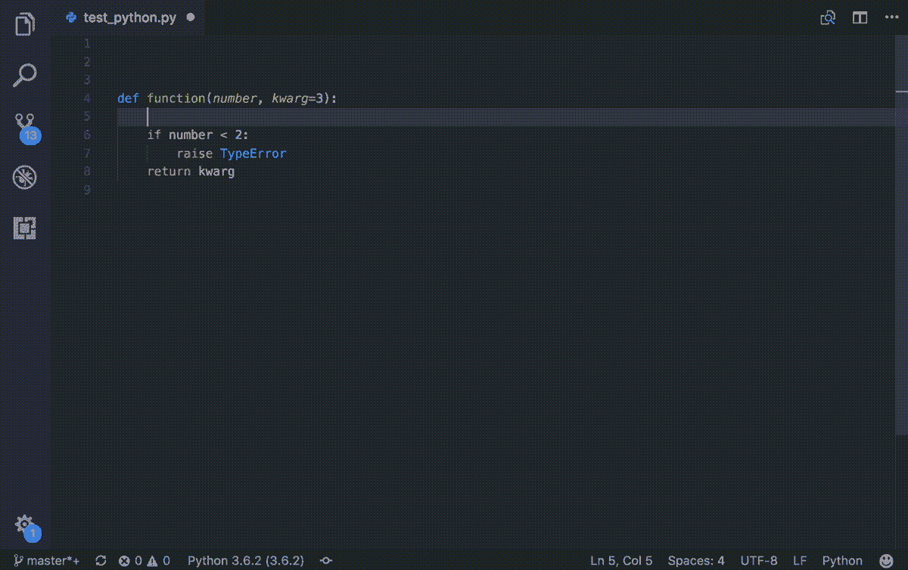
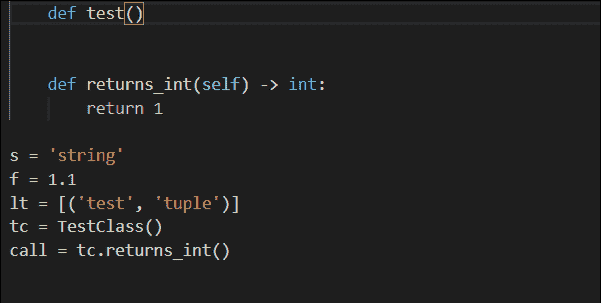
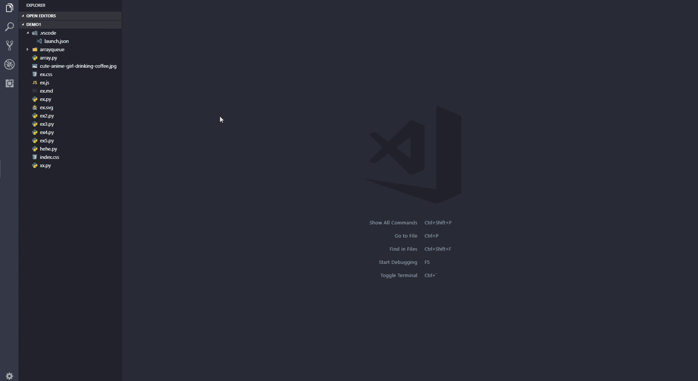

# Python 开发人员的 5 个最佳 VS 代码扩展

> 原文：<https://blog.devgenius.io/5-best-vs-code-extensions-for-python-developers-69c2d19dcb60?source=collection_archive---------4----------------------->

Python 是一种非常著名的编程语言。它通常是每个业余爱好者的主要编程语言。Python 被广泛认为是初学者学习的最简单的编程语言之一，然而，它也很难攻克。如果足够努力，任何人都可以学习 Python，然而，成为 Python 开发者需要大量的实践和耐心。今天我们将了解一些伟大的 VS 代码扩展，它们将帮助你掌握 Python。

# 风筝自动完成人工智能代码:

Kite 是一个人工智能驱动的编程助手，它使你能够在 Visual Studio 代码中更快地编写代码。Kite 通过保存击键和在适当的时间显示适当的数据，使你能够更快地编写代码。

Kite 适用于所有最重要的编程语言:Python、Java、Go、PHP、C/C#/C++、Javascript、HTML/CSS、Typescript、React、Ruby、Scala、Kotlin、Bash、Vue 和 React。

要使用这个扩展，请在 visual studio 代码的扩展部分搜索 Kite 自动完成 AI 代码。安装扩展后，您将能够快速地用 VS 代码编写代码。

> **点击给定链接可以下载这个扩展:** [**风筝自动完成 AI 代码**](https://marketplace.visualstudio.com/items?itemName=kiteco.kite)

# Python 文本浏览器

Python 测试资源管理器扩展允许您使用测试资源管理器 UI 运行 Python 单元测试或 Pytest 测试。这个小而易访问的工具将允许你用一个出色的用户界面和调试能力来检查你的代码。它对于在整个测试发现过程中报告错误很方便，并且对多根工作区有额外的帮助。

要使用该扩展，请在 visual studio 代码的扩展部分搜索 Python Text Explorer。安装该扩展后，您将能够使用 VS Code 的出色用户界面和调试功能来测试您的代码。

> **你可以点击给定的链接下载这个扩展:** [**Python 文本浏览器**](https://marketplace.visualstudio.com/items?itemName=LittleFoxTeam.vscode-python-test-adapter)

# Python 文档字符串生成器

这是一个 Visual Studio 代码扩展，用于快速生成 python 函数的文档字符串。它为您提供了在众多不同类型的 docstring 格式中进行选择的机会。它为 args、kwargs、decorators、errors 和参数类型提供帮助。

要使用此扩展，请在 visual studio 代码的扩展部分搜索 Python Docstring Generator。安装扩展后，您将能够为 Python 函数生成 Docstring。

> **点击给定链接可以下载这个扩展:** [**Python Docstring 生成器**](https://marketplace.visualstudio.com/items?itemName=njpwerner.autodocstring)

# Python 类型提示

Python 类型提示为内置类型、估计类型和类型模块提供了类型提示完成项。这个扩展给你不同的建议来完成你的代码，从而提高你的效率。此外，它能够在工作区内查找 Python 文档，以进行类型估计。它估计作为完整项目提供的合适类型。

要使用此扩展，请在 visual studio 代码的扩展部分搜索 Python 类型提示。安装扩展后，您将能够使用 Python 类型提示。

> **点击给定链接可以下载这个扩展:** [**Python 类型提示**](https://marketplace.visualstudio.com/items?itemName=njqdev.vscode-python-typehint)

# Python 预览

Python Preview 是一个扩展，可对 Python 代码进行可视化调试。它将调试代码转换成一个带有动画和图片元素的交互式咨询，以象征您的应用程序状态。这个扩展创建了你创建的对象和变量的图片，从而帮助你实时可视化你的代码。

要使用此扩展，请在 visual studio 代码的扩展部分搜索 Python 预览。安装扩展后，您将能够使用 Python 预览。

> **点击给定链接可以下载这个扩展:** [**Python 预览**](https://marketplace.visualstudio.com/items?itemName=dongli.python-preview)

> 这些是 Python 开发人员最好的 5 个 VsCode 扩展。如果你喜欢这个博客，不要忘记关注更多这样的博客。

*更多内容请看*[*blog . dev genius . io*](http://blog.devgenius.io)*。*