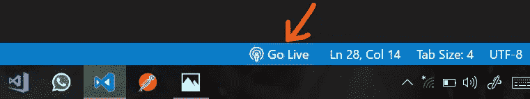
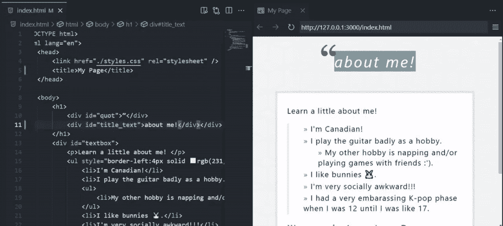
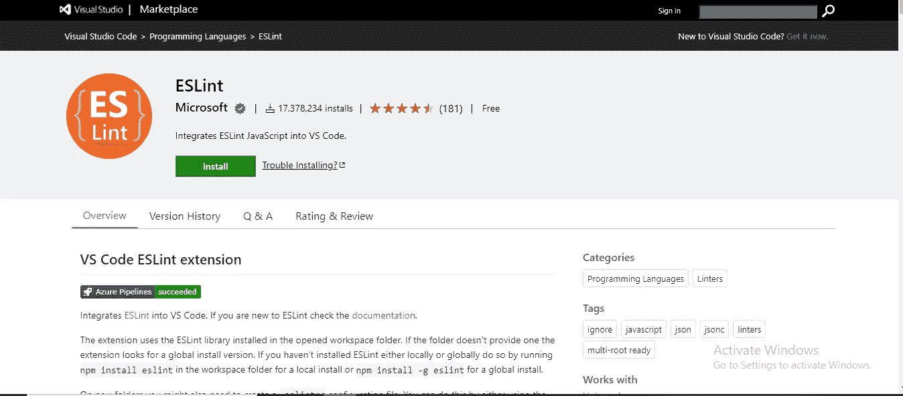
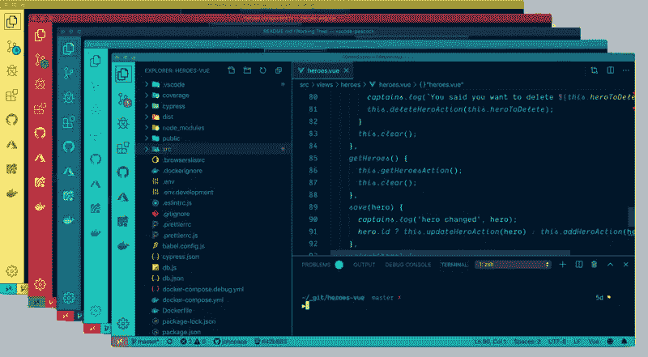

# Web 开发人员的 5 个最佳 VsCode 扩展

> 原文：<https://blog.devgenius.io/5-best-vscode-extensions-for-web-developers-a05a7554d551?source=collection_archive---------2----------------------->

Visual Studio Code 是微软提供的开源文本编辑器。VS 代码支持多种编程语言，比如 Java、C++、python 等等。Visual Studio 代码最出名的是它惊人的扩展。在这篇博客中，我们将介绍一些对 Web 开发人员来说最好的 VS 代码扩展。

# 实时服务器

Live Server 是最流行的扩展之一。Live Server 帮助您获得代码的实时输出。它帮助你使你的网页看起来更好。代码中任何保存的更改都会立即出现在浏览器中，这将有助于您确定网站的外观。这个扩展提供了非常快速和良好的开发者体验。

要在 visual studio 代码的扩展部分使用此扩展 search live server，请在安装扩展后单击 Go Live，您将能够在默认浏览器中看到您的输出。

> **点击给定链接可以下载这个扩展:** [**直播服务器**](https://marketplace.visualstudio.com/items?itemName=ritwickdey.LiveServer)

# 实时预览

Live Preview 是 live server 的高级版本。在 Live 服务器中，我们必须进入浏览器才能看到输出，但是 Live Preview 将浏览器直接放在 VS 代码中，这样您就不必在编码时切换窗口。

要使用这个扩展，请在 visual studio 代码的扩展部分搜索实时预览。安装完扩展后，单击实时预览，您将能够在 VS 代码中看到您的输出。

> **点击给定链接可以下载这个扩展:** [**实时预览**](https://marketplace.visualstudio.com/items?itemName=ms-vscode.live-server)

# 埃斯林特

很多时候，当我们编码时，我们陷入困境，我们不能定位我们的代码中的错误，这个扩展使您能够找到您的代码中的错误，并为您提供了一个很好的体验。

安装扩展后，在 visual studio 代码的扩展部分使用这个扩展 search ESLint，您将能够很容易地找到错误。

> **你可以点击给定的链接下载这个扩展:** [**ESLint**](https://marketplace.visualstudio.com/items?itemName=dbaeumer.vscode-eslint)

# 雄孔雀

这个扩展帮助你定制你的可视化代码。在这个扩展的帮助下，你可以改变菜单栏、工具条和状态栏的颜色。这个扩展帮助您更容易地识别您的项目。

要在安装扩展后在 visual studio 代码的扩展部分使用这个扩展搜索孔雀，您将能够自定义您的 Visual Studio 工作区。

> **点击给定链接可以下载这个扩展:** [**孔雀**](https://marketplace.visualstudio.com/items?itemName=johnpapa.vscode-peacock)

# 波拉科德

这是我用得最多的一个扩展，这个扩展可以帮助你截屏你的源代码。现有的主题和字体显示为与源代码相同，并将源代码放置在智能布局中。您可以选择要在屏幕截图中插入的代码。

要使用此扩展，请在安装扩展后在 visual studio 代码的扩展部分搜索 Polacode。转到“VSCode”编辑器，选择“view ”,然后单击“Command Pallate ”,输入 Polacode。在窗口的右侧，它将打开带有白色边界的 Polacode。复制源代码并将其粘贴到 Polacode 窗口中。点击圆形按钮保存截图。

> **你可以点击给定的链接下载这个扩展:** [**Polacode**](https://marketplace.visualstudio.com/items?itemName=pnp.polacode)

> 这些是 Web 开发人员最好的 5 个 VsCode 扩展。如果你喜欢这个博客，不要忘记关注更多这样的博客。